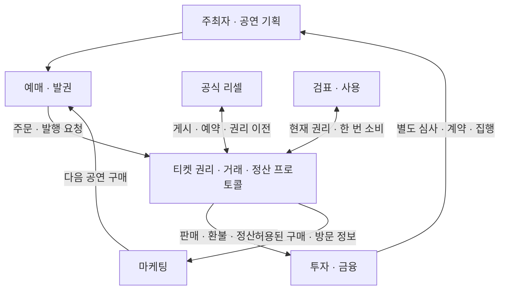
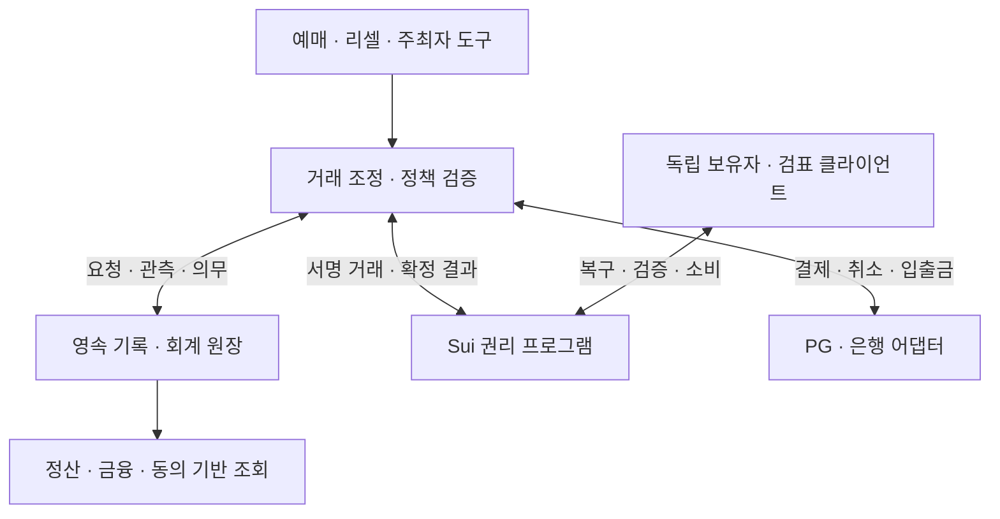

# KIX 개발 현황 · 로드맵 · 블루프린트

작성·조회 기준: 2026-09-14. 설계안 버전: 1.3 — S05 분리 보존·새 작업 환경의 읽기 전용 복원 반영.

이 문서는 첨부 구조도의 ‘티켓 권리·거래·정산 프로토콜’을 중심으로 현재 구현과 목표 설계를 연결한다. 새로운 소프트웨어 릴리스나 운영 승인 문서가 아니다. 1.1에서는 PR #3의 새 저장 검사 8개를 직접 재실행했다. 이번 1.2에서는 S03을 구현하고 두 Python 환경에서 각각 123개 전체 검사를 직접 실행했다. 실제 Sui·ZK는 GitHub CI의 실행 결과를 별도로 판정한다. 장애 주입의 재현과 과거 자연 유실의 원인 재현은 구분한다. 이후의 객체명·명령명·단계명은 제안이며 현행 API와 구분한다.

**현재 위치: 공개 리셀과 실제 Sui·모의 금융의 연결 및 저장 차단에 이어, PR #4에서 원 요청·호출 직전 확인값이 남은 최초 지급의 두 중단 사례를 재개하거나 보류하는 경로를 구현했다. 과거 저장 유실 원인, 독립적인 기록 보존, 나머지 거래 유형의 복구, 최초 유상 생애주기와 새 환경의 권리 복구는 미완료다.**

**1.3 추가 상태:** PR #4 `f2a370d`를 기준으로 S05를 구현했다. 다른 파일시스템에 원 요청·장부·확인 기록을 보존하고, 원 운영 폴더 삭제 후 새 폴더에서 복원·대사한다. 복원된 환경의 지급 실행은 차단하며 현재 제공자 결과로 조회용 회계 결과를 계산한다. 두 Python 환경의 141개 검사는 직접 통과했고 실제 Sui·ZK 성공 여부는 변경 커밋의 CI로 별도 판정한다. 원 폴더 유실과 호스트 전체 유실·원격 저장 내구성을 구분한다. [S05 범위와 실행](PAID_ARCHIVE.md)

## 1. 개발 기준과 근거

| 기준 | 확인 상태 | 해석 |
|---|---|---|
| main `2658a43aefa792ff783457188814f8598a62f5b0` | 기존 실행본 | 이후 ZK 수정·유상 통합 미포함 |
| PR #1 `a13244fe6dc07d72b314752f056612899dc544cb` | 초안·미병합, main 대상 | 회로별 기여·검증, 초기 키 거절, 권리 현재성 경계 검사 |
| PR #2 `8e69bd7f64e019dc3e1256a94ccf283d13dffc73` | 초안·미병합, PR #1 브랜치 대상 | 실제 Sui 공개 리셀과 모의 금융의 첫 연결 |
| PR #3 `c5121714b58c3e5250740c924733e1964445d102` | 초안·미병합, PR #2 브랜치 대상 | 저장 상태 대조, 명령 잠금, 미완료 명령 차단, 조사·장애 주입 도구 |
| Actions `34804317014` | PR #3 검사 성공 | 저장 프로브·공개·유상·ZK 검사를 포함; 과거 유실 원인 해결을 뜻하지 않음 |
| PR #4 `6b6d7675eecba9f599a8760698fd2c469359aef9` | 초안·미병합, PR #3 브랜치 대상 | S03의 근거 대사·계획 재검증·최초 지급 복구 또는 보류 |
| Actions `34810147415` | 전체 성공 | head `6b6d767`, 임시 병합 `492e3aacf4fc5260240df10c3c55a39a54fcb466`. 저장·공개·유상 복구·ZK 조작 거절·비공개 여정 성공 |

신규 개발의 검토 기준은 PR #4의 위 전체 SHA다. 실제 작업을 시작할 때 HEAD와 PR 상태를 다시 확인한다. PR #4 → PR #3 → PR #2 → PR #1 → main의 의존 관계이며 main에 반영된 것으로 취급하지 않는다. CI의 임시 병합 커밋과 PR head를 구분하고 해당 실행에 연결된 소스·결과를 확인한다. 병합은 별도 변경 작업이며 이번 작업에서는 수행하지 않았다.

현재 소스에는 과거 작성 시점의 설명도 남아 있다. 예를 들어 원래 Sui·ZK 설계 문서의 ‘미컴파일’ 표기나 이전 ROADMAP의 ‘유상 연결 예정’은 해당 문서의 작성 시점에 해당한다. PR #3의 README는 Codespaces에서 검토할 PR 브랜치를 선택하도록 수정했다. 기준 SHA·지원 시험·미해결 문제의 일관된 안내와 이전 문서의 시점 표시는 계속 관리한다.

근거: [PR #1](https://github.com/BeautifulMind-JT/kix-protocol/pull/1), [PR #2](https://github.com/BeautifulMind-JT/kix-protocol/pull/2), [PR #3](https://github.com/BeautifulMind-JT/kix-protocol/pull/3), [PR #4](https://github.com/BeautifulMind-JT/kix-protocol/pull/4), [PR #4 CI](https://github.com/BeautifulMind-JT/kix-protocol/actions/runs/34810147415).

## 2. 구조도에 대응하는 현재 개발 상태

아래에서 ‘모형 구현’은 합성 입력으로 규칙을 실행한다는 뜻이고, ‘실제 체인’은 Sui 로컬넷에서 거래를 실행했다는 뜻이다. 어느 쪽도 곧바로 실제 결제·현장 운영·운영용 보안을 뜻하지 않는다.

| 구조도 영역 | 지금 확보한 것 | 다음에 연결할 것 |
|---|---|---|
| 주최자·공연 기획 | 모형의 행사·재고·정책·초대권, Move의 공연 생성·발행 권한 | 주최자 인증, 회차·좌석 편집, 발행 한도, 판매·입장·공연 완료 시점 관리 |
| 예매·발권 | 모형의 최초 판매·재고 예약, Move 발행, 공개 지갑 이전 | 최초 유상 결제와 발행의 통합, 주문·주문행, 늦은 결제·중복 발행·발행 실패 처리 |
| 공식 리셀 | 모형의 게시·예약, 실제 체인의 제안·이전, 공개 리셀 1회와 모의 정산 통합 | 공개 게시와 결제 예약의 제품 연결, 반복 리셀, 다양한 수취인·정책, 외부 사업자 |
| 공통 프로토콜 | 버전·정책·권한 검사, 권리 전이, 배분·환불·지급 모형, 실제 결과 일부 연결, 저장 차단, S03의 제한된 지급 복구·보류 | 유실 원인 규명, 다른 중단 유형의 근거 대사·재개, 독립 기록 보존, 생애주기 정합성 |
| 검표·사용 — 구조도에 보충 | 공개·비공개 소비, 옛 권리·중복 사용·일부 폐기·취소 거절 | 독립 검표 운영, 현장 장애 절차, 300석 규모와 동시 요청 검증 |
| 투자·금융 | 합성 금융 조회: 승인액·배분·지급·환불 부담·미회수금·증거 범위 | 실제 제공자 근거의 보고서, 금융기관 제공 계약, 심사·자금 집행 연결 |
| 마케팅 | 합성 동의 버전·철회·최신 동의 확인과 제한 조회 | 실제 신원·채널 연결, 발송 직전 확인, 재구매 측정과 외부 발송 |
| 운영자 독립성 | 설정 프로세스 종료 후 다른 프로세스에서 백업·체인 조회로 사용 | 기존 작업 폴더 없는 복구, 대체 RPC·가스·검표자, 자료 배포 |
| 프라이버시 | 실제 mint/spend 증명과 Sui 검증, 설정 결함 보완 | 운영용 설정·검토, 공개 연결 정보 감소, 비공개 리셀·환불·키 복구 |

특히 현재 Move의 공연 정원도 최대 16슬롯이다. 비공개 회로만 16슬롯인 것이 아니다. ‘300석 공연’은 확장 목표이며 현재 성능이나 지원 정원으로 표시하면 안 된다. [현행 Move 코드](https://github.com/BeautifulMind-JT/kix-protocol/blob/8e69bd7/reference/v0.3-rc1/sui/sources/rights.move)

유상 통합에서 확인한 세 가지 결과는 다음과 같다. 모두 모의 원화이며 실제 은행 송금은 아니다.

| 시험 경로 | 실제 권리 결과 | 금전 모형 결과 |
|---|---|---|
| 120,000원 리셀, 결제·이전 응답 유실 | 원 digest 조회로 이전 성공 확인 | 판매자 114,000원·주최자 2,400원·플랫폼 3,600원 지급 |
| 이전 전 공연 취소 | 저장된 이전 요청 실제 실패 | 배분 없이 120,000원 환불 |
| 지급 중 공연 취소 | 이전 성공 후 공연 취소 | 늦은 지급 114,000원 회수채권, 미이행 환불 의무 120,000원 |

현재 통합은 한 공연당 거래 하나, 공개 권리 버전·세대 1, KRW, 고정 배분, PG 비용 0의 시험이다. 부분 지급·반환 등의 단독 Python 모형을 통합 완료로 세지 않는다. [유상 통합 설명](https://github.com/BeautifulMind-JT/kix-protocol/blob/8e69bd7/docs/PAID_INTEGRATION.md)

## 3. 서비스 목표 구조

원래 그림의 연결은 유지하고, 티켓의 실제 사용을 확정하는 검표를 명시한다. 아래는 목표 구조이며 모든 연결의 구현 완료를 뜻하지 않는다.

각 서비스는 자체 화면과 업무를 가지되 공연·회차·재고·권리·거래·정책 식별자를 공유한다. 단순히 동일한 ID를 사용한다는 것에 더해, 상태 변경의 근거와 버전, 누가 변경을 승인할 수 있는지를 공유해야 한다.

금융 제공자가 제작자금을 공급하는 계약과 티켓 구매자의 결제는 별도 자금 흐름이다. 금융 기능은 거래 증거를 이용하지만 티켓 결제금을 자동으로 제작자금으로 바꾸지 않는다. 마케팅 기능은 동의한 범위의 정보를 이용하며 티켓 보유가 광고 수신 동의를 대신하지 않는다.

## 4. 구현 아키텍처와 사실의 근거

초기에는 논리적 모듈을 명확히 나누고, 조정자·원장·조회 서비스를 소수의 배포 단위로 운영하는 구성을 제안한다. 서로 다른 자금·권한·증거를 구분하는 데 서비스 수를 늘릴 필요는 없다. 체인·외부 제공자는 각자 독립된 시스템으로 둔다.

| 사실 | 최종 근거 | KIX가 관리할 것 |
|---|---|---|
| 티켓의 현재 보유·사용·폐기 | 채택한 Sui 권리 프로그램의 확정 상태 | 조회 사본, 체인·패키지·객체·버전·시점 참조 |
| 결제 승인·원결제 취소 | 인증된 해당 PG의 거래 근거 | 원자료, 정규화한 관측, 거래 귀속·상충 상태 |
| 실제 입출금·정산 조정 | 제공자·계좌의 해당 자금 이동 근거 | 이동 식별자, 금액·통화·귀속·원장 반영 |
| 배분·환불·회수 의무 | 고정 정책과 확인된 사건으로 계산한 회계 원장 | 의무별 잔액, 지급·회수·상각 등 처리 근거 |
| 요청을 보냈는지·재시도 가능한지 | 전송 전 보존한 요청·작업 기록과 제공자 결과 | 실행 단위, 허가, 재조회·재제출 조건 |
| 마케팅 사용 허용 | 적용 범위를 명시한 최신 동의 기록 | 목적·사업자·채널·버전·철회·발송 근거 |

권리 조회 DB는 체인에서 재구축할 수 있어야 하지만, PG 원자료·미전송 요청·동의 이력까지 체인에서 복원할 수 있는 것은 아니다. 이 자료는 별도의 보존·복구 대상이다. 전체 시스템을 ‘체인이 정본’이라는 한 문장으로 설명하지 않는다.

체인 확정과 실행 성공은 구분한다. 실행 결과의 성공 여부와 변경된 객체·이벤트를 거래 조건에 대조하며, RPC 조회 실패를 거래 실패로 취급하지 않는다. [Sui 거래 생애주기](https://docs.sui.io/develop/transactions/transaction-lifecycle)

운영자 독립성을 위해 이미 발행된 권리의 검증·소비 경로는 KIX 조정 서버를 필수 경유하지 않아야 한다. 유상 이전의 외부 결제 사실 확인, 최초 발행 권한, 실제 PG의 가용성까지 자동으로 없어지는 것은 아니며 남는 신뢰를 기능별로 표시한다.

## 5. 공통 데이터 블루프린트

다음은 목표 논리 객체다. 현재 Python·Move 구조를 한 번에 전면 교체하지 않고, 매핑과 이관 규칙을 먼저 작성한다.

| 객체 | 핵심 필드·역할 | 필수 규칙 |
|---|---|---|
| Organizer / AuthorityGrant | 주최자, 발행사, 권한 주체·범위·버전 | 주최자별 발행량, 회차별 검표·증거 발급 권한 구분 |
| Event / Performance | 공연, 회차, 시간·장소·정책 | 판매 종료·입장 종료·공연 완료·취소를 분리 |
| InventoryUnit | 발권사·공연·회차·좌석 또는 자유석 단위 | 같은 단위에 유효 권리를 중복 발행하지 않음 |
| TicketRight | 권리 ID, 재고 ID, 발행 세대, 보유자, 버전, 상태 | 옛 권리는 되살리지 않고 새 발행 ID·세대를 사용 |
| Order / OrderLine | 주문, 티켓별 주문행, 가격·할인·세금 배분 | 주문행 합계가 결제 금액과 일치; 부분 성공 처리 |
| Listing / Reservation | 제안 가격·만료, 판매자, 예상 버전, 결제 예약 | 게시와 배타적 예약 구분; 늦은 확정까지 차단하는 종료 규칙 |
| Trade / Terms | 당사자, 권리·버전, 금액·통화, 만료, 정책 해시 | 합의 후 변경 불가; 변경은 새 거래로 기록 |
| Payment / PaymentAllocation | 제공자 결제 참조, 주문행별 금액 배분 | 같은 외부 결제 사실을 중복 반영하지 않음 |
| ExternalObservation | 원자료 참조·해시, 출처, 제공자 사건 ID, 인증·해결 상태 | 귀속 거절과 원자료 삭제를 구분 |
| ExecutionRequest / Attempt | 원 요청 바이트, 멱등 키, 시도·허가·조회 결과 | 같은 의미의 재전달과 다른 실행을 구분 |
| ChainReceipt | 네트워크, 패키지, digest, 효과, 관련 이벤트·객체 | 확정 결과와 고정한 거래 조건을 결합 |
| Obligation / LedgerEntry | 수취인, 발생 원인, 금액·통화, 정책, 차변·대변 | 배분 예정·지급 완료·회수채권·환불 의무 분리 |
| RefundCase | 사유, 대상 거래·권리, 수혜자, 경로, 부담 주체 | 발권 실패·일반 환불·공연 취소·차지백을 별도 정책으로 처리 |
| Admission / Delegation | 검표자, 권리 버전, 요청·만료, 위임 세대 | 양도·환불·입장 사이 공통 배타성; 불명확 사용권 재발행 금지 |
| Consent / Delivery | 주체, 목적·사업자·채널, 버전, 허가·발송 결과 | 발송 직전 최신 허용 확인; 전송한 사실과 동의 상태 구분 |
| RecoveryBundle / CircuitProfile | 암호화 권리 자료, 체인·키·회로·manifest 참조 | 개인 비밀과 공개 증명 생성 자료를 분리 보관 |
| EvidenceSnapshot | 기준 시점, 자료 범위, 누락·충돌, 계산 버전 | 계산 일관성과 자료 전체성에 대한 주장을 분리 |

재고 식별자는 경로 문자열의 단순 연결 대신 정규화한 구조를 사용한다. 거래에는 `network + package + issuer + event + performance + right + generation + version + parties + amount + currency + policy`를 결합한다. 식별자마다 자료형·정규화·해시 직렬화 규격을 고정한다.

복수 티켓 결제는 결제 ID를 한 번 반영한 뒤 주문행으로 금액을 배분한다. ‘같은 결제 ID를 여러 티켓에 쓴다’는 정상 상황과 ‘같은 결제를 중복 매출로 반영한다’는 오류를 구분한다. 초기 구현은 티켓 한 장당 결제 한 건으로 제한할 수 있다.

## 6. 명령·이벤트·상태 변경 계약

명령 봉투의 제안 필드는 `schemaVersion, operationId, authenticatedActorRef, scope, expectedVersion, policyHash, bodyHash, body`다. 역할 문자열을 인증으로 사용하지 않는다. 체인 서명·권한과 어댑터 인증은 별도로 확인한다.

이벤트에는 `eventId, causationId, correlationId, aggregateId, aggregateVersion, sourceRef, observedAt, recordedAt, evidenceClass`를 둔다. 처리 시각 하나로 모든 외부 사건의 선후관계를 정하지 않는다. 제공자 사건 ID·순서·체인 버전·조회 범위를 함께 사용한다.

| 명령 묶음 — 제안 이름 | 선행 조건 | 만들어야 할 근거 |
|---|---|---|
| CreatePerformance / AuthorizeIssuance | 주최자·발권 권한, 정책 승인 | 회차·재고·물량과 정책 버전 |
| ReserveInventory / CreateOrder | 판매 가능, 예약 충돌 없음 | 주문행·만료·예약 세대 |
| RequestPayment / ObservePayment | 고정 주문, 제공자 범위 | 원 요청·응답·원결제 참조 |
| IssuePaidRight | 확인된 배정 결제와 유효한 발행 예약 | 발행 영수증, 권리와 주문행 연결 |
| PublishListing / ReserveResale | 현 보유자 승인, 현재 버전·정책 | 게시와 구매 예약, 종료 시점 |
| AcceptTransfer | 수신자 수락, 결제 근거 또는 무상 이전 조건 | 이전 확정과 배분 근거 |
| ConsumeRight | 현재성·검표 권한·미사용·문맥 | 한 번 소비된 사실 |
| RequestRefund / CancelPerformance | 사유별 권한·정책 | 권리 종료와 금전 의무의 별도 결과 |
| PrepareEffect / DispatchEffect / ObserveEffect | 유효 의무·자금·원 요청·실행 허가 | 전송 의도, 접수 여부, 상태·자금 이동 |
| SetConsent / AuthorizeDelivery | 최신 동의 버전·허용 범위 | 동의 이력과 실제 발송 결과 |

상태는 객체별로 나눈다. 다음은 목표 상태군이며 모든 이름을 현재 코드에 존재하는 것으로 해석하지 않는다.

| 대상 | 구분할 상태·금액 |
|---|---|
| 재고 | 판매 가능, 예약, 발행됨, 사용/종료 검토 중, 재개방 가능, 판매 종료 |
| 권리 | 유효, 이전 예약, 사용됨, 종료 대기, 폐기; 비공개 전환은 별도 프로파일 |
| 결제 | 요청 준비, 결과 불명확, 승인 확인, 취소 일부/전부 확인; 매입·정산·현금은 별도 |
| 체인 실행 | 서명 전, 서명 저장, 제출/조회 중, 성공 확정, 실패 확정 |
| 금전 실행 | 준비, 전송 허가, 접수 불명확, 일부 이행, 이행 완료, 미이행 확정, 증거 상충 |
| 환불 | 발생 의무, 미분류 금액, 경로 결정, 실행 중, 이행 금액, 남은 의무 |

`NOT_FOUND`는 제공자 계약에 따라 의미를 판단한다. 지급되지 않았다는 확정 증거로 바로 변환하지 않는다. 이전 실패가 확정돼도 다른 유효한 이전 요청이 남을 수 있는지 확인하고, 권리 처리를 차단할 근거를 확보한 뒤 보상한다.

## 7. 한 장의 티켓을 끝까지 연결하는 기준 여정

1. 주최자가 회차·재고·발행량·가격·양도·환불·배분 정책을 확정한다.
2. A가 주문하고 재고를 예약한다. 결제 원 요청을 외부 호출 전에 보존한다.
3. 결제 결과를 확인하고 주문행에 귀속한다. 승인과 정산 입금을 구분한다.
4. 발행을 실행한다. 발행 결과가 불명확하면 원 요청을 조회하며 같은 재고를 새로 판매하지 않는다.
5. A가 리셀을 게시하고 B가 예약한다. 게시 자체와 거래 잠금을 분리한다.
6. B의 결제와 고정 약정을 확인한 뒤 권리를 이전한다. 배분 의무는 해당 정책과 성공 근거로 한 번만 생성한다.
7. B가 입장하거나 사유별 환불을 요청한다. 사용·환불·양도 경합의 권리 결과는 상호 모순되지 않아야 한다.
8. 지급·취소·환불·회수 관측을 반영한다. 실제 이동 금액과 남은 의무를 구분한다.
9. 금융 조회에는 기준 시점과 증거 범위를 붙이고, 마케팅에는 허용 범위의 정보만 제공한다.

환불된 좌석은 옛 권리를 폐기하고 사용·위임·이전의 불명확성이 해소된 후 새 권리로 재발행한다. 금융 의무가 남았을 때 재고 재개방을 허용할지는 상품 정책으로 명시한다. 현장 사용 여부가 불명확한 권리와 비공개 소비를 개별 재고에 안전하게 대응시키지 못하는 프로파일에서는 재발행을 허용하지 않는다.

### 금전 정책의 필수 결정

| 사유 | 구현 전에 확정할 사항 |
|---|---|
| 결제 성공·발행/이전 실패 | 반환 대상 결제, 재시도 종료·권리 차단 근거, 원결제 취소 또는 다른 허용 경로 |
| 리셀 계약 취소 | 원 판매자에게 권리를 돌릴 수 있는 조건, 당사자 금전 조정 |
| 현재 보유자의 일반 환불 | 기준 금액·수수료·기한, 재고 재개방, 부담 주체 |
| 공연 취소·회차 변경 | 최종 구매자 환불과 과거 매매 조정의 관계, 초대권·일부 주문 처리 |
| 지급 후 취소·차지백 | 회수채권, 부족 재원, 이중 반환 방지, 분쟁·수동 처리 |

`FULL_CHAIN_UNWIND_FIXTURE`와 `LATEST_TRADE_UNWIND_FIXTURE`는 시험 정책이다. 이를 모든 상품의 약관으로 승격하지 않는다. 최종 구매자에게 환불한다는 이유만으로 과거 계약상 의무를 지우거나, 과거 거래 모두에 자동으로 전액 환불을 발생시키지 않는다. 첫 상품의 환불표를 확정한 뒤 그 표에 맞는 통합 검사를 만든다.

리셀 배분 정책에는 총액/차익 기준, 원가 기준의 정의, 수취인, 비율·정액, 반올림, 지급 시점, 비용, 취소 부담을 포함한다. 이전 구매자라는 이유만으로 후속 리셀 이익을 계속 받는 구조는 넣지 않는다. 현재 판매자의 판매 대금은 별개다.

## 8. 저장·복구 신뢰성: 첫 통과 조건 G0

현재 사고 기록은 Python 3.12.14 / SQLite 3.53.1 환경의 손상·전송 기록 누락을 보고하고, 연결 수명 변경 후에도 재발했다고 명시한다. 유상 CLI는 Python 3.12 / SQLite 3.45.1로 제한한다. 이는 시험 조건이며 원인 해결 또는 운영 버전 추천이 아니다. [사고 기록](https://github.com/BeautifulMind-JT/kix-protocol/blob/8e69bd7/validation/2026-09-14/storage-boundary-incident.json)

PR #3의 탐지·차단을 유지하고 PR #4에서 지정한 최초 지급의 복구 경로를 추가했다. 아래는 G0의 과제별 상태다.

| G0 세부 과제 | 현재 결과 | 남은 조건 |
|---|---|---|
| 원인 조사 | 합성 체인과 실제 조정자 저장 코드로 두 환경에서 각각 66개 명령 성공 | 자연 유실 미재현. 과거 손상 DB/WAL 원본 부재; 원인 미해결 |
| 불일치 탐지·차단 | 마지막 확인값과 SQL 상태 비교, 한 CLI 명령 잠금, 실행 전 pending, 체인 질의·재열기 전후 대조 | 같은 실패 영역의 DB·확인 기록 동시 되돌림, 전원 장애, 직접 Core 호출까지의 보호는 입증하지 않음 |
| 의도적 장애 재현 | 지급 후 projection만 과거로 복원하면 기존 경로는 취소를 오분류하고 새 CLI는 취소 전에 차단 | 과거 유실이 발생한 원인의 재현으로 표시하지 않음 |
| 중단 후 안전한 재개 | PR #4에서 호출 직전 확인값이 남은 최초 지급의 근거 대사·명시적 재개 또는 보류 구현 | 기존 확인값 없는 pending, 다른 거래 유형, 독립 저장·인증된 운영자 복구 |
| 실행 안내 | README에서 main 대신 검토할 PR 브랜치 선택 안내 | 이전 자료의 시점 표시와 후속 기준 SHA 관리 |

1.1 문서 검토에서는 새 `test_storage_receipt.py`의 8개를 Python 3.12.14 / SQLite 3.53.1에서 재실행해 모두 통과했다. 그중 실제 CLI 차단 검사는 `/usr/bin/python3`의 지정 SQLite 3.45.1 환경을 호출했고 생략되지 않았다. 당시 기존 104개 전체 검사와 실제 Sui·ZK 여정은 재실행하지 않고 CI를 확인했다. 이번 S03의 직접 실행 범위는 아래에 별도로 기록한다. [검사 소스](https://github.com/BeautifulMind-JT/kix-protocol/blob/c512171/reference/v0.3-rc1/test_storage_receipt.py), [조사 문서](https://github.com/BeautifulMind-JT/kix-protocol/blob/c512171/docs/STORAGE_INVESTIGATION.md)

탐지 장치는 두 시험 DB를 같은 CLI가 독점 변경하는 범위다. 실제 PG의 독립 변경을 같은 방식으로 해시 고정할 수는 없다. 같은 디스크의 확인 기록은 독립 백업이 아니며, 기록이 없는 기존 DB를 자동으로 새 기준으로 승인하지 않는다. pending 차단은 `summary`를 포함한 정상 CLI 명령에 적용되고, PR #4는 별도의 `recovery_inspect`·`recovery_apply` 경로를 제공한다.

조사는 이미 만든 체인 없는 저장 프로브를 기준으로 계속한다. 통과한 구성과 실패한 구성에서 실행 파일·SQLite 소스/빌드·옵션·저장 경로·파일시스템·권한·프로세스·저널 설정을 기록하고, 한 번에 하나의 조건만 바꾼다. ‘버전 때문에 발생했다’는 결론은 다른 조건이 분리된 뒤에만 내린다. 프로브의 반복 성공만으로 원인 규명을 대체하지 않는다.

SQLite 공식 문서는 WAL도 영속 상태의 일부이며 잘못 분리하면 커밋 자료가 손실될 수 있다고 설명한다. 조사·백업 과정 자체가 상태를 바꾸지 않도록 일관된 보존 절차가 필요하다. 또한 알려진 WAL 관련 수정의 적용 여부를 정확한 빌드로 확인해야 한다. 공식 문서의 WAL-reset 결함 정보는 점검 항목이며, 현재 KIX 사고의 원인으로 확인된 것은 아니다. [SQLite WAL 문서](https://www.sqlite.org/wal.html)

| 중단·오류 주입 지점 | 대조할 근거 | 기대 결과 |
|---|---|---|
| 원 요청 커밋 전 | 조정자 기록, 제공자 기록 | 외부 실행을 시작하지 않음 |
| 원 요청 저장 후·제공자 호출 전 | 저장한 요청, 실행 허가, 제공자 조회 범위 | 미실행/불명확을 구분하고 계약이 허용할 때 같은 요청 재개 |
| 제공자 처리 후·응답 수신 전 | 제공자 원 실행 ID·결과, 저장 요청 | 조회로 동일 실행을 귀속; 새 경제적 실행 생성 금지 |
| 체인 성공 후·원장 반영 전 | 원 digest·효과·이벤트, 고정 약정 | 배분을 한 번만 반영 |
| 출금 이후·관측 반영 전 | 출금 식별자·금액과 실행 의무 | 실제 이행분만 반영, 잔액·예약 보존 |
| 취소와 늦은 지급 경합 | 취소 근거, 전송·접수·출금 근거 | 과거 전송 사실을 되돌리지 않고 회수·환불 의무 계산 |
| 기록 누락·상충 발견 | 별도로 보존한 원 요청·외부 목록과 대사 | ‘없으므로 미전송’으로 단정하지 않고 영향 범위를 보류 |

G0 산출물은 최소 재현 코드, 변경 전후 기록, 조건 비교표, 수정 및 실패 재현 회귀 검사, 지정 중단점의 복구 결과다. DB 구조 검사 통과와 경제적 기록의 완전성은 각각 판정한다. 작업 프로세스 중단 검사를 디스크 고장·정전·서버 전체 장애 보장으로 확대하지 않는다.

### 차단 이후 복구 계약과 S03 구현 상태

아래는 전체 복구 계약이다. PR #4에서는 호출 직전 확인값이 남은 최초 지급의 두 중단점에 한정해 구현했다. 확인값이 없는 기존 pending과 불일치 장부를 현재 상태로 자동 승인하지 않는다. 나머지 거래 유형과 독립 저장은 후속 과제다.

1. **복구 사례 생성:** DB·저널·확인 영수증·pending·원 요청을 일관된 방식으로 보존한다. PR #4는 원 명령과 호출 직전 외부 요청·장부 확인값을 추가했다. 이 자료가 없는 과거 pending을 현재 상태로 다시 작성하지 않는다. 해시만으로 원 요청을 복구할 수는 없다.
2. **외부 결과 수집:** 지급은 제공자 실행 ID·멱등 키·상태·실제 자금 이동을, 권리 처리는 원 digest·실행 효과·현재 권리 상태를 대조한다. 출처·조회 시점·범위와 상충 자료도 보존한다. `NOT_FOUND`를 곧바로 미지급 확정으로 해석하지 않는다.
3. **복구 계획 작성:** 실제 이행, 확정 미이행, 일부 이행, 불명확, 증거 상충을 실행 단위로 분류한다. 일부 이행분은 보존하고 확인되지 않은 부분의 예약과 환불·회수 의무를 유지한다. 새 요청을 보내기 전에 남아 있는 실행 가능성을 확인한다.
4. **별도 상태에서 재구성·검증:** 보존한 요청과 외부 근거로 후보 장부를 만들고, 의무·원장·권리·기반 자료의 차이를 보고한다. 체인만으로 PG 자료나 미전송 요청까지 복구했다고 판단하지 않는다.
5. **명시적 복구 확정:** 검증된 계획 ID·근거·승인 주체·처리 결과를 기록한 복구 명령으로 재개한다. pending 삭제나 현재 장부를 읽어 확인값만 다시 만드는 방식은 사용하지 않는다. 기존 확인값과 복구 근거는 남기고 별도 실패 영역의 보존도 검증한다.

첫 수락 사례는 동일한 모의 지급에 대해 ‘호출 직전 종료’와 ‘제공자 접수 직후 종료’를 각각 복구하는 것이다. 프로그램은 어느 위치에서 종료됐는지 입력받지 않는다. 원 요청·제공자 결과·현재 체인 근거로 판단하고, 조회 부재를 곧바로 미실행으로 확정하지 않는다. 제공자 계약과 현재 지급 조건이 허용할 때만 같은 요청·키를 재전달한다. 계획은 실행 직전에 재검증하고, 반복·복구 중 재종료에도 같은 경제적 실행·분개를 중복 생성하지 않아야 한다.

PR #4의 새 검사 19개를 포함해 Python 3.12.14 / SQLite 3.53.1과 Python 3.12.3 / SQLite 3.45.1에서 각각 123개를 직접 실행해 통과했다. 두 최초 중단점 각각에 대해 복구 중 여섯 위치의 재종료를 주입한 12개 조합도 포함한다. 자료 부족·상충·늦은 지급·공연 취소·재전달 만료는 보류 또는 이전 계획 거절로 검사했다. 로컬 근거 묶음의 두 사례는 합성 체인·모의 자금이며, 실제 Sui의 별도 여정과 구분한다.

구현은 별도 후보 장부에서 관측과 분개를 만들고, 복구 저널에 반영 전후 확인값을 남긴 뒤 원본에 반영한다. pending은 반영 확인과 새 영수증 보존 뒤에만 해제한다. 후보·원본·영수증·저널이 같은 파일시스템에 있다는 제한은 유지한다. `RECOVERED`는 해당 복구를 반영했다는 뜻이며 접수·출금·지급 완료는 `effect`와 `remainingDuties`로 따로 표시한다. [S03 설계·실행·제한](https://github.com/BeautifulMind-JT/kix-protocol/blob/6b6d767/docs/PAID_RECOVERY.md), [로컬 근거 묶음](https://github.com/BeautifulMind-JT/kix-protocol/blob/6b6d767/validation/2026-09-14-recovery/paid-recovery.json)

S03의 지정 사례를 통과해도 전체 유실 원인과 모든 장애의 복구가 해결됐다고 보지 않는다. 다음에는 원인 조사·독립 보존을 계속하고, 처음부터의 유상 발행 및 다른 중단 유형에 동일한 근거·재검증·반복 실행 계약을 적용한다.

최종 CI 로그에서도 새 두 사례를 확인했다. 호출 전 종료는 동일 요청 재개 뒤 판매자 114,000원과 나머지 배분금 6,000원을 이행했다. 호출 후 종료는 실제 Sui 공연 취소로 이전 계획을 거절하고 기존 지급에 연결했다. 이후 판매자 지급 114,000원은 회수채권으로 남고 고객 환불 의무 120,000원은 미이행 상태로 유지됐다. 두 판매자 지급 모두 모의 제공자의 경제적 실행 1회·submit 1회였다. 첫 CI의 취소 후 거절 사유 기대값을 수정한 뒤 위 head의 전체 CI가 성공했다. CI는 로그와 상태·산출물 메타데이터를 확인했으며 ZIP 내용의 바이트 대조는 수행하지 않았다. [최종 CI](https://github.com/BeautifulMind-JT/kix-protocol/actions/runs/34810147415)

운영 저장소의 선택은 G0 결과로 결정한다. SQLite 유지 또는 서버형 DB 이전은 후보이며, 엔진 교체만으로 원 요청 보존·대사 문제가 해결됐다고 보지 않는다. 운영 목표에는 원장·명령·관측의 원자적 반영 범위, 유일성 제약, 백업·복원, 배포 중 이관, 보관·삭제 정책을 포함한다. 수락한 금전 요청의 손실 허용량과 복구 시간 목표를 정하고 장애 종류별로 실측한다.

원인을 특정하지 못하면 G0는 미완료로 남긴다. 그동안 설계·읽기 전용 분석·제한된 모의 시험은 진행할 수 있지만 해당 저장 경로에 실제 금전 처리를 맡기는 다음 단계로 승격하지 않는다.

## 9. 독립 복구와 프라이버시의 개발 경로

운영자 독립성과 프라이버시는 공통 프로토콜의 별도 완료 축이다. 유상 장부 개발 뒤에 무기한 미루지 않고, G0 동안에도 권한·복구 규격과 시험 설계를 진행한다.

| 의존성 | 목표 대체 경로 | 필요한 검증 |
|---|---|---|
| 로그인·개인키 | 보유자 키와 암호화 백업 | 새 환경에서 권리 제어; 백업·암호를 가진 조건 명시 |
| 증명 생성 파일 | 공연에 고정된 WASM·proving key·manifest의 공개 배포 | 해시·검증키 대조, 중단된 원 배포처 없이 확보 |
| 비공개 노트 | 보유자 암호화 복구 자료 | 현재 세대·폐기·소비 상태 확인 및 증명 갱신 |
| 가스 | 자기 가스 또는 대체 대납 경로 | KIX 대납 없이 실제 제출 |
| RPC·인덱서 | 별도 경로와 재구축 도구 | 현재 상태 확인; RPC 교체와 신뢰 없는 검증을 구분 |
| 검표 운영자 | 별도로 권한을 부여받은 검표자 | 실제 한 번 소비, 옛 보유자·재사용 거절 |

공개 증명 생성 파라미터와 보유자의 비밀 노트는 다르다. 생성된 proving key가 배포 가능하다는 사실은 설정 시 비밀을 공개해도 된다는 뜻이 아니다. 운영용 회로·설정·검증키는 검토하고 고정해야 하며, 현재 단일 주체 시험 설정은 별도 시험 프로파일로 유지한다. [Sui Groth16 문서](https://docs.sui.io/develop/cryptography/groth16)

새 환경에서 setup을 다시 돌려 임의의 새 키를 만드는 것은 기존 공연의 복구가 아니다. 기존 공연에 결합된 자료를 확보해야 한다. 알려진 결함이 있는 옛 키의 권리 이관은 별도 정책·프로그램이 필요하며, 이번 복구 시험의 정상 대상에는 보완된 설정을 사용한다.

대납을 사용한다면 사용자와 대납자의 서명 및 가스 조건을 고려해야 한다. 보조 대납자에 의존하는 경로만으로 독립성을 주장하지 않고 자기 가스 경로도 시험한다. [Sui 대납 거래 문서](https://docs.sui.io/develop/transaction-payment/sponsor-txn)

프라이버시 단계는 다음과 같다.

1. **비공개 검표의 현재성:** 폐기·루트 변경·취소·중복 소비와 정상 노트 갱신. 일부 실제 시험 완료.
2. **새 환경 복구·동시 사용:** 자료 확보, 증인 갱신, 동시 검표 실패·재시도, 관찰자별 공개 정보 측정.
3. **비공개 이전·환불·키 교체:** 옛 노트 소비와 새 노트 발행을 결합하고, 입장·양도·환불이 같은 권리를 중복 소비하지 못하게 설계. 현 검표 회로를 그대로 재사용하지 않음.
4. **금융 집계 증명:** 정확한 입력 범위와 계산식이 확정된 후 도입. 입력으로 주어지지 않은 PG 거래의 누락까지 ZK가 알아내는 것으로 주장하지 않음.

공개 체인에는 현재 주소·발행·공개 이전·shield 시점 등 연결 단서가 남는다. 검표자가 구매 사슬을 받지 않는다는 성과와 모든 관찰자에게 익명이라는 주장을 구분한다. 회로 크기 확장과 별개로 300석의 사용 패턴·타이밍이 주는 연결 정보도 평가한다.

## 10. 각 서비스의 제품 블루프린트

| 서비스 | 첫 제공 기능 | 완료를 보여줄 사용 장면 |
|---|---|---|
| 주최자 도구 | 공연·회차·재고·정책 등록, 판매/입장 상태, 정산 내역 | 한 회차를 만들고 취소까지 처리한 뒤 금전 의무를 설명 |
| 예매·발권 | 공연 선택, 주문·결제 상태, 티켓·복구 자료 | 재접속해도 구매·발권 결과 일치; 불명확 발권을 완료로 표시하지 않음 |
| 공식 리셀 | 게시, 가격·기한, 구매 예약, 이전·대금 상태 | 게시 중 취소·만료·입장과 구매가 경합해도 모순 없이 종료 |
| 검표 도구 | 권한 있는 검표, 사용 결과, 실패·재시도 안내 | 다른 검표자가 같은 티켓을 두 번 입장시키지 못함 |
| 정산 운영 도구 | 지급 예정·진행·완료, 환불·회수·대사 대기 | 늦은 지급과 취소를 보고 담당자가 원자료까지 추적 |
| 마케팅 | 목적·사업자·채널별 동의, 제한 대상 추출, 발송 결과 | 철회 후 새 캠페인에서 제외; 구매와 실제 방문을 구분 |
| 금융 근거 제공 | 매출·수취액·환불 부담·미회수금 보고서 | 특정 시점의 수치를 원자료 범위·계산 버전까지 재현 |

관객 화면에는 현재 필요한 행동과 상태를 제시한다. 내부 digest·원장 계정·WAL·어댑터 오류를 기본 사용자 흐름에 노출하지 않는다. 독립 복구·검증을 원하는 사용자에게는 별도 상세 도구를 제공한다.

마케팅의 장기 목표는 다음 공연 구매로 이어지는 흐름이다. 이를 위해 캠페인·동의·주문·입장의 연결 기준과 측정 기간을 정한다. 무상 초대, 취소 구매, 방문하지 않은 구매를 구분하고 과거 구매자의 모든 리셀 이력을 기본 마케팅 자료로 제공하지 않는다.

금융 근거에는 승인액, 권리 확정액, 최초 판매와 리셀 거래액, 배분 의무, 실지급, 미완료 환불, 미확정 지급, 미회수금, 수수료·세금·보류를 각각 표시한다. 리셀 총액을 주최자 수익에 전부 더하지 않는다. 자금 공급·상환 상품은 금융 파트너의 계약·집행 구조를 따르는 별도 기능이다. 스테이블코인 경로는 이후 별도 자산·지급 어댑터로 검토하며 초기 KRW 통합에 섞지 않는다.

## 11. 외부 발권사·리셀 사업자 연결

상호운용의 첫 대상은 동일 프로토콜을 사용하는 두 운영자로 제안한다. 그다음 외부 발권사 한 곳과 전환 계약을 구현한다.

외부 권리를 가져오는 제안 절차는 `전환 요청 → 원 권리 잠금 확인 → KIX 권리 발행 → 원 권리 종료/전환 확정`이다. KIX 발행 성공 후 외부 종료 응답을 잃었을 때 원 권리를 먼저 풀면 안 된다. 반대로 원 권리를 잠갔는데 KIX 발행이 실패한 경우에는 KIX 권리 부재·종료를 확인한 뒤 잠금을 해제한다.

이 절차가 성립하려면 외부 사업자가 검증 가능한 잠금·소비·폐기·조회 수단을 제공해야 한다. 제공하지 않는 티켓은 QR·이미지 소지만으로 공식 전환하지 않는다. 일부 화면 연동과 두 시스템의 중복 사용 방지는 별도 완료 항목이다.

외부 API·SDK 계약에는 발권사/가맹점 범위, 외부 ID, 인증·서명, 요청 정규화, 멱등 보존 기간, 이벤트 중복·순서, 상태 조회, 취소·복구, 자료 보관, 규격 버전·호환성 검사를 둔다. 서로 다른 구현체가 같은 오류·증거·버전을 해석하는지 적합성 검사를 제공한다.

## 12. 단계별 개발 로드맵

인력·개발 가능 시간·PG 테스트 계정·파일럿 일정이 확정되지 않았으므로 달력 날짜와 완료율을 임의로 부여하지 않는다. 각 단계는 선행 조건과 실행 증거로 닫는다. ‘현재 구현’, ‘지정 시험 통과’, ‘외부 환경 검증’, ‘현장 운영 확인’을 별도로 기록한다.

| 단계 | 목표·주요 작업 | 선행 조건 | 완료 증거 |
|---|---|---|---|
| G0 저장 신뢰성 — 진행 중 | PR #3 차단·PR #4 지정 지급 복구 유지, 원인 조사, 독립 보존·추가 중단 유형 대사 | PR #4 기준 소스·사고 기록·실행 자료 확보 | 원인·수정 범위와 회귀 근거, 독립 보존, 요청·외부 결과·장부 대조; 지정 복구 성공만으로 G0 전체 통과하지 않음 |
| G1 공개 유상 생애주기 | 최초 구매·발행, 리셀, 입장/환불, 재발행, 부분 지급·반환, 미실행 요청 재개 | G0, 첫 상품 정책 확정 | 실제 Sui+모의 제공자로 처음부터 끝까지 처리; 남은 의무 명시 |
| G2-A 외부 결제 경계 | 선택한 PG 테스트 환경, 웹훅 인증, 취소·정산·수수료·멱등 계약 | G1의 안정된 계약과 테스트 계정 | 원 요청·제공자 근거·체인·원장 대조; 실제 돈과 테스트 결과 구분 |
| G2-B 독립 복구 | 새 환경, 고정 증명 자료 확보, 대체 RPC·자기 가스·별도 검표자 | 보완된 권리·키 프로파일, 보존·복구 규격 | KIX 작업 폴더 없이 복구·검표, 옛 권리·재사용 거절 |
| G3 첫 현장 제품 | 최소 예매·주최자·리셀·검표·정산 화면, 계정·권한, 운영 대응, 정원·성능 확장 | G1, 사용 기능에 해당하는 G2 결과 | 실제 역할별 사용 여정, 복구 훈련, 정산 대사와 지연·비용 측정 |
| G4 복수 운영자·외부 발권 | 파트너 API/SDK, 전환 잠금·확정·보상, 규격 적합성 | G3의 안정된 프로토콜, 외부 운영 계약 | 원·새 권리 동시 사용 차단, 한 운영자 중단 후 다른 운영자 처리 |
| G5 서비스 순환 확장 | 동의 기반 마케팅→다음 구매, 금융 근거 제공→자금 계약, 다양한 배분 | G3의 실제 기록; 외부 연동에는 G4 | 캠페인·구매/방문 연결, 금융 자료 재현, 별도 자금 흐름 대사 |

G2-A와 G2-B는 독립적으로 진행할 수 있다. G0 동안 G1·G2의 규격과 화면 설계는 준비할 수 있지만 저장 문제 해결로 오인될 기능 확장은 피한다. 금융 조회 정의와 동의 기록은 G1부터 보존하고, 실제 서비스 연결은 G3~G5에서 한다. 프라이버시 확장은 9절 경로로 계속 관리하되, 비공개 리셀을 허용하려면 해당 명제·권리·금전 통합을 별도로 검증한다.

300석은 G3의 명시적 확장 목표다. 공개 재고의 16슬롯 제한과 공연 공유 객체의 경합을 먼저 검토하고, 비공개 회로 깊이·루트 계산·증명 갱신 비용은 별도로 설계한다. 상수만 300으로 바꿔 확장 완료로 처리하지 않는다. 300개 재고의 발행·취소·입장과 실제 운영에 맞춘 동시 도착 패턴, 가스·지연·재시도 결과를 보존한다. 모든 관객의 동시 입장을 임의 전제로 삼지 않는다.

## 13. 바로 실행할 개발 묶음

아래 작업 ID는 개발 묶음의 제안이다. PR #3에 포함된 진전은 표시하되, 제안 ID가 같은 이름의 실제 PR이나 완료 상태를 뜻하지는 않는다.

| 작업 ID | 내용 | 산출물·종료 조건 |
|---|---|---|
| S01 | 저장 사고 원인 조사 계속 — 프로브 추가됨 | 두 환경의 66개 명령 성공은 미재현 결과; 최초 불일치의 DB·저널·명령·환경 보존과 가설 분리 |
| S02 | 원인에 대응한 저장 수정 — 원인 미해결, 방어 추가됨 | PR #3의 탐지·차단을 유지하며 원인 가설별 재현·수정 근거 확보 |
| S03 | 지정한 최초 지급의 복구·보류 구현 — PR #4 | 두 중단점, 계획 재검증, 반복 및 복구 재종료 검사. 전체 유실·다른 거래 유형·독립 저장으로 범위를 확대하지 않음 |
| S05 | 분리 보존·새 작업 환경 복원 — 1.3 구현 | 다른 파일시스템의 최신 기록 대조, 원 폴더 삭제, 현재 제공자·체인 근거 대사. 읽기 전용 복원이며 호스트 전체 유실·새 지급 실행은 범위 밖 |
| S04 | 개발 기준과 실행 입구 정리 — README 보완됨 | PR #4 기준 SHA·명령·지원 환경·미해결 문제와 PR 의존 관계 일치 |
| L01 | 객체·정책·인증 매핑 | Python과 Move의 공연·권리·Terms·PaymentEvidence 대응표 |
| L02 | 최초 유상 발행 통합 | 결제·예약·발행 중단과 중복 처리 검사 |
| L03 | 미실행 지급 재개와 환불 종결 | 조회 부재의 계약적 의미, 부분 지급·환불·반환 및 잔액 대사 |
| R01 | 복구 자료 규격·배포와 새 환경 시험 | 권리 자료·공개 파라미터를 나눠 확보하고 실제 소비 |
| E01 | PG 테스트 어댑터 | 인증·이벤트 재전달·원결제 취소·정산 조정 결과 |

프로토콜 개발 담당은 S/L 작업과 대사 근거를, Move·암호 검토 담당은 R 작업의 권한·명제·설정을, 상품·정산 담당은 환불·배분 정책표를, 현장 파트너는 검표·취소 운영 조건을 책임지는 구성을 제안한다. 이는 필요한 역할의 구분이며 현재 해당 인력이 확보됐다는 뜻은 아니다.

## 14. 단계별 시험 환경과 공개 범위

| 환경 | 목적 | 해당 단계에서 금지할 과장 |
|---|---|---|
| 모형·내부 모의 환경 | 규칙·장애·재현 개발 | 실제 결제·은행 지급·현장 운영 완료 |
| 실제 Sui 로컬넷+모의 제공자 | 권리와 장부 연결 | 다중 검증자 장애 내성·실제 PG 검증 |
| PG 테스트+선택 체인 시험 환경 | 인증·취소·정산 계약 검증 | 실제 자금 흐름·상용 보안 완료 |
| 제한된 현장 파일럿 | 실제 역할·재접속·검표·취소 운영 | 지원하지 않는 비공개·외부 전환 기능의 제공 |

모의 자금 내부 스테이징을 실제 거래용 환경과 구분한다. 실제 관객·결제를 사용하는 파일럿은 저장·권한·자금·운영 대응의 관련 완료 조건을 통과한 기능만 노출한다. 공개 권리 파일럿이 비공개 기능 개발 목표를 없애지는 않는다. 사용하는 프로파일과 공개 정보 범위를 명확히 설명한다.

성능 목표는 실제 측정 후 수치로 확정한다. 사전에 확인할 지표는 발권·이전·검표 지연의 p50/p95, 재시도율, 거래당 가스·증명 생성 비용, 미해결 거래 수와 체류 시간, 대사 차이, 복구 소요 시간이다. 승인된 시험에서 중복 유효 권리·중복 지급·중복 소비·설명되지 않는 장부 차이를 허용하지 않는다. 이것을 모든 미래 장애에 대한 무조건적 보장으로 확대하지 않는다.

## 15. 첫 상품에서 결정할 정책과 개발 우선순위

| 결정 | 제안하는 초기 접근 | 결정이 필요한 시점 |
|---|---|---|
| 대상 공연·회차 | 한 회차·지정 좌석, 이후 300석 확장 | G1 전 |
| 결제 단위 | 티켓 한 장·결제 한 건으로 시작, 주문행 구조는 유지 | G1 전 |
| 통화·제공자 | KRW 한 경로, 실제 PG 계약 확정 후 확장 | G2-A 전 |
| 리셀 가격·배분 | 현재 고정 배분을 시험 기준으로 보존; 상품 조건은 별도 확정 | G1 전 |
| 환불·공연 취소 | 사유별 수혜자·금액·부담·원결제 경로를 표로 확정 | G1 전 |
| 지급 시점·부족 재원 | 판매자 대금과 로열티 지급 조건, 취소 후 부족액 대응 | G1 전 |
| 현장 연결 끊김 | 초기에는 온라인 확정을 기준으로 하고 보류·대체 창구 절차 마련 | G3 전 |
| 비공개 모드 | 검표 프로파일부터 제한 도입; 리셀·환불 가능 범위 별도 표시 | 해당 기능 제공 전 |
| 운영 변경·키 복구 | 권한 회수·교체, 패키지·키 버전과 기존 권리 이관 규칙 | 지속 운영 전 |

기본 데이터·권한·상태·증거 계약은 먼저 고정하고, 모든 금융 상품·마케팅 채널·회로 확장을 첫 출시 조건으로 묶지 않는다. 특허 검토에는 구현과 비교 실험의 기록을 활용하되 기능 조합이나 실행 성공만으로 특허성이 확인됐다고 보고하지 않는다.

## 16. 완료 보고 양식

각 개발 묶음의 보고에는 다음을 포함한다.

1. 기준 SHA와 변경 SHA, PR·병합·배포 상태.
2. 실제 달라진 사용자 또는 프로토콜 동작.
3. 사용한 환경과 증거 등급: 합성/모의, 실제 로컬넷, 외부 테스트, 실제 운영.
4. 직접 실행한 성공·실패·중단 사례와 원자료 위치.
5. 권리·금전의 최종 상태 및 미해결 의무·금액.
6. 남은 의존성과 다음 단계로 넘어갈 수 없는 조건.

현재 기준 판정은 ‘PR #4의 제한된 유상 통합·저장 차단·지정 최초 지급 복구에 이어 S05의 분리 보존·새 환경 읽기 전용 장부 복원을 구현했으나, 과거 유실 원인·호스트 전체 장애의 보존·복원 후 지급 권한 이관·전체 유상 생애주기·새 환경 권리 복구는 미완료’다. 이후의 성과는 작업량이나 검사 수 대신 **보존된 기록으로 설명할 수 있는 거래 범위, 실제 재개 가능한 중단 지점, 운영자 의존과 공개 정보가 줄어든 범위**로 평가한다.

## 주요 구현 근거

- [PR #3 저장 확인·잠금·미완료 명령 차단](https://github.com/BeautifulMind-JT/kix-protocol/blob/c512171/reference/v0.3-rc1/storage_receipt.py)
- [PR #3 실제 CLI 적용 경계](https://github.com/BeautifulMind-JT/kix-protocol/blob/c512171/reference/v0.3-rc1/paid_driver.py)
- [PR #3 저장 조사·제한·보존 결과](https://github.com/BeautifulMind-JT/kix-protocol/blob/c512171/docs/STORAGE_INVESTIGATION.md)
- [권리·거래·정산 유상 통합 코드](https://github.com/BeautifulMind-JT/kix-protocol/blob/8e69bd7/reference/v0.3-rc1/paid_integration.py)
- [실제 체인 관측 어댑터](https://github.com/BeautifulMind-JT/kix-protocol/blob/8e69bd7/reference/v0.3-rc1/client/paid-chain.mjs)
- [회계·금융 조회 모형](https://github.com/BeautifulMind-JT/kix-protocol/blob/8e69bd7/reference/v0.3-rc1/finance.py)
- [재고·게시·동의 모형](https://github.com/BeautifulMind-JT/kix-protocol/blob/8e69bd7/reference/v0.3-rc1/lifecycle.py)
- [ZK 설정 및 권리 현재성 보완](https://github.com/BeautifulMind-JT/kix-protocol/blob/8e69bd7/docs/PROTOCOL_HARDENING.md)
- [현재 독립·비공개 여정](https://github.com/BeautifulMind-JT/kix-protocol/blob/8e69bd7/reference/v0.3-rc1/client/localnet.mjs)
