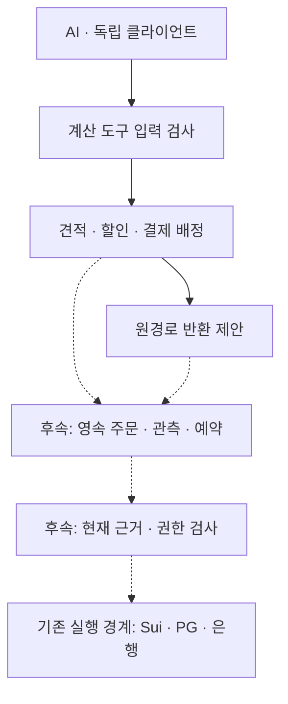

# S06 — 자산·묶음 계산 계약과 복구 보류 기록

개발 기준: S05 `96d0daad5b96af501c19284f149cb288b17e5d05`. 개발계획 2.1의 P0/P2 일부와 P1 보류 기록 보완이다. 고객 프론트엔드를 개발하지 않는다.

## 이번 변경이 실제로 하는 일

1. 자산을 단순 표시 기호 대신 namespace·완전한 참조·소수 자릿수·허용 금액으로 구분한다.
2. 정수 최소단위로 묶음 가격과 순차 할인을 계산한다.
3. 한 주문의 고객 부담액을 여러 결제 예정 경로와 주문행에 정확히 배정한다.
4. 선택한 주문행을 전액 되돌릴 경우의 원결제 경로별 반환안과 할인 부담 취소분을 계산한다.
5. 위 세 계산을 AI가 호출할 수 있는 제한된 JSON 도구로 제공한다.
6. 기존 S03 복구가 HOLD를 반환할 때 보류 이유와 근거를 기록한다.

**1–5는 계산 전용이다. 결제 승인·발행 실패·환불 완료를 관측하지 않으며, 돈·권리·환불 예약을 변경하지 않는다.** 실제 언어 모델 호출이나 자율 운영도 이번 범위에 없다. 기존 Sui·모의 PG/은행 유상 통합의 KRW·단일 공개 리셀 제한은 유지된다. 저장 원인 조사와 G0 전체 완료를 주장하지 않는다.

## 전체 프로토콜 안에서의 위치



점선은 아직 연결하지 않은 경로다. 계산 결과를 직접 `send_effect`로 전달하는 변환기는 제공하지 않는다. 계산 계약을 먼저 고정하여 후속 원장·체인·AI가 같은 금액을 해석하게 한다.

## 금액과 자산의 규격

| 항목 | 구현 규칙 | 아직 별도로 필요한 것 |
|---|---|---|
| AssetSpec | namespace, reference, decimals, maxAtoms 전체를 식별 해시에 결합 | 승인된 자산 목록·체인별 정규화·등록 권한 |
| qualified reference | 토큰이면 체인·네트워크·전체 타입/계약을 참조에 포함한다는 호출 계약 | 체인에서 해당 자산이 존재한다는 인증 |
| 정밀도 | 0–38자리, 금액은 0–2^128−1 범위 안의 자산별 한도 | 실제 Sui Coin/PG/회로별로 더 작은 허용 범위 적용 |
| JSON 금액 | 부호·지수·선행 0이 없는 십진 문자열. 예: `"9007199254740993"` | SDK·Move·회로의 공통 서명 직렬화 |
| 시각·버전 | JSON 정수, bool 거절, 2^53−1 이하 | 실제 시간·현재 버전의 신뢰 가능한 원천 |
| 연산 | 동일한 전체 자산 명세만 더하기/빼기, 부족·초과 거절 | 자산별 복식 원장·환율 견적·실제 환전 |
| 등록 | 같은 namespace/reference의 다른 정밀도·한도를 같은 레지스트리에 등록하면 거절 | 영속 레지스트리·변경 정책·서명 |

가격 입력에 float를 받거나 금액을 반올림해 맞추지 않는다. 소수 문자열은 자산 정밀도 안에서만 변환한다. 기존 `common.positive`와 KRW 10^12 한도는 기존 실행 경로에서 유지된다. 새 모듈의 u128 표현 범위를 곧바로 체인·PG가 지원하는 금액으로 표시하지 않는다.

## 견적과 할인 정책

`build_quote(request)`는 다음을 검사한다.

- 스키마 `kix:commerce:1`, 주문 ID·버전, 발권사·공연·회차, 정책 참조, 만료 시점.
- 주문행 1–300개, 중복 주문행·재고 ID 거절, 한 견적 안에서는 동일 자산.
- 할인 최대 64개. 각 할인은 고유 ID·부담 주체·대상 주문행·적용 순서를 갖는다.
- 정액(FIXED) 또는 1/10,000 단위 비율(BPS), 선택 상한액. 정액은 자산의 최소단위다.
- 비율 할인은 앞선 할인 적용 후 남은 대상 금액을 기준으로 계산하며 총 할인액의 최소단위 미만을 버린다.
- 대상 행에 비례 배정하고 나머지는 소수부가 큰 행부터, 동률이면 주문행 ID 오름차순으로 1단위씩 배정한다.
- 정액 할인이 남은 대상 금액보다 크면 거절한다. 상한 적용 후의 값으로 판단한다.
- 고객 부담액과 할인 부담액의 합은 원 가격과 같고, 할인 뒤 금액은 음수가 될 수 없다.

견적에는 원 요청, 자산 명세, 행별 계산, 합계와 도메인을 구분한 해시가 담긴다. 다른 기능이 견적을 사용하면 원 요청으로 전체를 다시 계산하여 모든 필드와 비교한다. 공격자가 계산 행을 바꾸고 해시도 다시 만들어도 계산이 틀리면 거절한다.

견적 해시는 작성자의 권한이나 정책 승인 여부를 증명하지 않는다. 새 요청으로 재계산한 새 견적은 만들 수 있다. 이후 실행 계층은 권한 있는 주체가 선택한 견적 해시·정책 버전을 별도 저장하고 현재 상태와 비교해야 한다. `now`도 현재는 호출자가 준 계산 입력이며 실제 서버 시간 증거가 아니다.

지금은 한 견적의 회차와 자산을 하나로 제한한다. 서로 다른 회차/자산을 포함한 상위 주문의 조정, 세금·수수료, 자격 증빙, 쿠폰 예산 예약, 할인 취소 시 잔존 행 재가격 정책, 환전은 후속 계약이다. 이 제한은 전체 개발 목표의 제외가 아니다.

## 복수 결제와 선택 주문행 반환

`plan_payments`는 최대 16개 결제 예정 경로의 합계가 고객 부담액과 같은지 검사한다. 각 경로는 legId·providerRef·routeRef·금액에 결합하고 원 요청 순서대로 남은 주문행 금액에 비례 배정한다. 현재 견적 해시와 만료를 확인하며, 다른 자산·중복 legId·0원 유상 경로·합계 차이를 거절한다. 무료 견적은 결제 경로가 없는 계획을 사용한다.

`propose_line_refund`의 명시 정책은 `FROZEN_LINE_PRICE_FULL_REVERSAL_V1`이다. 선택 행은 견적 당시 고객 부담액 전부를 원 결제 예정 경로대로 반환하고, 선택하지 않은 행의 가격을 다시 계산하지 않는다. 할인 부담 취소분도 따로 제시한다. 일반 환불·공연 취소·리셀 사슬 환원 전체에 이 정책을 자동 적용하지 않는다.

| 검증 예시 | 계산 결과 |
|---|---|
| 티켓 3장 | 10,000 + 20,000 + 30,000 = 60,000원 |
| 주최자 부담 정액 할인 | 6,000원, 행별 1,000 / 2,000 / 3,000원 |
| 이후 플랫폼 부담 10% | 5,400원, 행별 900 / 1,800 / 2,700원 |
| 고객 부담 | 8,100 / 16,200 / 24,300원, 총 48,600원 |
| 카드 예정 30,000원 | 행별 5,000 / 10,000 / 15,000원 |
| 계좌 예정 18,600원 | 행별 3,100 / 6,200 / 9,300원 |
| 두 번째 행 전체 반환안 | 고객 16,200원: 카드 10,000 + 계좌 6,200원 |
| 할인 부담 취소분 | 주최자 2,000 + 플랫폼 1,800원 |

이 예시에서 결제와 환불은 실제로 실행되지 않았다. 반환 제안에는 `executionAuthorized: false`와 필요한 근거 목록이 담긴다. 후속 연결에서는 실제 원결제 승인·현재 권리 상태·환불 정책 권한·기존 미완료 환불 예약·제공자 취소 가능 잔액을 확인해야 한다. 반복 계산은 같은 제안을 만들지만 환불 한도를 예약하거나 소비하지 않으므로, 반복 지급 방어가 완성됐다는 증거로 사용할 수 없다.

할인 부담 취소분은 정책상 계산값이다. 이를 수취 가능한 현금이나 확정된 외부 채권으로 자동 분개하지 않는다. 스폰서의 계약·실제 지급·회수 상태를 후속 금융 모듈에서 연결한다.

## AI 도구의 현재 범위

`commerce_driver.py`는 요청 하나를 표준 입력으로 받고 JSON으로 응답한다. 최대 입력 256 KiB, 정확한 필드·형식, 중복 JSON 키·NaN·Infinity·잘못된 UTF-8·허용하지 않은 동작 거절을 적용한다. 모든 출력은 `CALCULATION_ONLY`다.

| action | args | 동작 |
|---|---|---|
| simulate_quote | 견적 요청 객체 | 가격·할인 시뮬레이션 |
| plan_payments | quote, legs, expected_quote_hash, now | 결제 예정 금액 배정 |
| propose_line_refund | quote, payment_plan, line_ids, expected_plan_hash | 선택 주문행의 원경로 반환안 |

송금·환불 실행·임의 SQL·셸·서명 도구는 이 인터페이스의 허용 목록에 없다. 외부 문자열에 지시문이 있어도 새로운 동작을 만들 수 없다. 이는 실제 AI 자율 운영이나 공격 전반에 대한 보안 검증 완료가 아니다. 모델 호출·사건 조회·사건 큐·지급 허가·권한 회수·제한 서명·누적 비용 예산은 아직 연결하지 않았다.

## 보류 기록 보완

기존 S03 복구의 모든 반환형 HOLD에 대해 다음 경로에 기록한다.

`recovery-cases/<attemptedPlanId>/hold-<holdId>.json`

기록은 시도한 계획, 비교 계획, 현재 계획, 이유, 판단 단계, 원 요청·제공자·체인 근거를 담는다. 기존 파일을 재사용할 때도 내용을 검증하고 디렉터리 동기화를 확인한다. 근거가 같으면 원 기록을 재사용하며, 근거가 바뀌면 새 파일로 남긴다. 감사 쓰기가 실패하면 보류가 기록된 것처럼 응답하지 않고 오류로 끝난다. 기존 pending·자금 예약·의무는 해제하지 않는다.

계획 작성 뒤 공연 취소, 송신 직전 상태 변경, 송신 후 상충 관측, 설치 직전 상태 변경, 기록 전후 재종료·반복을 검사한다. 기존의 분산된 hold 파일 이름을 새 규격으로 통일했으므로 이를 읽는 외부 도구는 경로를 갱신해야 한다. 과거 파일을 삭제하거나 자동 변환하지 않는다.

이 로컬 감사 파일은 독립 서명·원격 보존 자료가 아니다. S05 archive가 해당 감사 이력을 모두 별도로 보존한다는 주장을 하지 않는다. archive 최신 기록 확인과 복원 환경 실행 차단을 유지했다.

## 기존 코드와 다음 연결

| 현재 코드 | S06 역할 | 다음 변경 |
|---|---|---|
| assets.py | 새 금액 규격 | 승인된 자산 레지스트리·체인/PG 범위 매핑 |
| commerce.py | 견적·할인·예정 결제 배정·반환안 | 영속 주문·버전·예약 및 결제 관측 연결 |
| commerce_driver.py | 계산 도구 | 인증된 사건 조회·허가 기반 실행 API |
| lifecycle.py / contracts.py | 기존 KRW 단일 권리 실행 유지 | 주문행과 결제 배정의 소비·실패 보상 |
| finance.py | 기존 장부 유지 | 자산별 원장·반환 예약·할인 부담 계약 |
| paid_integration.py / Sui | 기존 실제 권리+모의 금전 통합 유지 | 최초 유상 발행·여러 권리·반복 리셀 |
| paid_recovery.py / paid_archive.py | 보류 감사 보완, S05 보호 유지 | 여러 주문·부분 지급·다중 작업자·원격 복원 |

다음 개발은 계산 계약을 영속 주문·주문행과 외부 관측에 연결한다. 결제 한 건을 여러 권리에 배정해도 중복 매출이 생기지 않고, 부분 승인·일부 발행 실패·환불 예약·늦은 승인에서 의무가 보존돼야 한다. 금융 계약·전체 비공개 거래·실행하는 AI 운영은 개발계획 2.1에 계속 포함한다.

## 재실행

저장소 루트에서:

```bash
python scripts/verify_commerce.py --report .local/verification/commerce.json
python -m unittest discover -s reference/v0.3-rc1 -v
```

구체적인 환경·검사 결과·파일 해시는 [S06 검증 기록](../validation/2026-09-14-commerce/README.md)을 따른다. 이번 계산 결과와 기존 실제 Sui·ZK CI의 근거 종류를 구분한다.
