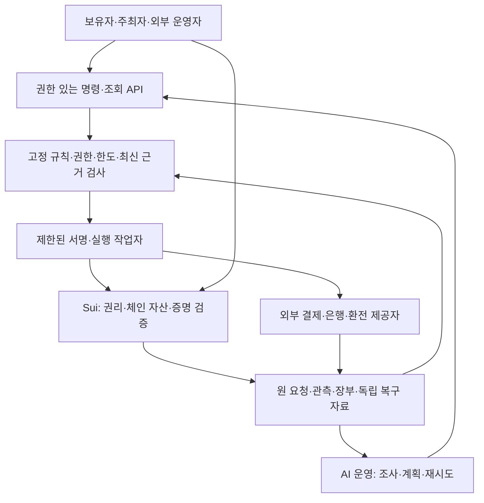

# KIX 개발계획 2.0 — 포괄 프로토콜과 AI 운영

작성일: 2026-09-14. 문서 버전 2.0이며 소프트웨어 출시 버전이 아니다.

## 1. 사용자 결정과 개발 목표

사용자는 고객용 프론트엔드보다 프로토콜 고도화를 우선하고, 묶음 결제·복잡한 할인·다중 통화·다양한 금융계약·공개/비공개 거래를 함께 수용하도록 범위를 확대했다. AI가 운영에 적극 개입하여 사람의 반복 업무를 줄이는 것을 공통 설계 조건으로 추가했다.

이에 따라 이 문서는 [블루프린트 1.2](BLUEPRINT_20260914.md)의 향후 개발 순서, 좁은 첫 상품 중심의 완료 조건, 조기 프론트엔드·파일럿 중심 계획을 대체한다. 과거 구현 결과와 사고 기록은 그대로 유효하다. 현재 단계의 목표는 상품성 검증이나 판매 개시가 아니라, 다양한 거래를 조합해도 권리·자금·증거·권한·프라이버시가 일관되는 프로토콜을 구현하고 검증하는 것이다.

**목표: 여러 운영자와 AI가 동일한 규칙을 따라 티켓·주문·결제·정산·금융계약을 처리하고, 필요한 정보만 공개하면서 장애 후에도 권리와 남은 의무를 확인할 수 있는 공통 기반.**

전체 범위를 지금 설계하고 구현은 의존 순서에 따라 나눈다. 모든 새 기능을 동시에 한 번에 바꾸는 방식은 사용하지 않는다. 고객 화면은 후순위이며, 명령 도구·API·시험 프로그램·간단한 운영 조회 도구는 프로토콜 검증을 위한 개발 도구로 유지한다.

## 2. 재확인한 현재 상태

코드·문서 기준: PR #4 `f2a370dd55c29d7b3403e3872489bd965e38411e`. 코드 변경의 직전 기준은 `6b6d767`, `f2a370d`는 블루프린트 추가 커밋이다. PR #4는 초안·미병합, main은 `2658a43aefa792ff783457188814f8598a62f5b0`이다. 해당 head의 [CI 34811690942](https://github.com/BeautifulMind-JT/kix-protocol/actions/runs/34811690942)는 전체 성공을 재확인했다. 이번 계획 작성에서는 전체 검사를 새로 실행하지 않았다. 직전 검토의 직접 실행은 Python 123개 통과이며 실제 Sui·ZK는 CI 실행 근거와 구분한다.

| 영역 | 현재 구현 | 다음에 필요한 변화 |
|---|---|---|
| 권리·재고 | Python의 발행 세대·잠금·환불 후 재고 재개방, Move의 공개 발행·이전·사용 | 주문행·복수 권리 연결, 다중 운영자·권한·규모 확장 |
| 유상 통합 | 이미 발행된 공개 권리의 리셀과 실제 Sui·모의 PG/은행 | 최초 유상 발행, 묶음·부분 성공·반복 리셀·다양한 환불 |
| 금액·정책 | 단일 티켓, KRW, 고정 정책·배분 | 자산별 금액형, 견적·할인·배분 정책 버전, 여러 지급 경로 |
| 저장·복구 | 불일치 차단, 호출 직전 확인값이 남은 최초 지급 두 중단점 복구/보류 | 보류 감사 기록 완결, 독립 보존, 다른 거래 유형, 다중 작업자 |
| 금융 | 환불·지급·회수 의무와 합성 집계 | 자금 약정·집행·채권 배정·상환·손실의 계약 모듈 |
| 프라이버시 | 실제 mint/spend 증명·검증 및 현재성 경계 일부 | 발행·양도·리셀·환불·회수·재발행·키 교체와의 통합 |
| 운영자 독립성 | 다른 프로세스에서 백업·체인 조회·사용 | 원 작업 폴더 없는 복구, 대체 접근·가스·검표자 |
| AI 운영 | 미구현. S03의 대사·재검증 명령이 연결 출발점 | 사건 큐·도구 권한·계획·제한 실행·평가·감사 체계 |

구체적인 코드 제약: `lifecycle._prepare_trade`는 티켓 한 장과 KRW를 고정한다. `finance.py`의 실행·정산·조회도 KRW를 전제로 한다. `contracts.INTEGER_FIELDS`는 금액·시각·수량을 공통 10^12 한도로 검사한다. 토큰 최소단위가 큰 자산을 추가하려면 단순 통화 문자열 변경이 아니라 값의 의미별 검증과 직렬화를 바꿔야 한다. 현재 Move 공연 정원은 공개 권리까지 최대 16슬롯이다. Python의 300개 좌석 허용을 실제 체인 300석 지원으로 표시하지 않는다.

직전 별도 호출에서 `Recovery.apply()`가 오래된 계획을 거절하는 두 경로는 지급 0회·pending 유지였지만, 보류 이유와 최신 근거를 별도 영속 기록으로 남기지 않았다. 이 공백, 과거 자연 유실 원인, 같은 저장 환경의 동시 유실은 여전히 미해결이다. 이번 문서는 코드 수정이나 해당 결함 해결 보고가 아니다.

## 3. 책임을 나누는 전체 구조

마지막 직접 연결은 권한 있는 독립 클라이언트 경로다. KIX의 AI가 없거나 교체돼도, 필요한 자료와 권한을 가진 보유자·검표자가 체인에서 권리를 처리할 수 있어야 한다.

| 책임 | 담당할 계층 |
|---|---|
| 현재 권리, 사용·이전·폐기, 체인 자산 잠금·이동, 채택한 증명의 검증 | Sui 프로그램 |
| 주문·견적·원 요청·외부 관측·현금 장부·동의·암호화 자료 보존 | 영속 실행·증거 계층 |
| 카드 승인·취소·정산, 실제 원화 송금·환전 | 인증된 외부 제공자와 계약 |
| 반복 조사, 근거 수집, 사건 분류, 실행 계획, 예외 요약 | AI 운영 계층 |
| 정확한 금액 계산, 권한·한도·멱등·현재성 검사 | 결정적인 규칙 프로그램 |
| 정책 변경과 권한 부여, 계약상 재량이 필요한 예외 | 지정된 정책·계약 권한자 |

체인 기록과 AI 판단은 외부 은행에서 돈이 움직였다는 사실을 대신하지 않는다. 단일 Sui 거래에 포함되는 동작은 원자적 실행을 활용하되, PG·은행·다른 체인을 가로지르는 전체 거래에는 부분 성공·보류·보상·재개 상태를 둔다. 서명·결과의 원문과 확정 범위를 보존한다. 체인에 저장한 해시만으로 원자료의 가용성을 확보했다고 판단하지 않는다.

## 4. 공통 기반의 확장

다음 이름은 새 설계 객체이며 모두 현재 구현돼 있다는 뜻은 아니다.

| 객체 | 책임 |
|---|---|
| Asset / AssetAmount | 통화 또는 체인·발행자·토큰 식별, 최소단위·정밀도·정수 범위 |
| PolicyVersion / Quote | 적용 정책·가격·할인·수수료·환율·유효기간과 동의한 조건 고정 |
| Order / OrderLine | 여러 공연·여러 권리·수량과 총 주문의 관계 |
| Payment / PaymentAllocation | 외부 결제 사실 1회 반영, 주문행별 금액 배정, 복수 결제 경로 |
| Inventory / Right / Reservation | 재고·이번 발행 권리·만료·이전/입장/환불의 충돌 방지 |
| Obligation / Journal | 받을 돈·줄 돈·실제 이행·보류·반환·회수의 자산별 기록 |
| FXQuote / FXExecution | 환율 약정과 두 자산의 실제 교환·부족분·부분 이행 |
| FinanceAgreement / ClaimAllocation | 자금계약·수익채권·상환 일정·우선순위·담보 배정 |
| ExecutionIntent / Observation / RecoveryCase | 호출 전 원 요청·외부 사실·복구 계획·결과·보류 이력 |
| PrivacyProfile / ProofEnvelope | 관찰자별 공개 범위, 회로·검증키·공개 입력·암호화 복구 자료 |
| AgentGrant / ActionPermit / DecisionRecord | AI 또는 작업자 권한, 1회/범위 실행 허가, 근거·결정·검사·결과 |

정규화·도메인 분리·직렬화 버전은 Python/TypeScript/Move/회로에서 교차 검사한다. 큰 정수는 손실 없는 형식으로 전달하며 JS 부동소수점 숫자로 금액을 계산하지 않는다. 시각·수량·금액의 검증을 분리한다. 기존 스냅샷·미결 명령·정책·키 버전을 읽는 호환성과 이관 규칙을 만든다.

유지할 코드는 권리 버전·세대·잠금, 원 관측 보존, 의무와 현금의 구분, 요청 멱등, 상충 시 보류다. 기존 참조 구현을 비교 기준으로 보존하고 새 모듈을 연결해 확장한다. 과거 실패 검사가 계속 유효한지 확인한다.

## 5. 묶음 결제·할인·부분 성공

복수 티켓을 한 번에 사고, 하나의 주문을 여러 결제수단으로 지급하는 경우를 구분해 모두 설계한다. 티켓 여러 장은 서로 다른 보유자에게 배정될 수도 있다. 한 주문의 서로 다른 회차·판매자 거래는 같은 실패 결과를 강제로 공유하지 않고 주문 정책에 따라 처리한다.

할인에는 정액·비율·쿠폰·수량·등급·기간·묶음 조건을 포함한다. 우선순위, 중복 적용, 상한, 제공자 부담, 쿠폰 사용 횟수, 취소 후 복원 조건을 견적에 고정한다. AI가 실행 시 임의로 할인식을 바꾸지 않는다.

| 상황 | 요구하는 처리 |
|---|---|
| 3장 묶음 할인 | 원가·할인·실결제·부담자 금액을 주문행에 배정, 합계 검증 |
| 한 장 발행 실패 | 전체 취소형 또는 부분 성공 허용형을 사전 고정; 성공분과 반환분 분리 |
| 할인 티켓 일부 환불 | 원 배정액 유지/할인 재계산 정책에 따라 고객 환불과 추가 부담을 계산 |
| 쿠폰 동시 사용 | 사용량·예약·해제를 동시성 조건 아래 한 번 반영 |
| 한 결제의 반복 통지 | 결제 사실 중복 반영 없이 여러 주문행에 배정 |
| 복수 결제수단 부분 실패 | 각 경로의 승인·취소·환불 잔액과 미확정 결과 유지 |
| 묶음 처리 규모 초과 | 단일 체인 거래 제한을 명시; 분할 집행은 별도 부분 성공 계약으로 처리 |

동일 자산에서 주문행별 순결제 배정 합계는 주문의 해당 자산 결제액과 맞아야 한다. 할인 부담은 장부에서 별도로 설명한다. 고객의 누적 환불과 예약은 원결제 경로의 남은 취소·반환 가능액을 넘지 않는다. 쿠폰 재계산으로 추가 청구가 필요하면 원 동의·결제 권한 없이 자동 출금하지 않는다.

## 6. 다중 통화·체인 자산·환전

표시 통화, 고객 결제 자산, 판매자 정산 자산, 금융계약 상환 자산을 구분한다. 초기 적합성 검사에는 KRW, 소수단위를 가진 법정통화, 서로 다른 정밀도의 시험용 체인 자산을 포함한다. 특정 상용 토큰이나 제공자 통합 완료로 표시하지 않는다.

자산별 수량과 장부를 별도로 맞춘다. 원화 10만 원과 토큰 100개를 더해 단일 잔액으로 표시하지 않는다. 공통 통화의 보고가 필요하면 환율·기준시각·범위가 있는 평가 자료를 원 수량과 별도로 제공한다.

환전 계약에는 출처, 거래 가능한 견적과 참고 가격의 구분, 입력/출력 자산, 환율, 유효기간, 수수료, 최소 수령액, 반올림, 부족분 부담, 부분 실행·취소·반환 규칙을 포함한다. 시세 급변·가격 자료 중단·늦은 정산에서 기존 약정과 현재 견적을 구분한다. AI가 환율을 추정해 금전 근거를 만드는 경로는 없다.

동일 체인의 지원 자산 교환과 권리 이전은 가능한 범위에서 단일 실행에 결합한다. 원화 PG와 체인 자산 지급 또는 서로 다른 체인의 자산 이동은 각각의 확정 결과와 불명확 상태를 대사한다. 다중 통화 지원은 모든 체인 간 즉시 결제 보장을 의미하지 않는다.

## 7. 배분·정산·금융계약

배분 정책은 판매자, 주최자, 공연자, 기획사, 공연장, 플랫폼 등 복수 수취인을 표현한다. 총액/차익 기준, 원가 정의, 비율·정액·구간, 반올림, 비용 부담, 지급 시점, 취소 부담을 정책에 고정한다. 단지 과거 구매자였다는 이유로 후속 리셀 이익을 계속 받는 구조는 기존 결정대로 포함하지 않는다.

금융 모듈은 다음 초기 계약군을 실제로 실행 가능한 상태 기계로 구현하고 새 유형의 등록 규격을 제공한다. 상품 판매나 자금 조달을 이번 개발 완료 조건으로 삼지는 않는다.

| 계약군 | 프로그램이 표현할 것 |
|---|---|
| 제작자금 대여·선지급 | 약정·인출 조건·집행·원금·이자/비용·상환·연체·손실 |
| 수익 참여·배분 | 기준 수익 정의·회수 순서·비율/상한·정산 조정 |
| 정산채권 양도·매입 | 원 채권·배정량·보유자·우선순위·대가·회수 |
| 담보·준비금 계약 | 대상 자산/채권·예약·해제·부족·추가 납입·계약상 집행 |

관람권과 돈을 받을 금융채권은 분리한다. 금융채권 보유가 관람·검표 권한을 주지 않는다. 동일 등록 범위의 채권 금액을 초과 배정·담보로 잡는 것을 차단하며, 외부에서 이미 양도·담보된 채권의 완전성은 원 등록부·제공자·계약 근거로 확인한다. 체인 등록만으로 외부 중복 담보가 모두 사라졌다고 주장하지 않는다.

금융 프로그램은 약정된 계산과 실행 조건을 검증한다. 실제 심사, 법정화폐 공급, 미회수금 회수 사실은 외부 근거가 필요하다. 원화 결제금, 주최자 정산금, 투자·대여 자금, KIX 운영자금의 계정·권한·예약을 나눈다. 부분 지급 종료·지급 후 반환·채무 조정·상각도 원자료와 원래 채권 이력을 보존한다.

## 8. 공개·비공개 전체 생애주기

비공개 지원은 버튼 하나가 아니라 행위별 공개 범위와 검증 조건이다. 다음 매트릭스의 각 행에 공개와 비공개 경로, 암호화 복구 경로, 실패 시 결과를 정의한다. 아직 구현이 없는 행을 기존 검표 회로로 지원한다고 표시하지 않는다.

| 행위 | 비공개 경로가 확인할 사실 | 주요 충돌 |
|---|---|---|
| 최초 발행·초대 발행 | 승인 물량·정책·수신 권한·필요한 결제 배정 | 중복 발행·발행 실패 반환 |
| 묶음 배정·분리 | 각 권리 유효성·주문 배정·금액 보존 | 일부 실패·동일 권리 재배정 |
| 무상 양도·유상 리셀 | 현재 보유 권한·수신 동의·조건·결제 | 옛 권리 사용·이중 판매 |
| 검표·위임 | 해당 회차의 현재 유효·미사용 권리 | 양도/환불과 동시 소비 |
| 환불·공연 취소·폐기 | 환불 자격·대상 권리 종료·금액 근거 | 비밀을 잃은 권리의 무효화 |
| 재발행·키 교체 | 옛 세대 종료와 새 세대 발행 권한 | 과거 노트·백업 재사용 |
| 배분·금융 보고 | 약정 산식·자산별 보존·자료 범위 | 누락·이중 채권·추적 단서 |

공개 체인, 검표자, 주최자, 거래 상대방, 결제 제공자, 금융 자료 수신자, AI 모델 제공자별로 보이는 정보를 표로 관리한다. 결제 제공자가 원래 보유하는 결제자 정보까지 ZK가 없애 주는 것으로 설계하지 않는다. 공개/비공개 전환 시점·금액·거래 묶음·가스 지급자의 연결 단서도 측정한다.

권리의 현재성을 검증할 루트/폐기/세대/소비 구조와 비공개 이전을 함께 설계한다. 비밀에서 만든 소비 표식만으로 강제 취소·키 분실이 해결된다고 가정하지 않는다. 회로·검증키·공개 입력 규격을 등록·고정하고, 도메인·행사·명령·자산·정책·현재 상태에 증명을 결합한다. 폐기 루트가 바뀌면 정상 보유자가 증거를 갱신할 수 있어야 한다.

새 환경에서 기존 공연에 결합된 공개 파라미터와 보유자 비밀 자료를 복원한다. AI에 비밀키·비공개 노트·전체 거래 내용을 기본 제공하지 않는다. AI에는 필요한 검증 결과와 제한된 사건 정보만 제공하고, 상세 열람은 별도 허가한다.

## 9. AI 운영과 인력 부담 감소

AI는 운영 사건을 조사하고 정해진 도구로 행동하는 계층이다. 같은 입력에 정확한 결과가 필요한 산술·장부·권한·서명 검사는 규칙 프로그램이 수행한다. 정상적인 반복 작업은 자동 실행 프로그램으로 처리하고, AI가 불일치 분류·도구 선택·복구 계획·예외 설명을 보완한다.

| 업무 | AI의 역할 | 실행 조건 |
|---|---|---|
| 상시 대사 | 결제·체인·장부의 미처리와 차이 탐색 | 인증된 읽기 도구, 범위·비용 제한 |
| 복구 | 근거 수집, 계획 선택, 재조회·동일 요청 재개 | 현재 근거와 원 요청에 결합된 실행 허가 |
| 보류 관리 | 부족 자료 확인, 재검토 일정·우선순위, 예외 요약 | 예약·의무 유지, 이유·시각·후속 책임 보존 |
| 정책 개발 | 자연어 제안을 규격 초안으로 변환, 조합 시뮬레이션 | 검증된 정책 등록·승인 전에는 실행 조건 변경 불가 |
| 금융 운영 | 자료 집계·상환 일정·미이행·노출 정리 | 자금 약정과 출처가 있는 근거, 불확실성 표시 |
| 시스템 운영 | 실패율·지연·비용 이상 탐지, 허용된 재시작·제한 | 정해진 대상·기간·영향 범위, 독립 감시 |
| 운영 보고 | 사건·금액·잔여 의무·사람에게 필요한 선택 요약 | 근거 참조, 확인 사실과 추론 구분 |

### 자율 실행 권한

매 거래에 사람의 확인을 요구하지 않는다. 정책 권한자가 사전에 정한 행사·자산·명령·수취 대상·금액/누적 한도·기간·제공자·정책 버전 안에서는 AI가 조사와 실행을 이어갈 수 있게 한다. 명령마다 별도 검증 계층이 조건을 확인한다.

새 지급액·수취인·새 자금계약·관리 권한을 AI가 임의로 만들 수 없다. 허용된 의무의 지급은 규칙 계산값과 현재 재원을 근거로 실행한다. 사전 범위를 벗어난 권한 확대·정책 변경·부담 주체 변경·관리 키 복구는 지정 권한자의 절차를 따른다. 누군가의 승인이 외부 지급 사실을 지우거나 이중 지급을 허용하지는 않는다.

`AgentGrant`는 운영자/행사/자산/행동/한도/기간에 묶고 회수 가능하게 한다. `ActionPermit`은 원 요청·근거·버전·정책·만료에 결합한다. 제한된 서명 작업자는 별도 키 보관·검사 계층으로 두며 언어 모델에 관리자 비밀키를 전달하지 않는다. 체인 호출도 같은 허가를 강제하고, 서명자에게 직접 호출해 규칙을 우회하지 못하게 한다.

### 명령과 사건 기록

초기 명령은 `collect_evidence`, `inspect_case`, `simulate_policy`, `propose_recovery`, `execute_permitted_action`, `verify_outcome`, `escalate_case`로 제한한다. 이름은 제안이며 API 구현은 후속 작업이다. AI에 임의 SQL 수정·셸 실행·모든 주소 송금 도구를 운영 권한으로 제공하지 않는다.

행위 기록에는 사건 ID, 모델·도구·정책 버전, 참조 근거, 요청한 행동, 승인/거절 사유, 실제 실행 참조, 결과·잔여 의무를 남긴다. 숨은 추론 전체를 저장할 필요는 없으며 검토 가능한 근거와 짧은 판단 요약을 기록한다. 기록 자체에 개인정보가 과다 축적되지 않도록 보관 범위를 정한다.

외부 문서·문의·웹훅의 지시문은 실행 권한을 바꾸지 못하는 입력 데이터로 다룬다. 가짜 결과·다른 행사 자료·오래된 계획·주입된 명령·유출 요청을 적대 시험에 포함한다. 입력 정제나 추가 AI 검토만으로 안전성을 보장하지 않고 실제 실행 계층의 권한과 불변조건을 검사한다.

복수 작업자는 영속 작업 큐, 인수 세대, 만료된 작업자의 실행 차단, 실행 단위의 중복 제거, 원 요청의 단일 귀속을 사용한다. 모델 호출·도구 조회·가스·재시도·동시 작업에 예산을 둔다. 불일치 발견 시 관련 범위만 보류할 수 있게 하며 무관한 사건을 모두 멈추는 현재 시험 모형을 그대로 운영 구조로 승격하지 않는다.

AI 서비스 중단·모델 교체·제공자 장애에서도 보유자와 권한 있는 운영자는 일반 클라이언트를 사용할 수 있어야 한다. 자동화 실패 시 중복 실행을 피하고 남은 사건을 재인수한다. AI 자체가 권리의 단일 유지 조건이 되어서는 안 된다.

### 인력 절감 평가

실제 인건비 절감률은 아직 알 수 없다. 자동 처리율, 잘못 실행한 건수, 근거 없이 보류한 건수, 사람의 사건당 개입 시간, 보류 체류 시간, 모델·도구·가스 비용을 함께 측정한다. 사람만 처리, 규칙 자동화만 처리, 규칙+AI 처리의 같은 사건 집합을 비교한다. 비용·오류가 늘면서 자동 처리율만 올라가는 것을 성공으로 판정하지 않는다. 새로운 증거가 없는 미확정 지급이나 미회수금은 AI도 미해결로 유지한다.

## 10. 저장·복구·운영자 독립성

과거 사고 조사와 앞으로 사용할 실행 경로의 수락 조건을 분리한다. 자연 유실 원인은 계속 미해결로 표시한다. 새 경로는 외부 호출 전 원 요청 보존, 독립 사본, 원 관측 인증, 장부 재구성, 근거 부족 시 보류를 검증한다. 원인 규명 대기 때문에 설계·모의 구현·권리 복구 연구를 무기한 멈추지 않는다.

장부와 같은 디스크의 사본을 독립 보존으로 표시하지 않는다. 별도 실패 영역에 일관된 백업/명령·관측 로그를 확보하고, 원 장부·영수증·pending을 함께 사용할 수 없는 시험을 수행한다. 확인 자료가 없으면 원 요청을 새로 지어내거나 현재 DB를 무조건 승인하지 않는다.

체인 자료의 재구축과 PG·동의·비밀 노트·미전송 요청 복원은 별도다. 검증 가능한 확정 참조·자료 범위·누락 여부를 표시한다. 원자료 인증·가용성·복호화 키 보존을 해시 고정과 각각 검증한다. 외부 제공자 장애·결과 상충·부분 반환은 자동 성공으로 바꾸지 않는다.

운영자 독립 시험은 KIX의 웹서버뿐 아니라 전용 로그인/증명/가스/저장/인덱서 의존을 목록화한다. 자료·권한이 확보된 조건에서 대체 RPC·자기 가스·별도 검표자·새 환경으로 기존 티켓을 사용하고, 옛 권리와 재사용은 거절한다. KIX 전체 장애와 블록체인 전체 장애는 별도 시험 범위다.

## 11. 반드시 유지할 공통 불변조건

1. 동일 재고에 동시에 유효한 권리는 최대 하나이며, 새 세대 발행은 옛 세대가 안전하게 종료됐음을 확인한 뒤에만 허용한다.
2. 양도·입장·환불·폐기는 현재 권리를 상충하게 소비하지 않는다.
3. 하나의 외부 결제·출금·취소 사실은 해당 범위에서 한 번만 경제적으로 반영한다.
4. 각 자산의 장부와 예약을 따로 맞추며 평가 환율로 실제 자산 부족을 숨기지 않는다.
5. 고객 실결제·주문행 배정·할인 부담·환불·수수료·잔여 의무의 합계를 설명한다.
6. 원 요청·정책·견적·수취인·증거를 고정하고 변경은 새 버전/새 권한으로 다룬다.
7. 불명확하거나 상충하는 결과는 예약·의무와 함께 보류하며 실패 표식 하나로 지우지 않는다.
8. 회수채권·미이행 환불·자금 부족을 실제 이행으로 표시하지 않는다.
9. 금융권리와 관람권을 분리하고 등록 범위의 채권 초과 배정·담보를 차단한다.
10. 비공개 증명은 현재 상태·허용 회로·행위·정책에 결합하며 정상 보유자는 필요한 증거를 갱신할 수 있다.
11. AI가 틀리거나 멈추거나 악의적 입력을 받아도 권한·금액·중복·증거 규칙은 실행 계층에서 유지한다.
12. 재개 계획은 실행 직전에 다시 검증하며 반복·재종료 후에도 경제적 효과가 중복되지 않는다.

## 12. 개발 단계와 완료 증거

단계 번호는 새 계획의 작업 묶음이며 현재 코드의 버전명이 아니다. 모든 범위를 프론트엔드 전의 목표에 포함한다. 인력·공수·외부 접근 조건을 산정하기 전 임의의 출시 날짜나 완료율을 부여하지 않는다.

| 단계 | 작업 | 선행·병행 관계 | 종료 증거 |
|---|---|---|---|
| P0 공통 계약 | 자산·정책·주문행·근거·권한·비공개 행위 매트릭스, 현재 코드 매핑·이관 | 즉시. 보류 기록 보완·사고 조사와 병행 | 버전 규격·골든 입력·불변조건·지원/미지원 표 |
| P1 실행·보존 | 보류 기록 완결, 영속 요청·작업 큐·원 관측·독립 복원·제한 서명 | P0 핵심 규격, AI 읽기 도구와 병행 | 원 환경 손실·중단·반복·상충·동시 작업에서 복원/보류 |
| P2 주문·가격·자산 | 묶음·복수 결제·할인·부분 환불, 자산별 장부·환전 계약 | P0, 안전한 통합 실행에는 P1 | 할인/정밀도/부분 성공 조합에서 금액·예약 보존 |
| P3 체인 권리 통합 | 최초 유상 발행, 복수 권리·반복 리셀·환불·재발행, 권한·정원 확장 | P1/P2, P4 회로 연구와 병행 | 실제 Sui에서 성공·중단·취소·동시 소비와 300개 재고 시험 |
| P4 비공개 전체 경로 | 각 행위의 명제·회로·현재성·암호화 복구·관찰자별 노출 | P0부터 연구, P2/P3와 통합 | 공개/비공개 행위 매트릭스 전 항목의 구현·검증·제한 표시 |
| P5 금융계약 | 대여·수익 참여·채권 양수·담보/준비금, 배분·상환·손실 | P2/P3의 근거·의무, P4 공개 범위 | 계약 전 기간·부분 이행·취소·부족 재원·중복 배정 검사 |
| P6 AI 자율 운영 | 읽기 시범→검증된 명령 실행→복수 에이전트, 비용·권한·감사 | P0부터 명령 설계, P1부터 읽기, 각 모듈 검증 후 자동 실행 | 같은 사건의 사람/규칙/AI 비교, 주입·재시도·오판·중단 검증 |
| P7 외부·전체 적합성 | 실제 제공자 테스트·독립 클라이언트·복수 운영자, 전체 조합 시험 | 외부 계약 조사는 P0부터, 통합은 관련 모듈 뒤 | 서로 다른 구현·환경에서 동일 사실·권리·의무 판정 |
| P8 프론트엔드 | 관객·주최자·검표·정산 화면 | 아래 진입 조건 충족 후 | 검증된 API와 프로파일을 일관되게 표현 |

과거 사고 원인을 특정하지 못한 것과 새 경로의 검증 결과는 별도로 보고한다. 연구·테스트와 실제 자금 운영은 구분한다. 외부 제공자 접근이 없으면 어댑터 적합성 모형을 개발하고 그 경계는 미검증으로 남기며 전체 완료로 표시하지 않는다.

## 13. 통합 수락 시나리오

기능별 검사와 함께 아래 시나리오를 처음부터 끝까지 연결한다. 자금은 먼저 시험용으로 수행하고 실제 체인 여부·제공자 종류·모델 사용 여부를 각각 표시한다. 장애 주입 위치나 시험 정답을 복구 프로그램/AI에게 알려주지 않는다.

| 사례 | 연결할 동작 | 반드시 확인할 것 |
|---|---|---|
| T01 묶음·할인 | 3장 할인 구매, 한 장 발행 실패, 다른 한 장 부분 환불 | 주문행 배정·쿠폰·반환 가능액·남은 권리 |
| T02 여러 결제 | 한 주문의 복수 결제, 한 경로 지연/실패, 중복 통지 | 원 결제 사실 1회·부분 성공·각 경로 환불 |
| T03 공개/비공개 리셀 | 묶음 중 한 권리 비공개 이전, 동시 입장 시도 | 동일 권리 한 번 소비·옛 노트 거절·약정 배분 |
| T04 다중 자산 | 원화 결제와 다른 자산 정산, 견적 만료·부분 교환 | 자산별 수량·환전 의무·비용·부족분 |
| T05 금융 연계 | 정산채권 일부 배정·자금 공급·상환 중 공연 취소 | 관람권과 채권 분리·우선순위·미회수금·환불 |
| T06 복구·AI | 호출 전/후 종료·늦은 지급·예전 계획·복구 재종료 | 근거 있는 재개/보류·감사 기록·중복 없음 |
| T07 독립 환경 | 원 장부·같은 디스크 사본 없음, KIX AI 중지 | 별도 근거 복원·권리 사용·잔여 의무·부족 자료 명시 |
| T08 악의적 입력 | 문서 안 송금 지시·가짜 근거·한도 초과·동시 에이전트 | 실행 권한 차단·개인정보 최소화·예약 보존 |
| T09 이관·규모 | 이전 정책/키의 미결 거래, 새 버전·300개 재고 | 과거 권리 유지/명시적 이관·지연·가스·충돌 측정 |

T01→T03→T04→T05→T06을 한 확장 거래로 잇는 종합 시험을 추가한다. 모든 조합을 무한 열거하지 않고, 지원 프로파일별 필수 조합과 위험 경계·속성 기반 생성·방어 제거 시험을 둔다. 비공개·금융·AI도 단독 모형 성공만으로 통합 완료로 세지 않는다.

## 14. 프론트엔드 진입 조건과 다음 작업

고객 프론트엔드 전에 다음을 충족하는 것이 이번 계획의 목표다.

- 묶음·할인·다중 자산·금융·비공개 행위가 선언된 프로파일에서 실제 프로그램으로 연결된다.
- 권리·금전·증거·정책·AI 권한의 API와 버전 이관 규칙이 문서·소스·시험에서 일치한다.
- 지정 장애에서 독립 복원 또는 근거 있는 보류를 보여주며, 지원하지 않는 경계가 명시된다.
- 실제 Sui 실행과 외부 제공자 테스트의 범위를 구분하고 각 필수 시나리오의 근거를 보존한다.
- AI 운영은 실제 모델을 도구에 연결한 시험을 포함하고, 스크립트 모형과 구분한다. 인력·비용 효과와 오작동을 함께 평가한다.
- 원 환경과 KIX AI 없이 보유자가 현재 권리를 복구·사용하는 경로가 검증된다.

당장 다음 구현 묶음은 P0의 공통 규격과 S03 보류 기록 보완이다. 산출물은 자산·금액 명세, 주문행·할인 배정 명세, 정책/증거 버전 규격, 행위별 공개 범위, AI 도구·권한 계약, 기존 코드 이관표다. 구현 완료를 ‘명세가 있다’로 판정하지 않으며 후속 각 모듈을 실행 가능한 프로그램으로 연결한다.

개발자가 규칙·저장·서명·암호·AI 도구·외부 계약의 기술 선택과 시험을 책임진다. 이 단계에서 사용자에게 상품 가격·수요·마케팅 전략 결정을 개발 선행조건으로 요구하지 않는다. 정책 엔진 검증에는 명시적인 복수 시험 정책을 사용하고 실제 상품 정책으로 오인하지 않는다. 신규 지출·자격 증명·외부 자금 집행이 필요한 경우 구체적 의존과 근거를 따로 제시한다.

## 15. 검토 근거

- [현재 코드 기준 PR #4](https://github.com/BeautifulMind-JT/kix-protocol/pull/4), [기준 CI](https://github.com/BeautifulMind-JT/kix-protocol/actions/runs/34811690942)
- [기존 블루프린트 1.2](BLUEPRINT_20260914.md), [S03 범위·제한](PAID_RECOVERY.md)
- [권리·주문 모형](../reference/v0.3-rc1/lifecycle.py), [금융 모형](../reference/v0.3-rc1/finance.py), [입력 규격](../reference/v0.3-rc1/contracts.py)
- [Sui PTB](https://docs.sui.io/develop/transactions/ptbs/): 단일 체인 거래의 원자적 구성 근거. 외부 PG까지 포함하는 보장은 아님.
- [Sui 객체 이전](https://docs.sui.io/develop/objects/transfers/): 권리 이전 규칙 구현의 기술 근거. KIX의 우회 차단은 자체 코드·시험으로 검증.
- [Sui Groth16](https://docs.sui.io/develop/cryptography/groth16): 신뢰 설정과 기대 검증키 식별 필요. 시험 키는 운영 보안 근거가 아님.
- [OWASP 과도한 에이전트 권한](https://genai.owasp.org/llmrisk/llm062025-excessive-agency/), [명령 주입](https://genai.owasp.org/llmrisk/llm01-prompt-injection/): 최소 도구·권한과 실행 계층 검증 설계의 참고. 사전 허가 안의 자동 실행은 KIX의 설계 제안.

이 문서의 모듈·단계·AI 권한은 제안 설계다. 이번 작업으로 코드·금융 연결·AI 운영이 새로 구현됐다는 주장은 하지 않는다.
