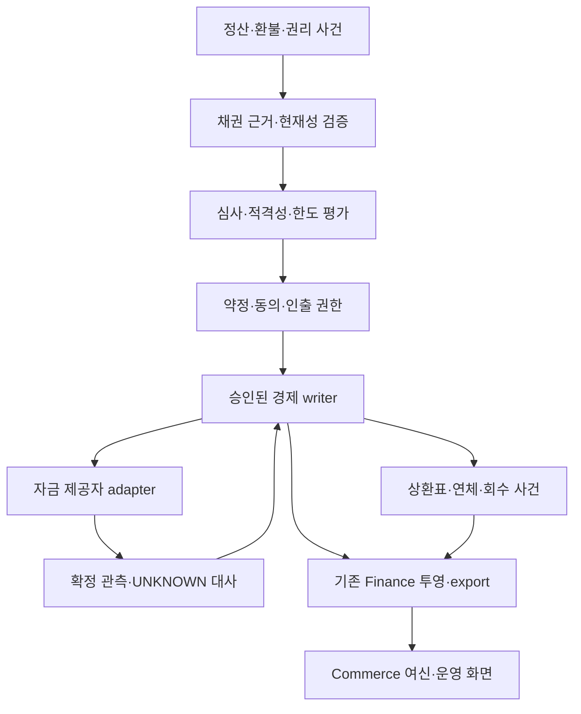

# KIX 여신 수명·위험·회수 설계 고도화

2026-10-02 KST · 설계 제안 / 미채택 / 구현·실자금 실행 아님.

사용자 요청 “여신 관련된 사항도 고도화해서 설계해줘”에 따라 F04와 Finance 설계를 확장한다. **목표는 정산채권의 적격성 확인 → 차주 심사 → 약정·한도 → 인출 → 지급 관측 → 상환 → 연체·회수 → 종결을 하나의 추적 가능한 업무로 연결하는 것**이다. 첫 개발 후보는 정산채권 기반 사업자 선지급이다. 상품 법률 분류, 대주·차주, 금리·수수료·기간·우선순위는 미정이며 설계자가 임의 채우지 않는다.

## 1. 기준과 호환성

관측 main은 `dd0a501248e092c2a4475088d94d7449b7bd98b5`, 이 설계의 기반은 PR #85 후보 `f931cfc87bdeaa1ed2495df0ce659ee832ac1c33`다. #84·#85 미병합 후보를 현행 운영 구현으로 취급하지 않는다. 본 PR은 문서만 추가하며 F04 목, Move, kernel, 실행 계획을 수정하지 않는다.

| 영역 | 현재 코드·계약에서 확인한 것 | 이번 제안 |
|---|---|---|
| F04 | 메모리 내 OFFERED/APPROVED/DRAWN/DEFAULTED 등, 한 번 전액 draw, 부분 목 repay | 별도 버전의 약정·인출·상환·회수 모델 |
| 한도 | 최초 face snapshot 고정; 부분 repay는 예약 유지; close만 예약 해제; default는 예약 유지 | 새로운 평가 revision, 다중 한도, 보수적 재평가·중복 사용 통제 |
| 결과 보존 | 수락 명령 재생; 거절 결과는 restore에 복원되지 않음 | 채택 backend의 첫 결과·거절·UNKNOWN 내구 의미를 ADR로 확정 |
| 금융 | 합성 복식 투영·대사·export 후속 설계 존재 | 그 생산자를 재사용하는 여신 사건·노출·servicing 계약 |
| 실자금·심사 | unsupported / mock only | 담당자·상품·제공자 게이트가 닫힐 때까지 BLOCKED |

기존 `FACE_SNAPSHOT_FROZEN`, `DEFAULTED` terminal, `reserved_open`, 모의 `repay`의 의미는 바꾸지 않는다. 새 모델은 **CR-LIFECYCLE-CANDIDATE**라는 문서상 후보 명칭을 사용하며 공식 wire profile은 후속 ADR에서 정한다. 기존 건을 새 정책으로 조용히 재해석하거나 terminal 건을 재개하지 않는다.

## 2. 제품 경로와 순서

| 후보 | 경제적 기초 | 먼저 확보할 근거 | 제안 순서 |
|---|---|---|---|
| 정산채권 기반 선지급 | 확인 가능한 미지급 정산 의무 | 귀속·금액·기한·취소/환불 부담·중복 양도/담보 확인 | 첫 합성 개발 범위 |
| 판매자 반복 인출 한도 | 차주 단위 약정과 적격 채권 풀 | 차주/관계자 총노출, 재인출 조건, 유동성·집중 위험 | 첫 경로 검증 이후 |
| 주최자 제작·운전자금 | 미래 공연 수익과 별도 상환재원 | 미실현 수익 위험, 취소 시 부담, 별도 심사·상품 결정 | 독립 상품 후속 |
| 소비자 후불·할부 | 구매자의 상환의무 | 별도 상품/동의/심사/운영 체계 | 별도 검토; 사업자 선지급과 혼용 금지 |
| 실물 리셀 재고금융 | 실물 식별·검수·보관·처분 통제 | 이중 담보·멸실·가격·보관자 위험 | 별도 재고 도메인 이후 |

리셀 매물 등록, 티켓 NFT 보유, 공연 정원, 거래대금 총액은 각각 금융 담보 또는 현금 잔액이 아니다. 기존 플랫폼의 100만 권리 용량 목표는 100만 대출 건이나 그만큼의 대여 재원을 뜻하지 않는다. 토큰 발행은 여신의 선행조건이 아니다.

## 3. 계층과 작성 권한

- 체인은 관람권의 소유·사용과 검증된 위임 권한을 다룬다. 법정화폐 입금, 채권 귀속·담보 효력은 각각 외부 증거가 필요하다.
- 경제 writer는 승인 backend·경제 계약의 범위에서만 약정·예약·효과를 수락한다. 금융 투영이나 심사 결과 cache를 경제 정본으로 승격하지 않는다.
- 심사 서비스는 versioned 평가와 이유를 내며, 평가 자체는 자금 집행 명령이 아니다. 명령 시 유효 약정·현재 평가·권한·가용량을 다시 검증한다.
- provider adapter는 승인된 출금 지시와 관측을 분리한다. DB commit과 은행 지급이 원자적으로 완료됐다고 가정하지 않는다.
- 운영자는 역할별 조회·제안·검토 권한을 가진다. 정책 변경·수취계좌 변경·예외 승인·채무 조정은 maker/checker 분리와 근거 기록을 요구하는 후보이며 적용 역할은 승인 명세로 고정한다.
- LLM은 자료 요약·누락 탐지·설명 초안에 쓸 수 있지만, 담보 완성 판정·한도 승인·계좌 변경·자금 송신의 권한을 주지 않는다.

## 4. 기록 모델

| 기록 | 최소 연결·버전 | 책임 |
|---|---|---|
| Party/Relationship | 내부 party ID, 확인된 법적 주체 참조, 관계 revision | 판매자 계정·지갑·차주·수취인을 구별 |
| ProductPolicy | 상품·통화·계약/규칙 revision, 유효구간 | 금리/비용/상환·재인출·부담 규칙; 미정 값은 차단 |
| ClaimEvidence | 원 정산 의무 ID, 소유/귀속, 금액, source cut, 상태 | 외부 양도·질권 확인 범위와 미확인 항목 보존 |
| EligibilityEvaluation | 평가 ID, claim revision 목록, 정책, 시점/만료, 이유 | borrowing base 계산 입력을 동결 |
| CreditDecision | 차주·관계자 범위, 자료 snapshot, 모델/규칙, 담당자 | 승인·거절·추가 자료·만료 및 override 근거 |
| Facility | 차주·대주·자산·한도·기간, 약정 동의 증거, revision | 약정 상태와 실제 지급 분리 |
| Draw/Reservation | facility, claim slice, funding reservation, command ID | 동일 채권·한도·자금의 중복 사용 방지 |
| TransferObservation | 원 provider/account/environment, 외부 거래 ID, 금액·자산, 검증 출처 | 요청 수락·지급 확정·반환·UNKNOWN 구별 |
| Schedule/Accrual | 원 draw, 정책·달력 revision, 기간, 원금·이자·비용 항목 | 상환 의무 계산; 사실과 예상 구별 |
| Repayment/Allocation | 확인 입금, 차주·약정 결합, 배분 순서·revision | 중복 상환·임의 상계 방지 |
| ServicingCase | 연체/분쟁/조정/회수 case, 원 채권, 승인/증거 | 법적 채권·장부 손실·실제 회수 분리 |

ID는 업무 identity와 원천 namespace를 포함한다. 숫자 금액은 최소 단위 정수, 비율은 정수 분자/분모로 다룬다. 인코딩·해시·wide integer는 기존 canonical/schema 계약을 따르며 JSON 문자열 정규화를 임의로 BCS commitment라 부르지 않는다. 민감한 신용·신원·계좌 원문은 공개 체인/검색 인덱스에 넣지 않는다.

## 5. 적격 채권과 차입 기초

채권별로 존재·금액·귀속·지급기한·취소/환불·분쟁·외부 부담·정산 현재성을 검증한다. 새 매출이 생겼다는 이유만으로 기존 인출 가용량을 늘리지 않는다. 외부 중복 양도/담보를 전부 발견할 수 없으면 확인 범위와 HOLD 이유를 남긴다. 플랫폼 내부 unique constraint만으로 외부 우선순위를 보장하지 않는다.

합성 계산 후보에서 채권 j의 `V_j`는 **확인된 적격 미지급 액면에서, 겹치지 않도록 식별한 선행 부담·환불 준비분·제외분을 차감한 순가치**다. 겹치는 공제는 중복 계산하지 않으며 부담 정책이 미정이면 값을 추정하지 않고 HOLD다. 이미 소진·취소된 채권은 적격 풀에서 제외한다.

`B = concentration_adjust(Σ floor(V_j × a_j))`, `0 ≤ a_j ≤ 1`.

`a_j`와 집중도 규칙은 승인된 정책 입력이다. 문서는 비율의 기본값을 두지 않는다. 차주/주최자/공연/정산 지급자별 집중도를 함께 평가한다. risk-adjusted 가치 B와 법적 담보 가치·시장 매각 가능액은 같은 말이 아니다.

차주 약정의 신규 인출 가용량 후보:

`A = max(0, min(L_facility − U_facility, L_party − U_party, B − U_base, L_portfolio − U_portfolio, F_free))`.

- L은 같은 자산·같은 계약상 노출 기준의 승인 한도다. U는 각 범위에서 **확정 원금 노출 + 아직 송금 확정 전인 예약/UNKNOWN**을 중복 없이 센다. 이자/비용 포함 여부는 별도 명시하며 미정이면 수용하지 않는다.
- `U_base`는 해당 적격 풀을 이미 사용하는 모든 약정의 금액이다. 같은 채권을 여러 facility의 B에 중복 포함시키지 않는다. claim slice ID와 한도 사용 연결이 필요하다.
- `F_free`는 대주 측 확인 가능한 사용 허가 재원에서 예약·송금 중 금액을 뺀 값이다. F04의 `confirmed_cash`, `recovery_due`, 판매자 예수금은 여기에 더하지 않는다.
- 지급 확정 시 reservation을 outstanding으로 **한 번 전환**한다. 둘 다 더하거나 둘 다 빼는 순간이 없도록 내구 전이한다. 반환·취소도 확정 근거 뒤에만 재원을 복원한다.
- 비회전 약정은 누적 실행 한도도 추가 제약이다. 원금을 상환했다고 재인출할 수 없다. 회전 약정의 한도 복원 역시 명시 정책과 확정 상환 증거가 필요하다.
- 재평가로 B가 기존 U보다 작아지면 `DEFICIT`를 기록하고 신규 인출을 막는다. 기존 채무를 삭제하거나 자동 매각·강제 상환으로 이어가지 않는다.

100만 건에서 매번 전체 채권을 스캔해 한도를 계산하지 않는다. 권위 있는 한도 사용 record와 claim 할당을 갱신하고, 투영은 읽기에만 사용한다. 동일 차주·같은 채권 pool의 인출은 같은 배타 범위에서 처리한다.

## 6. 다중 한도와 분산 경계

첫 내구 구현은 승인 backend의 **하나의 원자 트랜잭션 범위** 안에서 차주·약정·채권 slice·자금 예약·명령 첫 결과·outbox를 함께 갱신하는 후보로 제한한다. 단일 거래가 요구하는 모든 한도를 원자적으로 검사할 수 없으면 실행을 막는다. eventually consistent 합계 조회로 한도 초과를 허용하지 않는다.

확장이 필요하면 포트폴리오 예산을 사전에 배정하는 별도 설계를 평가한다. `Σ partition 승인 예산 ≤ 전체 승인 예산`, `partition 사용량 ≤ partition 예산`을 유지하고 미확정 사용을 포함한다. 예산 이전은 이전 권한 회수·확정 cut·새 epoch가 증명된 뒤에만 가능하다. 회수 불명 예산은 다른 partition에 재배정하지 않는다. 이 문서는 새 분산 합의나 자체 log engine 구현을 승인하지 않는다.

검색 shard, 공연 페이지, 차주 신용 한도 범위는 다르다. 한 차주가 여러 공연의 매출을 갖더라도 차주 한도가 공연별로 복제되지 않아야 한다. 조회 지연·지역 장애 시 해당 범위 신규 인출은 차단하되 기존 입금 관측·회수 증거 수신 경로를 보존한다.

## 7. 심사·정책 변경

심사 입력은 사용 권한·출처·취득 시점·현재성·누락 여부가 있는 매출/정산/환불/분쟁·부채·집중도 자료다. 합성 fixture와 실제 개인신용정보를 분리한다. 데이터 부재를 0채무나 정상 등급으로 채우지 않는다.

결과는 APPROVED/DECLINED/NEEDS_INFORMATION/EXPIRED 등 후보 상태와 이유 코드, 유효기간, 한도 조건, 사용 정책 revision을 갖는다. 자동 심사 규칙·모델은 재현 가능한 입력/출력과 검증 기록을 갖추고, 집단별 오류·편향·설명 가능성 점검 항목을 둔다. 아직 모델을 선택하거나 임계값을 정하지 않는다.

수동 예외는 기존 거절 결과를 덮어쓰지 않고 새 결정 revision으로 연결한다. 승인자·근거·범위·만료를 기록하며 규제/상품/권한 게이트를 면제할 수 없다. 정책 변경은 과거 약정·이자·결과를 소급 재계산하지 않는다. 약정 변경은 명시 동의와 적용일·변경 전후 schedule을 보존한다.

## 8. 지급·상환·연체·손실

상세 상태·산술·오류 경계는 [수명 및 사건 계약 후보](LIFECYCLE.md)에 둔다. 주요 원칙은 다음과 같다.

- 약정 승인, 인출 예약, 제공자 수락, 지급 관측, 고객 계좌 수취의 의미를 분리한다. 상품별 채무 발생 시점도 명시적 결정 사항이다.
- timeout은 실패 확정이 아니다. UNKNOWN은 한도·재원을 계속 점유하며 동일 operation을 원 제공자에서 관측한다. 새 ID/provider로 대신 송금하지 않는다.
- 상환 입금은 받은 사실과 특정 채무에 배분한 사실을 나눈다. 미확인·초과·주인 불명 금액은 suspense로 남기며 수익으로 잡거나 자동 환급하지 않는다.
- 환불과 여신 회수, 판매자 정산금과 상환은 각 의무와 권한이 다르다. 승인된 지급지시·상계/양도 정책 없이는 정산금을 자동 차감하지 않는다.
- 연체·분쟁·회계상 손실·채무 소멸·회수 완료는 독립 상태다. 장부상 상각으로 채무가 소멸했다고 표시하거나 회수 근거를 삭제하지 않는다.
- 자동 티켓 압류·소유권 이전·검표 차단을 여신 부도의 부수효과로 넣지 않는다. 별도 권한·계약 없이 권리 계층을 변경하지 않는다.

## 9. Commerce와 운영 화면

차주 화면은 신청/추가 자료/조건 제안/동의/가용 한도/인출 진행/상환 예정/입금 반영/분쟁 접수를 구분한다. “승인됨”을 “송금됨”으로 표시하지 않는다. 예정 금액·확정 채무·관측 현금에는 각각 출처와 기준 시점을 붙인다.

운영 화면은 채권 평가, 한도 사용·부족, 자금 예약, UNKNOWN, 미배분 입금, 환불 충격, 연체 cohort, 회수 사건, 대사 차이를 보여 준다. maker/checker 역할과 관측/명령 버튼을 분리하고 UI에서 한도를 직접 계산하지 않는다. 신용·정산·심사 화면 접근은 party/role/scope로 제한하며 조회·내보내기 이력도 남긴다.

새 조회/명령은 별도 producer 계약·generated SDK·OpenAPI·manifest와 semantic conformance tuple이 있어야 연결한다. 기존 `offer_gift`, `settle_capture`, health 호출로 대체하지 않는다. actor/mode/session/aggregate 변경 시 stale callback을 버리고 UNKNOWN 상태에서는 후속 충돌 쓰기를 막는다. profile 미연결은 NOT_BOUND, 합성 환경은 MOCK/SYNTHETIC을 화면 전체에 유지한다.

## 10. 위험 지표·스트레스·수용

지표는 자산별 원금, 약정 미사용분, 지급 예약/UNKNOWN, 담보 기초 부족, 차주·공연·정산 지급자 집중도, 기한별 연체 잔액, 회수액, 상각과 후속 회수, 자금 만기 불일치로 나눈다. 승인율은 cohort/분모/기간을 표시하고 낮은 연체율이 누락·신규 대출 증가 때문인지 구분한다. PD/LGD/EAD나 회계 손실 추정은 별도 검증 모델이 있을 때만 산출하며 현재 값을 만들지 않는다.

스트레스 후보는 공연 취소·환불 급증, 지급자 정산 지연, 차주 다중 계정 동시 인출, 외부 부담 뒤늦게 확인, 자금 공급 중단, 제공자 응답 유실, 대규모 상환 입금 지연, 데이터 역순·재구축이다. [합성 시나리오](scenarios.json)는 운영 위험 한도나 법적 판정이 아닌 검증 입력이다.

필수 안전 조건은 같은 채권 slice 이중 사용 0, 승인된 노출/재원 예산 초과 0, 중복 지급 경제 효과 0, 미관측 입금으로 채무 감소 0, UNKNOWN 유실 0, 자산별 보존식 위반 0이다. 실제 외부 지급의 exactly-once는 합성 시험으로 주장하지 않는다. 처리량·지연·복구 시간·현재성·보존기간은 환경별 책임자가 확정해야 하며 미정이면 성능/운영 수용은 BLOCKED다.

## 11. 법률·회계·운영 입력과 개발 경계

이 문서는 법률·금융 자문이나 상품 적법성 판단이 아닌 소프트웨어 설계다. 따라서 특정 법령상 허용 여부·금리 상한·회계 분류를 단정하지 않는다. 운영 검토 시 아래 입력을 관할·상품·당사자·유효일과 함께 담당자가 확인한다.

| 입력 | 책임 범위 | 미완료 시 |
|---|---|---|
| 대주/차주·대여/채권매입 등 상품 분류·인허가·고객 고지 | User + 지정 법무/금융 담당 | 실상품 활성화 차단 |
| 채권 귀속·양도/담보·외부 부담·우선순위·환불 부담 | 지정 법무/정산 담당 | 해당 채권 적격 평가 HOLD |
| 금리·비용·연체·상환·조정·기한·동의 | 상품 책임자 + 지정 검토자 | 해당 계산/계약 명령 차단 |
| 자금 제공자 계약·수취계좌 검증·관측/중복 계약 | 금융 운영/제공자 담당 | 실자금 rail 차단 |
| 계정 분류·손실 인식·세무·보존 | 지정 회계/법무 담당 | 공식 회계/규제 보고 차단 |
| 개인정보·신용정보 사용·접근·보존/삭제 | 지정 보안/개인정보 담당 | 실제 민감정보 처리 차단 |

개발은 합성 데이터와 로컬 mock으로 계약·산술·장애 경계를 먼저 검증할 수 있다. 실자금·심사 서비스 연결은 기존 `f04-real-funds-lift-criteria` 등 게이트를 충족한 별도 승인 범위다. 금지된 실제 bank/PG/KYC, production endpoint, 체인 배포, 키/설정 변경, 자체 복제·합의는 수행하지 않는다.

## 12. 출처와 다음 작업

- [F04 계약](../../contracts/CREDIT_ADVANCE_F04.md), [목 구현](../../../reference/credit_advance_f04/mock_credit.py), [수락 FSM](../../../reference/credit_advance_f04/credit_fsm.py).
- [Finance 확장안](../../aiops/FINANCE_COMPLETION_DESIGN_KO.md), [권위 모델](../../decisions/AUTHORITY_MODEL_1.md), [인증 export](../../../runtime/AUTHENTICATED_EXPORT.md).
- [플랫폼 확장 설계](../platform-scale-v1/README.md), [개발계획](../../DEVELOPMENT_PLAN.md).
- [후속 작업·기존 증거 대응](DELIVERY_PLAN.md). CR 작업은 설계 제안이며 기존 118개/Finance 8개를 자동 변경하지 않는다.
