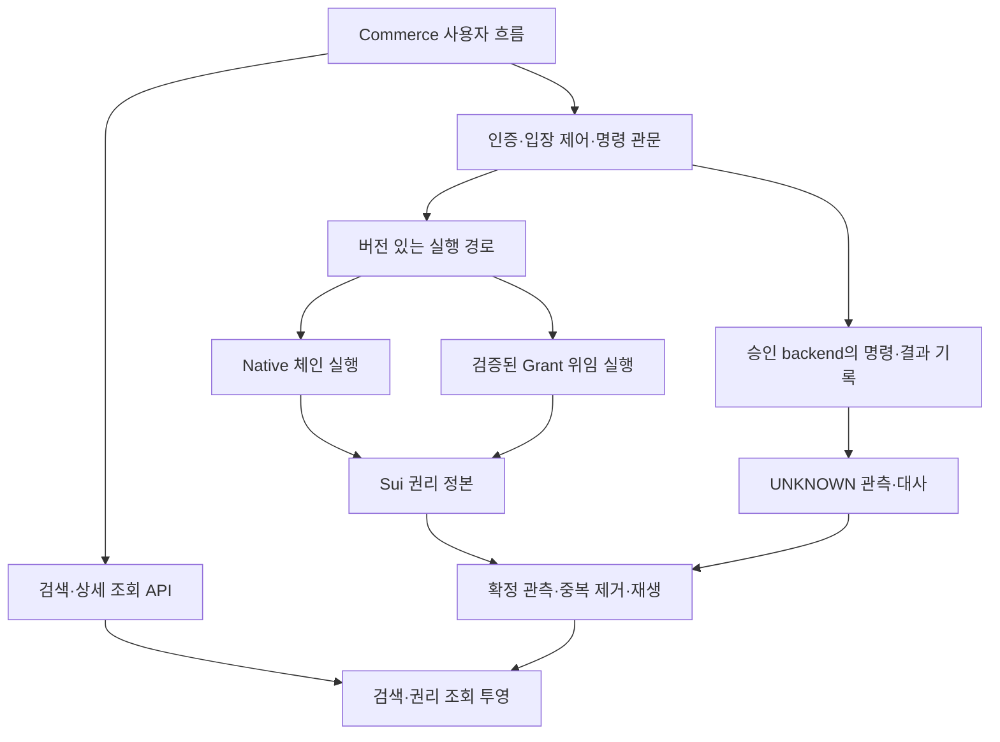

# KIX 플랫폼 전체 용량 확장 설계

2026-10-02 · 설계 제안 · 사용자 요청: “그 구조까지 설계해둬주겠니”.

목표는 **플랫폼 전체 100만 → 1,000만 → 3,000만 권리 규모**를 단계적으로 검증할 구조다. 숫자는 설계·시험 목표이며 실측 수용량이나 운영 보장이 아니다. 단일 공연 정원을 100만으로 올리는 요구와 구분한다. 이 문서는 구현, backend 채택, 프로그램 실행, 운영 배포를 승인하지 않는다.

## 1. 기준과 현재 구현

- 관측 main: `dd0a501248e092c2a4475088d94d7449b7bd98b5`.
- 설계 기반: PR #84 후보 `f4b79ce0d5cfbebc05b53118dd3d7ec83c8aff7f`. main에 병합된 구현으로 취급하지 않는다.
- [RS-PUBLIC-1](../../contracts/RIGHTS_SCALE_PROFILE.md): 공연당 정원 1..65,536, 독립 256슬롯 InventoryPage, 공연당 16 PaymentRefShard, 봉인 후 정원 고정. 기존 16슬롯 프로파일 보존.
- [검증 증거](../../../validation/2026-10-02-rights-scale/README.md): 새 Move 31개·기존 19개 시험과 단일 validator localnet의 1,024/16,384/65,536 정원 구성·끝 슬롯 발행 등. 전량 발행, 플랫폼 100만 권리, 동시 거래 처리량, 운영 장애 복구를 증명하지 않는다.
- 공개 권리 기능 후보와 별개로 비공개/ZK 확장, GA 자동 배정, 위임 실행, SDK/API/Commerce 연결은 미완료다.

이하 구조는 **제안**이다. 구현 사실은 위 기준과 기존 계약에 한정한다.

## 2. 용량의 단위

| 단위 | 정의 | 확장 방식 |
|---|---|---|
| 슬롯 | 한 공연 내 발행 가능한 재고 위치 | 공연 정원과 페이지 범위로 제한 |
| 권리 | 특정 슬롯·세대에서 발행된 소유·사용 대상 | 공연·권리별로 분산 |
| 리셀 매물 | 권리를 팔겠다는 게시 의사와 조건 | 권리와 연결된 별도 읽기 모델 |
| 활성 권리 | 현재 사용·이전 등의 대상인 권리 | 동시 보유량으로 측정 |
| 누적 발행/거래 이력 | 과거 세대와 종료 권리까지 포함 | 활성 재고와 별도로 보존·측정 |

100만 매물, 100만 활성 권리, 누적 100만 거래는 서로 다른 시험이다. 같은 권리를 여러 채널에서 게시할 수 있어도 유효한 매각 권한과 체결은 권리의 정본에서 배타적으로 통제해야 한다. 검색 결과 건수를 가용 재고로 사용하지 않는다.

현재 프로파일을 그대로 합산한 산술 예시는 다음과 같다. 공연 생성·봉인·발행 비용은 별도 측정한다.

| 시나리오 | 공연 수 | 공연별 정원 | 총 슬롯 | 총 페이지 | 결제 참조 샤드 |
|---|---:|---:|---:|---:|---:|
| S1 | 100 | 10,000 | 1,000,000 | 4,000 | 1,600 |
| S2 | 1,000 | 10,000 | 10,000,000 | 40,000 | 16,000 |
| S3 | 3,000 | 10,000 | 30,000,000 | 120,000 | 48,000 |

`총 페이지 = Σ ceil(공연 정원 / 256)`. 공연마다 마지막 페이지의 유효 범위를 검사하므로 페이지 여백은 판매 가능한 슬롯이 아니다. 총 슬롯을 먼저 256으로 나누면 공연별 여백을 놓친다. 페이지 수는 전체 온체인 객체 수가 아니다. 권리, 제어 객체, 결제 참조 항목과 이력이 추가된다.

## 3. 구성과 권위 경계

위임 경로와 승인 backend 기록은 미래 조건부 구성이다. 현재 가동 서비스라는 뜻이 아니다. Diagram의 체인 연결은 권한·정산 관계를 나타내며 위임 명령마다 동기 체인 쓰기를 강제하지 않는다.

- **체인:** 권리의 소유·세대·사용·취소 및 위임 권한의 정본. 로컬 HOLD, 검색 문서, 결제 완료 화면은 이 권위를 대체하지 않는다.
- **승인된 실행 backend:** 자기 권한 범위의 상태·불변 첫 결과·중복 제거 inbox·outbox를 내구 트랜잭션으로 기록한다. backend 미선정 상태는 구현 착수 BLOCKED이며 이 문서는 제품을 선정하지 않는다.
- **Commerce:** journey controller → adapter/generated SDK → 승인 관문으로 호출한다. UI 내부에서 경제 규칙이나 권리 권위를 새로 만들지 않는다.
- **검색·분석:** 정본을 투영한다. 경제적 쓰기를 하지 않는다. 검색·분석 장애가 정본 상태를 바꾸지 않는다.
- **결제·정산:** 외부 결제 사실과 권리 발행을 서로 다른 증거로 기록하고 대사한다. 검색 매출 합계가 정산 원장은 아니다.

## 4. 식별자와 분할

아래는 논리 식별 모델이다. 새 wire schema나 BCS 표현을 확정하는 문서가 아니다.

| 대상 | 필요한 식별 범위 | 규칙 |
|---|---|---|
| 재고 | network + package/profile + show + page + slot | 다른 네트워크·배포·공연과 충돌 금지 |
| 발행 권리 | 위 재고 범위 + generation + canonical right ID | 취소·재발행 시 과거 매물 재사용 금지 |
| 매물 | listing ID + right 참조 + listing revision | 채널별 게시와 매각 권한 분리 |
| 명령 | business scope + 인증 principal + client command ID | 라우팅 변경·재시도에도 동일 |
| 경로 | logical partition + placement version + authority epoch | 이전 작성자 fencing에 사용 |
| 투영 이벤트 | 원천 식별자 + 확정 위치 + 사건 순번 | 중복 수신에도 같은 결과 |

슬롯 generation, 매물 revision, 실행 authority epoch, UI context epoch는 서로 바꿔 쓰지 않는다. 명령 키에 payload hash를 넣어 다른 명령처럼 재시도하지 않는다. 같은 키에 다른 payload는 충돌이다.

분할은 3단계로 한다.

1. **공연:** 플랫폼에 공연을 추가해 전체 재고를 늘린다. 하나의 전역 mutable 재고 객체나 총판매 카운터를 거래마다 갱신하지 않는다.
2. **공연 내 페이지/경합 단위:** RS-PUBLIC-1은 256슬롯 페이지 단위다. 특정 페이지에 쓰기가 몰리면 서버 수를 늘려도 해당 정본 경합이 사라지지 않는다.
3. **오프체인 논리 partition:** 검색/투영은 공연·권리 범위로 분산하고 실제 저장 위치를 directory가 매핑한다. 실행 partition은 권한 단위에 맞춘다. 페이지 하나를 서버 하나·스레드 하나·Raft 그룹 하나로 고정하지 않는다.

`runtime/ONSALE_ADMISSION_CONTROL.md`의 native 지정석 계약은 좌석 단위 경합 cell을 기술한다. PR #84의 페이지 후보와 차이가 있으므로 **운영 채택 전 PS-01 ADR에서 적용 프로파일과 페이지↔좌석/행 매핑을 확정해야 한다**. 기존 계약을 이 문서로 덮어쓰지 않는다. GA는 불변 총정원과 분할 할당량 합계 보존을 별도로 검증하며 현재 공개 프로파일에 구현된 것으로 취급하지 않는다.

## 5. 리셀 거래 경로

1. 매물 작성 시 판매자·권리·generation·조건 revision을 연결한다. 게시 성공은 재고 잠금이나 판매 확약이 아니다.
2. 구매 관문에서 정본의 현재 소유자, 판매 가능 상태, 사용/환불/취소 여부, 기대 세대와 매물 조건을 확인한다.
3. 체결은 **권위 있는 조건부 상태 전이**로 하나만 성공시킨다. 조회 후 독립적으로 쓰는 check-then-write, Redis 잠금, UI single-flight만으로 이중 판매를 막았다고 주장하지 않는다.
4. 다중 채널 전용 판매 잠금이 필요하면 권위 있는 encumbrance/offer 규칙과 만료·해제 조건을 먼저 설계한다. 현재 Move의 공개 이전/리셀 기능만으로 전체 채널 잠금·결제 원자성이 완성됐다고 보지 않는다.
5. 외부 결제가 끼는 흐름은 별도 operation journal로 추적한다. 실패와 UNKNOWN을 구분하고, 불명확한 결과를 새로운 operation ID나 다른 결제 provider로 재실행하지 않는다.
6. 환불·사용·취소·재발행 사건을 매물 투영에 반영한다. 예전 generation 매물은 tombstone/비활성 처리하며 검색 갱신이 늦어도 체결은 정본에서 거절한다.

돈과 권리의 교환이 하나의 원자 트랜잭션으로 결합되지 않는 경로는 보류·관측·대사 상태와 사용자 표시를 계약으로 정의해야 한다. 자동 보상 쓰기로 UNKNOWN을 해소하지 않는다. 체인/PG 관측 결과를 연결한 확정 증거가 있어야 CONFIRMED로 바뀐다.

## 6. 검색·조회·인덱싱

검색은 최신성 지연이 있는 투영으로 운영하도록 설계한다. 상세 조회는 source cut, projection watermark, snapshot digest/참조, 현재성 상태를 제공한다. wall-clock 시간만으로 확정 위치를 나타내지 않는다.

- 확정 관측 → 검증 → inbox 중복 제거 → 투영 갱신 → watermark 이동 순서를 복구 가능하게 기록한다. at-least-once 수신을 전제로 하며 외부 전체 exactly-once를 주장하지 않는다.
- 역순 사건은 원천 권위 범위의 순서로 판별한다. 네트워크 간 높이나 서로 다른 shard cursor의 대소 비교로 전역 순서를 만들지 않는다.
- 재구축은 고정 source cut의 snapshot과 그 이후 delta를 잇고, 누락·중복·해시·건수를 확인한 뒤 읽기 alias를 교체한다. gap이 있으면 상태를 STALE/UNAVAILABLE로 노출한다.
- 페이지네이션 cursor는 query, 필터, 정렬, 접근 scope, snapshot에 결합한다. 대규모 결과는 안정된 keyset 경계를 사용한다. snapshot 만료 시 새 조회를 요구한다.
- 권리 소유자의 비공개 정보·결제 참조는 공개 검색 문서에 넣지 않는다. tenant/actor 접근 검사는 인덱스 필터에만 맡기지 않는다.
- 대기열 사용자는 버전 있는 공연 요약을 받는다. 입장한 사용자에게만 예산 내 좌석 snapshot/delta를 제공한다. 백만 항목 전체를 브라우저에 보내지 않는다.
- cross-shard export에 전역 일관성을 표기하려면 consistent cut과 관련 결정 증거가 필요하다. cursor 벡터만으로 atomic snapshot을 주장하지 않는다.

## 7. 집중 트래픽과 재배치

큐 길이, 승인된 입장 수, outstanding HOLD, cell/shard/provider별 요청·바이트·재시도·대기 시간을 제한한다. 결제 결과 관측, 취소, 환불, 복구가 신규 구매에 밀려 무기한 굶지 않도록 예산을 예약한다. 실패 응답 RPS를 구매 성공 TPS에 합산하지 않는다.

대기열 토큰은 공연·queue 위치·epoch·inventory mode·authority placement·shard·nonce·만료·key version에 결합한다. 재발급은 기존 위치와 소비 상태를 보존하고 이전 토큰을 terminal 처리한다. 공정성 증거는 샘플링하지 않되 metrics label에 권리 ID를 넣어 cardinality를 폭증시키지 않는다.

라우팅 재배치는 먼저 **검색/조회 partition**에서 시작한다. 복제/백필 → 일관성 확인 → placement version 교체 → 이전 경로 종료를 거친다. 읽기 재배치는 온체인 권리 이동이 아니다.

실행 작성자 이전은 별도 승인 backend의 fencing 기능과 계약이 전제다. 신규 입장 차단 → 기존 in-flight/UNKNOWN 보존 → 마지막 확정 cut 기록 → 이전 작성자 차단 증명 → 새 epoch 개시 순서를 검증한다. 이전 작성자 차단을 증명할 수 없으면 자동 승격하지 않는다. 다른 지역은 우선 읽기 복제본으로 두며 동일 권한 범위의 양쪽 지역 동시 쓰기를 허용하지 않는다. custom 복제·합의·log engine 구현은 본 제안에 포함하지 않는다.

## 8. 장애·보존·대사

| 상황 | 설계된 반응 | 재개 조건 |
|---|---|---|
| 검색 지연/중단 | 현재성 표시, 구매 시 정본 재검증 | gap 없는 replay와 watermark 확인 |
| 체인 제출 timeout | UNKNOWN 보존, 동일 거래/명령 관측 | 정본 확정 결과 또는 계약상 부재 증거 |
| PG 응답 유실 | 결제 중복 실행 차단, 관측·대사 | provider의 확정 사실과 명령 연결 |
| backend 장애 | 해당 권한 범위 신규 쓰기 차단 | 복구 cut·첫 결과·dedupe/outbox 검증 |
| 이전 작성자 재등장 | epoch/fence 검증 실패로 거절 | 유효한 현 작성자만 수용 |
| 인기 페이지 과부하 | 해당 범위 입장 감축 | 큐·최고 지연·복구 backlog 예산 회복 |
| 공연 취소 | 현재 제어 상태로 새 거래 차단 | 별도 환불·대사 계약 이행 |

복구 우선순위는 권리·자금 불변식, UNKNOWN 관측, 조회 회복, 신규 판매 순으로 예산을 설정하되 운영 SLO에서 최대 대기 시간을 정한다. 자산별 정확한 정수 금액·registry 단위를 유지하고 환산 가격으로 보존식을 대신하지 않는다.

누적 payment reference, 명령 첫 결과, 영수증, dedupe 증거는 활성 슬롯보다 계속 커질 수 있다. cold archive도 검증·조회 경로와 retention 계약을 갖춰야 한다. 오래됐다는 이유로 삭제/GC하거나 안전성 증거 보존 잠금을 해제하지 않는다. 저장 추정은 `N_active × B_current + N_history × B_history + N_operations × B_receipt + index/replica overhead`로 하며 B와 증폭률은 실측한다.

## 9. 검증 계획과 통과 기준

용량 N, 동시 입장 C, 명령 도착률 R, 체결 성공 TPS, 읽기 QPS, 지연, 비용을 별도 축으로 측정한다. 목표 N만으로 TPS를 약속하지 않는다. [워크로드](workload_profiles.json)는 합성 시험 입력이며 운영 SLO가 아니다.

- **L0 산술/계약:** S1~S3 페이지·정원 계산, 식별 범위, 세대/명령/라우팅 버전 분리 확인.
- **L1 조회 규모:** 100만부터 단계적으로 합성 projection을 적재하고 검색·백필·snapshot 페이지네이션을 시험. 온체인 100만 발행으로 표기하지 않는다.
- **L2 권위 통합:** 고정 producer/schema/SDK tuple, 승인된 local backend와 Move localnet에서 체결·취소·환불·재발행·중복 요청·관측 유실 검증. 직접 체인 경로와 위임 경로를 별도 보고한다. 미구현 경로는 BLOCKED로 남긴다.
- **L3 혼잡/장애:** 균등, 90% 단일 공연, 90% 단일 페이지, 90% 단일 권리 경쟁을 각각 시험한다. 분산 평균이 hot key의 실패를 가리지 않게 한다. crash/restart, 역순/중복 이벤트, 인덱스 재구축, 이전 writer 재등장도 포함한다.
- **L4 운영 전 검증:** 승인된 환경에서 실제 권리 수·활성 매물 수·이력량·체인 비용·분포·지속 시간을 기록한다. production 규모 주장은 이 단계의 해당 경로 증거 뒤에만 가능하다.

필수 안전 기준: 이중 판매/초과 발행 0, 자산별 대사 불일치 0, 유실된 UNKNOWN 0, stale generation 수용 0, 승인 범위 밖 쓰기 0. 관측 기간·분모·검사 oracle을 함께 기록해야 한다. p95/p99, 오류율, recovery 시간, 인덱스 지연, 비용 상한은 시험 전 책임자가 숫자로 확정한다. 미정이면 성능 수용 판정은 BLOCKED다. 높은 reject 처리량은 이 기준의 대체물이 아니다.

## 10. 실행 전 남은 결정과 출처

[후속 계획](DELIVERY_PLAN.md)은 제안이며 기존 118개 노드에 자동 추가되지 않는다. 핵심 미결정은 경합 단위 ADR, backend 선택/게이트, listing/체결 계약, 환경별 수용 기준, 증거 보존 정책이다. 65,536 초과 단일 공연이 필요해지면 별도 프로파일과 용량·원자성 시험을 거친다. 일반 중고상품까지 범위를 넓힐 경우 공연 슬롯을 그대로 강제하지 않고 상품·개체 재고 모델을 별도 계약으로 정의한다.

이 설계의 근거는 다음 고정 저장소 자료다. 소스 계약의 승인·잠금이 이 제안에 우선한다.

- [개발계획](../../DEVELOPMENT_PLAN.md), [권위 모델](../../decisions/AUTHORITY_MODEL_1.md).
- [입장 제어](../../../runtime/ONSALE_ADMISSION_CONTROL.md), [인증된 export](../../../runtime/AUTHENTICATED_EXPORT.md).
- [Protocol 적합성 설계](../../aiops/PROTOCOL_COMPLETION_DESIGN_KO.md), [Finance 설계](../../aiops/FINANCE_COMPLETION_DESIGN_KO.md).
- [Commerce 설계](https://github.com/BeautifulMind-JT/kix-commerce/blob/b0217cc9e92cc87813f6ce6724632699d400eb3a/docs/aiops/COMMERCE_PRODUCT_EVOLUTION_KO.md): context tuple fencing, UNKNOWN 후 쓰기 차단, 표시와 경제 권위 분리.
