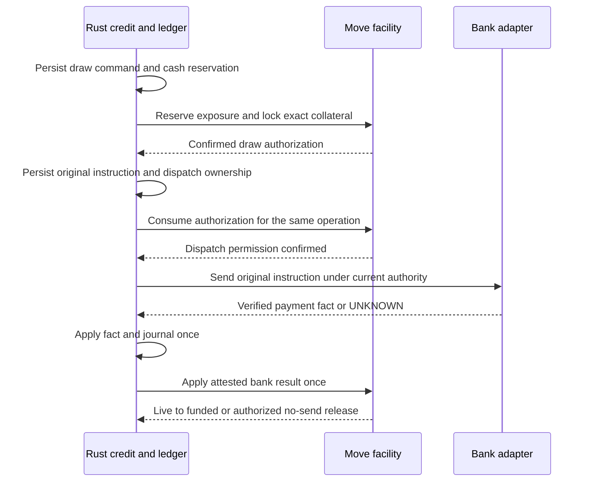

# 체인·경제 원장·은행 사이의 권위와 연결 계약

상태: **신규 설계 제안**, 구현 전 아키텍처 검토 대상. 이 문서는 통합 청사진 내부의 명칭·수량 통제·실행 순서를 통일한다. 승인된 기존 Model 1 및 LC-FACT/CUT/TERM을 재정의하지 않는다.

## 1. 공통 명칭과 중복 계상 금지

| 공통 명칭 | 논리 의미 | 표현·대조 규칙 |
|---|---|---|
| SettlementClaim | 원천 계약/배분에 근거한 특정 정산채권 | canonical origin, 실제 creditor/debtor, asset, amount, defenses, source cut. 원장 근거와 chain root가 같은 identity를 참조 |
| ReceivablePosition | SettlementClaim의 정확한 부분을 표현하는 제한형 Move 토큰 | root+slice+잔여액+owner. root 원금과 position 원금을 두 자산으로 더하지 않음 |
| Encumbrance | position/slice에 설정한 부담 | canonical position이 처리하는 동일 부담 레코드. 독립 token을 mint했다는 이유만으로 효력 발생 금지 |
| CreditFacility / FacilityPosition | 전자는 계약상 약정, 후자는 승인된 한도·인출예약을 집행하는 체인 표현 | 계약 버전과 onchain object identity 1:1 결합. 둘의 한도를 각각 사용하지 않음 |
| CreditPosition | funded 대출채권과 그 대주 몫의 제한형 표현 | 실제 은행 지급 facts와 대응 대출채무, funded/live 잔액을 대조. 소유만으로 은행잔고 생기지 않음 |
| CapitalInterest | 장래 다수 자본 공급자의 참여지분 표현 | 최초 상품 필수 아님. 해당 CreditPosition을 참조하며 별도 신규 원금처럼 합산 금지 |
| BankInstructionAuthorization | 특정 draw/refund/payout를 한 번 실행하도록 결합한 권한 | 원 intent/operation과 연계. 체인에서 소비했어도 은행 성공은 별도 |
| ShowControl / RightControl | 행사 취소/거래 세대 및 특정 권리 재발급 현재성 | 실 객체명 제안. API의 EventControl은 ShowControl에 대응하는 논리 이름 |

하나의 claim을 token으로 표현한 뒤 offchain 원천을 다시 token화하지 못하게 `canonical origin → issued portions` registry를 둔다. 같은 금융 권리를 다른 package/network에서 중복 발행하지 않는 범위도 issuer policy가 선언한다. 초기에는 단일 승인 network/package family만 허용한다. bridge·타 체인 담보는 별도 계약 없이는 받지 않는다.

## 2. 금융에서 한도가 두 군데 독립 실행되지 않게 한다

이번 **토큰 집행형 여신 제안**에서는 다음처럼 맡는다.

- **Move:** 등록된 position 처분·담보 중복·facility 인출권한 총량을 집행하는 단일 chain 상태. 금융 token을 유효하게 바꾸려면 이 경계를 지나야 한다.
- **Rust:** 계약·권한·적격성 계산, 외부 사실 검증, 법인별 경제 원장, 실제 현금 예약, intent와 진행 상태를 보존한다. chain 한도 mirror만으로 새 draw를 독립 허가하지 않는다.
- **은행:** 실제 입출금 사실. 실제 지급이 확인되면 chain projection 반영이 늦어도 그 채권·채무 사실을 버리지 않는다. 원장에서 사실을 기록하고 chain 적용 대기로 남긴다.

facility별 chain `funded + live reservations + counted exposure ≤ authorized limit`를 검사한다. 현금은 별도의 실제 지급 주체/account scope에서 예약한다. 모든 티켓 명령이 금융 facility 객체를 쓰지는 않는다.

정산채권 적격액과 위험평가의 원자료는 온체인에서 완전히 검증할 수 없다. 허용된 attestor가 source cut·목적·amount·expiry·policy를 서명한 versioned valuation을 제출한다. 취소/차지백/외부부담 발견 시 정정과 draw freeze를 전파한다. **발견 전 외부 위험·attestor 오작동까지 chain이 없애지는 못한다.** 데이터 신선도 상한·새 지급 전 조회·oracle 지연/장애 시 새 위험 중단·독립 한도·손실 부담을 금융 계약으로 고정한다. 그 수치는 아직 미정이다.

## 3. 선지급 한 건의 정확한 순서

핵심은 모든 단계가 하나의 ACID라고 부르지 않는 것이다. operation과 reservation을 먼저 내구 기록하며, 각 단계가 중단돼도 이전 결과를 조회·복원해 이어간다. `authorization consumed`는 송신 승인 단계다. facility freeze가 이미 노출된 은행 요청을 되돌리지 못한다.

| 중단 지점 | 유지할 상태 | 복구와 금지 |
|---|---|---|
| cash 예약 후 chain 준비 전 | 예약·원요청·결과 | chain 미생성 확인 뒤 정책에 따른 해제 가능; 이미 생긴 authorization 여부를 먼저 대조 |
| chain 준비 성공, 로컬 응답 유실 | chain live exposure + local intent | origin operation으로 chain 사실 조회, 새 draw ID 생성 금지 |
| 권한 소비 후 은행 송신 전 crash | live exposure·현금 예약·미결 intent | 유효 sender fencing과 미송신 증거가 있으면 승인된 abort; 단순 기록 부재는 증거 아님 |
| 은행 송신 뒤 응답 유실 | UNKNOWN + live exposure·현금 예약 | 원 operation 조회/동일 요청 계약상 재전송. 새 key/수취인/계좌로 재지급 금지 |
| 은행 성공, chain 적용 지연 | 원장 funded·chain pending reservation | 합계 노출은 보수적으로 유지; 확인된 사실 누락 금지. chain 반영만 재시도 |
| 늦은 성공이 freeze/취소 뒤 도착 | 실제 지급 사실·채무/회수 사건 | 과거 송신 권한과 현재 새 명령 허가 구분. 사실 수용이 새 draw 허용은 아님 |
| 재평가로 한도 부족 | 실제 funded·기존 live 유지 | 신규 인출만 차단, cure/회수/고객 환불 처리 지속 |

한도를 회수하는 조건은 상태별이다. **관측 슬롯 해제/운영 사건 종결과 credit exposure 소멸을 동일시하지 않는다.** LC-TERM이 허용한 인계/회수는 따르되, 미해결 외부 지급위험은 별도 contingent exposure/준비금으로 남겨야 한다. 계약이 승인한 위험 인수·재원·허용 조치 없이 UNKNOWN exposure를 0으로 만들지 않는다. 모든 상태를 무기한 메모리에 두는 것으로 대체하지 않는다.

## 4. 수금과 담보 해제 순서

1. 은행 입금 fact와 미배분금을 보존한다. 어떤 채권의 회수인지 미확인하면 suspense다.
2. 원천 미수 → 수취 현금 전환과 중복효과 방지를 원장 transaction으로 적용한다.
3. 그 원천에 대한 새 draw/양도/해제를 제한하고, chain receivable cut와 현금담보/상환 전이를 적용한다.
4. 같은 수취액을 원금·이자·수수료·환불·다른 수익자에게 배분할 때 총합을 검증한다. 실제 지급 가능한 cash와 계약상 payable을 구분한다.
5. chain/live·원장·은행의 source positions가 맞은 뒤 추가 차입 가용액을 갱신한다. 대사 중에는 오래된 claim과 새 cash를 동시에 담보로 세지 않는다.
6. 계약상 payoff·분쟁·다른 부담·법적 해제 요건을 확인하고 **해당 Encumbrance만** 해제한다. 원래 금융 사실과 과거 proof는 남긴다.

offchain 회수 사실을 chain에 등록하기 전의 시간차 위험을 줄이기 위해 지급 전 fresh quote/valuation/currentness가 필요하다. 어떤 형태든 외부 금융기관과의 증거·계좌 통제 없이 trustless 원화 정산이라고 표시하지 않는다.

## 5. Token 수명과 정정

`issued → active → partially settled → settled/retired` 같은 상태와 `encumbered / disputed / paused` 같은 제한은 구분한다. 상환으로 0이 된 토큰을 burn하더라도 origin registry의 재발행 차단과 감사 이력은 유지한다. 기록 수명/압축은 별도 승인 계약이다.

`retire(cancelled)`는 자유로운 채무 소각 함수가 아니다. 실제 취소/소멸/면제·오류 정정의 원인, 영향을 받는 소유자·담보권자, 권한·법적 증거와 대체 기록을 검증한다. 원장 정정은 reversal+new entry이며 이미 지급된 현금을 token수정으로 되돌린 척하지 않는다.

담보가 붙은 receivable의 split/merge는 원본을 소비하며 자식에 정확한 부담을 배정한다. 부담 부분을 빼내 free child로 만드는 것을 금지한다. debt token의 holder와 customer Right holder는 분리한다. 담보 회수는 고객의 AdmissionRight를 가져오는 함수가 아니다.

## 6. 배포 전에 닫아야 할 선택

| 선택 | 본 설계의 권고 | 남은 결정/증거 |
|---|---|---|
| 금융 법적 형태 | 기관별 기명 facility 우선 | 대출/채권매입/중개/servicing 역할, 계약·인가 검토 |
| 환불 재원 | 실제 통제계좌와 계약상 준비금·추가 손실부담 | 보관 주체/계좌 권한/부족시 제공자/도산 영향 |
| 금액 제약 집행 | chain position/한도, Rust 현금/원장, 각각 단일 권위 | 단계별 currentness·실제 장애·일치성 시험 |
| attestor | 지급·법률·정산/평가 권한 분리 | 운영 주체/키 custody/철회/오류·공모 위험과 책임 |
| 토큰 양도 | 제한형 module transfer | 수취인 요건, 법적 양도 효력/통지·동의 evidence |
| 별도 KIX 코인 | 목적·보유권·가치귀속부터 별도 설계 | 발행량·분배·규제·유통·보안은 아직 미정 |
| 기술 backend | 기성 후보의 동일 보장 비교 | 성능/장애/비용·운영 책임·채택 결정 |

이는 미해결 입력을 숨기지 않고 구현자가 임의로 결정하지 못하게 하는 목록이다. 모의 자금·localnet·설계 검증은 실금전 계약 마감을 기다리지 않고 별도 허용 Task로 진행할 수 있다.
