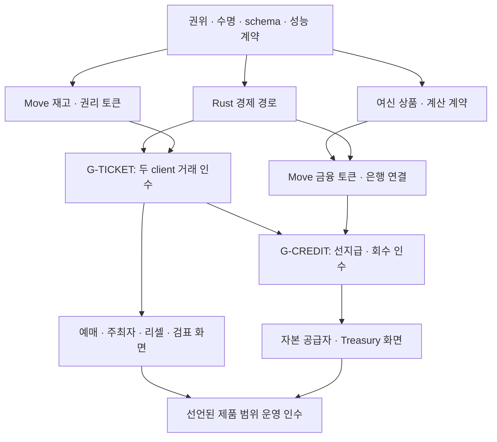

# KIX 통합 청사진 — 실행 순서와 인계 계약

버전: 1.0 제안 · 정리: 2026-09-23 · 기준 main: `6dbf8dfed6ee790e2ee56b49a75b727edd9db977`

**예매·리셀·마케팅과 정산·신용·Sui 토큰화를 하나의 제품 목표로 관리하되, 구현은 검증 가능한 권위 경계별로 나눈다.** 아래 FS 번호는 계획상의 작업 묶음이다. 현재 발행된 Task, 승인된 코드 변경 범위, 자동 dispatch 입력이 아니다. 저장소 `docs/DEVELOPMENT_PLAN.md`, `AGENTS.md`, `TASKS/TEMPLATE.md`, `RUNBOOKS/DISPATCH.md` 및 이미 승인된 계약이 계속 적용된다. 기존 BP 계획과의 대응은 `TASK_CATALOG.json.previous_blueprint`에 남긴다.

## 1. 먼저 결정하고 바로 준비할 것

| 지금 할 수 있는 일 | 산출물 | 확정해야 다음 구현에 쓰는 입력 |
|---|---|---|
| 기존 감사·승인·잠금 상태를 정확한 SHA로 정리 | FS-00 기준표 | 어느 계약과 audit가 어느 head에 적용되는지 |
| 금융 파트너와 상품·계좌·원천 채권 계약 설계 | FS-01 여신 조건표 | 대주/차주/수취인, 법적 형태, 부담 순위, 환불 부족분 담당 |
| 거래·위임·금융 identity 및 schema 설계 | FS-02 schema/API 제안 | origin ID, 명령/operation 구별, canonical wire, 권한 |
| 수명·회수·증거 인계 계약의 구현 전 정리 | FS-03 인수표 | 이미 승인된 LC-FACT/CUT/TERM 연결, 아직 허용되지 않은 변경 범위 |
| 현실 workload와 ACK·장애·비용 기준 작성 | FS-04 비교 규격 | 성능 목표 수치, 지연·실패 허용, 운영 인력과 비용 |

성능 목표는 아직 확정하지 않는다. `Rust/Polars/DuckDB/cuDF를 사용한다`는 선택만으로 처리량을 보증하지 않는다. FS-04의 본 비교·채택은 FS-02/03의 의미론과 장애 계약을 입력으로 받는다. workload 조사와 측정 계획 작성은 그 전에 병행 가능하다. 기존 PostgreSQL, TiKV, FoundationDB, TigerBeetle 등은 필요한 기능에 맞춰 후보를 추린다. 금융 원장 제품을 전체 주문·재고 저장소와 무조건 동급으로 비교하지 않는다. R2/자체 복제·저장·로그 개발은 본 청사진에 의해 허용되지 않는다.

## 2. 제품과 프로토콜을 분리한 인수 경로



**G-TICKET**은 UI 없이 Rust CLI와 독립 TS client로 구매·결제·관람권 발행·취소/환불을 검증한다. 두 client가 같은 서버 구현을 사용하는 것은 가능하지만 SDK가 서로의 직렬화 결과를 복사한 것을 독립 wire 검증으로 세지 않는다. 실제 체인 effects, 모의 PG/은행 사실, 경제 원장·증거·재시작 결과를 함께 대사한다. 공식 리셀/검표/무료·묶음/할인은 이후 각각의 계약 인수를 추가한다.

**G-CREDIT**은 기관별 facility 1개·공연 1개·원화의 모의 자금 경로에서 채권 근거→한도→담보/노출 예약→선지급→회수→배분→부담 해제를 검증한다. 한정 fixture가 통과했다는 사실을 범용 여신이나 실금전 운영 완료로 표시하지 않는다. 정상 회수 외에 공연 취소, 지급 UNKNOWN, 뒤늦은 성공, 환불 재원 부족, 연체/부도도 포함한다. 자본 공급자 포털의 완성을 기다릴 필요는 없다.

**플랫폼 인수**는 위 계약을 실제 사용자 역할·화면·API에 연결한다. 화면 mock 성공, protocol fixture 성공, 모의 파트너 통합, 실제 운영 계약은 각각 다른 증거다. FS-23은 선언한 제품 범위만 출시 대상으로 삼고, 아직 연결하지 않은 기능은 명시적으로 비활성으로 둔다.

## 3. 제안 작업 목록

담당 표기는 이해와 병렬 작업 계획을 위한 **후보**다. 현행 AGENTS의 Devin 단일 owner, Grok relay 권한은 바뀌지 않는다. `GROK_BUILD`는 이 표에서 가정한 별도 엔지니어링 실행자 이름이며 현행 `GROK` dispatcher에 구현 권한을 부여하지 않는다. GLM도 현재 허용 역할 안에서만 참여한다. 다른 builder를 정식 owner로 쓰려면 기존 권한 계약에 따른 명시적 지정이 필요하다. 이미 유효한 지정이 있으면 중복 승인 절차를 만들지 않는다.

| ID | 산출물 묶음 | 후보 builder | 선행 완료 |
|---|---|---|---|
| FS-00 | 정본·통합 계약과 인수표 | GLM | 없음 |
| FS-01 | 금융상품·계좌통제·법률 조건 | DEVIN | FS-00 |
| FS-02 | identity·schema·API·capability | GROK_BUILD | FS-00 |
| FS-03 | 수명·회수·색인과 효과 계약 | DEVIN | FS-00 |
| FS-04 | 성능 계약과 backend 비교·선정 | GROK_BUILD | FS-00, FS-02, FS-03 |
| FS-05 | 영속 명령·주문·예약·의도 기반 | DEVIN | FS-02, FS-03, FS-04 |
| FS-06 | 결제·원장·환불·현금 보존 | GROK_BUILD | FS-05 |
| FS-07 | 재고·grant·관람권 토큰 | DEVIN | FS-02, FS-03 |
| FS-08 | Rust Sui signer·effects·미확정 인계 | GROK_BUILD | FS-05, FS-07 |
| FS-09 | 두 독립 SDK/client 적합성 | GLM | FS-02 |
| FS-10 | 예매·주최자·운영 포털 | GLM | FS-02, FS-06, FS-08 |
| FS-11 | 거래 종단 인수 G-TICKET | DEVIN | FS-06, FS-07, FS-08, FS-09 |
| FS-12 | 적격채권·한도·회수 계산 계약 | GLM | FS-01, FS-02 |
| FS-13 | Move 채권·여신·담보 토큰 | DEVIN | FS-07, FS-12 |
| FS-14 | 여신 원장·chain·은행 orchestration | GROK_BUILD | FS-05, FS-06, FS-12, FS-13 |
| FS-15 | 자본 공급자·심사·Treasury 포털 | GLM | FS-12, FS-14 |
| FS-16 | 선지급·회수 종단 인수 G-CREDIT | DEVIN | FS-11, FS-13, FS-14 |
| FS-17 | 공식 리셀·판매자 지급 | GROK_BUILD | FS-11 |
| FS-18 | 무료·묶음·할인·다중자산 | DEVIN | FS-11 |
| FS-19 | 검표·프라이버시·키 복구 | GROK_BUILD | FS-07, FS-08, FS-11 |
| FS-20 | 인증 export·CPU 분석·SQL 대사 | GROK_BUILD | FS-05, FS-06 |
| FS-21 | 선예매·쿠폰·리워드·CRM | GLM | FS-10, FS-18, FS-20 |
| FS-22 | AI capability·선택 GPU·자체토큰 검토 | GROK_BUILD | FS-16, FS-20, FS-21 |
| FS-23 | 운영 격리·보안·복구·제한 출시 | DEVIN | FS-10, FS-15, FS-16, FS-17, FS-19, FS-20 |
각 행의 구체적인 deliverable, acceptance, 금지 범위는 [TASK_CATALOG.json](TASK_CATALOG.json)에 있다. 한 행이 여러 성격의 변경을 포함하면 발행 전에 작은 Task로 나눈다. 특히 FS-22는 AI 권한, native GPU 실측, 별도 KIX 코인 설계를 **세 작업으로 분리**한다. 한 Task의 두 writer를 만드는 방식으로 병렬화하지 않는다.

## 4. 병렬 작업과 변경 충돌

- 권위·schema·수명 계약을 공유 입력으로 고정한 뒤 Rust 거래 경로, Move 객체, 여신 기준 계산을 각자 구현할 수 있다.
- API schema와 read model이 고정되면 화면 제작을 병행할 수 있다. mock 서버를 사용한 화면에는 mock 상태를 표시하고 실제 지불·발권 완료라고 표시하지 않는다.
- 공유 schema를 바꾸는 Task는 version과 소비자 영향을 함께 다룬다. 소비자 Task가 조용히 로컬 변형을 만들지 않는다.
- Move 금융 객체와 은행 orchestrator는 `CROSS_BOUNDARY_CONTRACTS.md`의 동일 origin/operation과 실패 상태를 공유한다. 두 작업의 성공 기준을 따로 낮추지 않는다.
- branch별 허용 파일 범위를 나누고, 선행 PR이 병합되면 새 base에서 관련 인수만 다시 검증한다. 다른 base의 green CI를 승계하지 않는다.

한 작업 owner는 승인 범위 안에서 조사→구현→시험→실패 분석→수정→재시험을 자율적으로 진행한다. 일반적인 구현 선택마다 계획 승인을 요청하지 않는다. 권위·업무 불변식·wire schema·금융 의미론·운영 위험의 변경은 원래 Task 범위를 벗어나는지 판단하고 저장소 절차를 따른다. 실패 횟수만으로 중단하거나 다른 writer를 자동 추가하지 않는다.

## 5. 모든 builder에게 주는 동일한 Task 입력

아래는 업무 내용 체크리스트다. 실제 발행 파일은 현재 `TASKS/TEMPLATE.md`의 정확한 형식을 사용한다. 이 예시를 두 번째 control-plane schema로 구현하지 않는다.

```text
TASK: <canonical task ID / GitHub pointer>
OWNER: <one configured owner>
BASE: <full SHA and dependent merged commits>
AUTHORITY: <existing User decisions / contracts / allowed scope pointers>
GOAL: <one observable result>
SCOPE: <allowed paths and behaviors>
FROZEN: <paths + exact Git blob IDs>
INPUTS: <schema/policy/version/source fixtures/provider contract>
INVARIANTS: <the exact invariants affected by this task>
ACCEPTANCE: <normal, boundary, identity, causal, concurrency and recovery cases>
NON_GOALS: <only relevant prohibited changes>
EVIDENCE: <head, tree/blobs, raw commands and results, artifact digests, CI>
AUDIT: <repository-required independent gate; author cannot self-pass>
DELIVERY: <draft PR + exact limitations + unresolved decisions>
```

계승한 한국어 계약의 의미를 임의로 번역·축약하지 않는다. 명령의 첫 결과와 현재 상태, 결제 사실과 운영 종결, 토큰 보유와 법적 권리, bank transfer와 chain effect를 각각 구분한다. 숫자가 필요한데 아직 없는 항목은 `UNDECIDED`와 결정 책임자를 적는다. 추측한 금리·haircut·SLO·한도를 production 상수로 채우지 않는다.

## 6. 증거를 만드는 방식

| 대상 | 필요한 증거 | 충분하지 않은 것 |
|---|---|---|
| identity/멱등성 | 동일 command·payload 최초 결과, 다른 payload 충돌, 권한 이동 뒤 재시도 | command 수만 같음 |
| no-op/replay/error | 해당 계약이 요구한 정확한 pre/post 상태 불변성 | count 비교나 kernel/model의 같은 실수 |
| 순서가 본질인 계약 | 같은 order·operation의 원인부터 종료까지 trace-local anchor | 다른 seed의 클래스들을 합쳐 순서 충족 주장 |
| 외부 사실 | raw evidence 보존→검증→정규화→경제 효과의 연결 | event ID만 dedupe |
| 금융 보존 | 원천/노출/현금/분배의 금액식과 journal 대사 | 화면 잔액 또는 Move 잔액만 맞음 |
| Move 정책 | 직접 호출·대체 transfer·구 control·구 grant·replay·동시성 공격 | wrapper 정상 경로만 성공 |
| 장애/재시작 | commit·송신·응답 전후 중단과 실제 복구 결과 | 모의 함수에서 성공 상태로 변경 |
| 성능 | 같은 ACK·내구성·안전 보장, workload별 goodput/p99/queue/자원/오류 | 최고 TPS만 제시하거나 fallback 은폐 |

R1 v4 잠금과 Task 003 계열의 역사적 증거는 보존한다. 오래된 PR 판정을 새 head에 그대로 승계하지 않는다. read-only review와 변경 작성자가 수행한 자체 검사는 구분한다. property 모델은 source-informed 여부를 밝히고, 독립 모델이라는 이름만으로 인과·경계·identity coverage를 면제하지 않는다.

모든 제출은 base/head를 full SHA로 쓰고 코드 파일은 Git blob ID를 함께 낸다. local 실행과 원격 CI를 구분하며 run id·실제 head_sha·상태를 기록한다. synthetic merge ref를 head mismatch라고 오판하지 말고 tree/base 관계를 확인한다. 실행 중은 실행 중, 미실행은 미실행이다. 증거 artifact의 SHA-256과 원본/수정본 파일을 대조해 첨부 불일치를 막는다.

## 7. 정량 계획과 릴리스 판단

전체 개발기간을 Rust crate 수로 추정하지 않는다. FS-00/01/02/03/04의 확정 산출물에서 작은 발행 Task별로 1인 개발일·외부 대기·리뷰 일정을 산정한다. 현재에는 backend, 기관 계약, SLO, 실제 어댑터 접근과 팀 배정이 미정이므로 전체 완료일을 제시하지 않는다. 명시적 종료조건을 통과한 비율과 남은 장애 시나리오로 진척을 측정한다.

릴리스 범위마다 다음을 연결한다.

1. 인수한 protocol/schema/package와 정확한 SHA·Move package/version.
2. source와 일치하는 build/dependency lock, 서명·배포·키 custody.
3. tenant·operator·signer·partner 권한과 외부 지급 한도.
4. backup/restore·old writer fencing·미확정 작업 인계·증거 보존.
5. 동일 보장의 workload별 성능, 제한 부하에서의 관측·취소·회수 여유.
6. 파트너 및 금융 계약, 법적 효력, 환불/손실 재원과 실제 운영 책임.
7. 해당 범위의 비작성자 검토 및 저장소가 요구하는 독립 감사.

금융과 Move 토큰화는 마지막에 붙이는 화면 기능이 아니다. 계약·identity·정산채권 원천·수량 제약을 초기에 설계하고, 실제 활성화는 각각의 인수와 운영 조건을 갖춘 범위로 제한한다. 본 문서는 구현 완료, 실금전 준비, 성능 우위, 법적 효력, 형식 검증을 주장하지 않는다.
