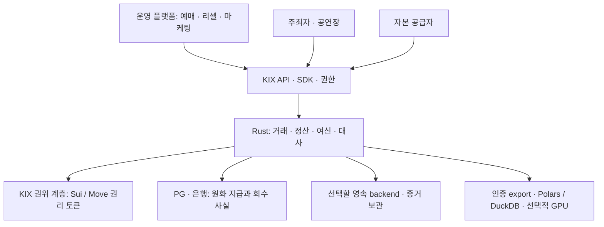

# KIX — 운영 플랫폼·권리 토큰화·정산·여신 통합 청사진

문서 버전: 1.0 제안 · 작성: 2026-09-22 · 정리: 2026-09-23

**목표: 예매·공식 리셀·마케팅 플랫폼이 KIX의 권리·정산·신용 계약을 공통 사용하고, Sui/Move가 토큰화된 권리와 제약을 실제로 집행하는 구조를 만든다. 자본 공급자는 승인된 여신을 집행·회수하고, 주최자·공연장은 계약에 따라 선지급과 잔여 정산금을 받는다.**

이 폴더는 사용자가 제시한 운영 플랫폼 / KIX 정산·신용 계층 / 주최자·공연장 / 자본 공급자 / Sui·Move 그림을 구현 가능한 경계로 확장한 **설계 제안**이다. 기존 `docs/DEVELOPMENT_PLAN.md` 및 승인 계약의 효력을 변경하지 않는다. 제품 코드·커널·배포·실자금·자동화 활성화 승인이 아니다.

## 한눈에 보는 구조

그림의 Sui/Move는 외부 로그 보관 서비스가 아니라 **KIX 권위 계층**이다. 관람권·재고 원권위는 승인된 Model 1을 따른다. 원화 계좌, 외부 채권계약, 실제 공연 이행은 체인이 자동 보증하지 않는다. 둘 사이의 결합과 실패 처리가 이 설계의 대상이다.

## 반드시 분리할 네 가지 권리

| 대상 | 의미 | 설계상 책임 |
|---|---|---|
| AdmissionRight | 구매자의 입장·이전·사용 권리 | Move가 발행/소유/정책/소비를 집행 |
| SettlementClaim | 주최자 등에게 귀속되는 정산채권 | 실제 채무자·근거·금액·법적 요건과 결합한 제한형 토큰 표현 |
| CreditPosition | 자본 공급자의 대출채권 또는 별도 승인된 금융 포지션 | facility·채무자·잔액·회수·양도 제한과 연결 |
| Encumbrance | 특정 정산채권에 설정된 담보/처분 제한 | 동일 채권 중복 사용 방지와 승인된 해제; 관람권에 전가하지 않음 |

KIX 명칭의 별도 유틸리티/거버넌스 코인, 공개 금융 pool, 토큰증권 유통은 위 객체의 존재로 자동 승인되지 않는다. 장래 확장 지점과 결정 항목은 보존한다.

## 읽는 순서

1. [SYSTEM_BLUEPRINT.md](SYSTEM_BLUEPRINT.md) — 권위, 시스템 모듈, 업무·자금 흐름, 불변식.
2. [SUI_TOKENIZATION.md](SUI_TOKENIZATION.md) — Move 객체/권한/토큰 수명, grant, 서명, 취소·복구.
3. [CREDIT_FACILITY.md](CREDIT_FACILITY.md) — 적격채권·차입 한도·집행·회수·손실·원장.
4. [OPERATING_PLATFORM.md](OPERATING_PLATFORM.md) — 사용자별 화면, API, 업무 권한과 운영.
5. [CROSS_BOUNDARY_CONTRACTS.md](CROSS_BOUNDARY_CONTRACTS.md) — 체인·은행·원장 사이의 소유권, 승인, 실패와 복구.
6. [DELIVERY_WORKFLOW.md](DELIVERY_WORKFLOW.md) — 개발 단계, builder 인계, 증거와 종료조건.
7. [TASK_CATALOG.json](TASK_CATALOG.json) — 제안 작업별 의존성·범위·인수 조건. 직접 dispatch 금지.

## 첫 인수 두 경로

- **거래 경로:** 두 독립 client에서 구매 → 검증된 결제 → 관람권 토큰 발행 → 취소/환불을 정상·장애 상황에서 대사. 공식 리셀과 검표는 후속 종단 인수로 확장한다.
- **여신 경로:** 검증된 정산채권 → 한도 산정/승인 → 담보 부담 설정 → 자본 공급자의 선지급 → 수금 → 상환/잔여 분배 → 부담 해제를 대사. 취소·차지백·부도 시에도 구매자 권리와 자금 부담을 구분.

첫 여신 구조로는 **허용 업무가 확인된 금융 파트너의 특정 facility + 원화 지급통제 구조**를 권고한다. KIX가 자체 대부업자/수탁자/증권 발행인이라는 가정은 두지 않는다. 법적 형태는 아직 채택 전이며 실제 파트너·계약 검토가 필요하다.

## 기존 계획과의 관계

설계 출발점은 main `6dbf8dfed6ee790e2ee56b49a75b727edd9db977`이다. 현재 Rust 5개 crate·R1 v4·BCS·검증 자산을 계승하며 영속 경제 엔진·production Move·금융을 이미 구현했다고 표시하지 않는다.

- Model 1: chain inventory/right authority + 검증된 배타 위임 실행 유지.
- 두 절대 잠금 blob 유지: `69564b166f0c27f9af5d8422f0a466b18d74c20f`, `b607996c83a119c349f1cc90469ac1ba82764e20`.
- backend 미정. R2/자체 복제·저장·로그 구현 금지와 기존 단계별 승인 유지.
- 수명·회수·색인 구현은 승인 계약 및 별도 허용 범위에서만 진행.
- 이 문서 작성자/설계 참여자의 검토는 독립 감사 PASS가 아니다.

‘운영 플랫폼’은 티켓 사업을 운영하는 제품이다. Devin/Grok Build/GLM을 실행하는 개발 control plane과 다른 시스템이다. 제품 개발 전체를 개발 자동화의 완성에 종속시키지 않는다.
