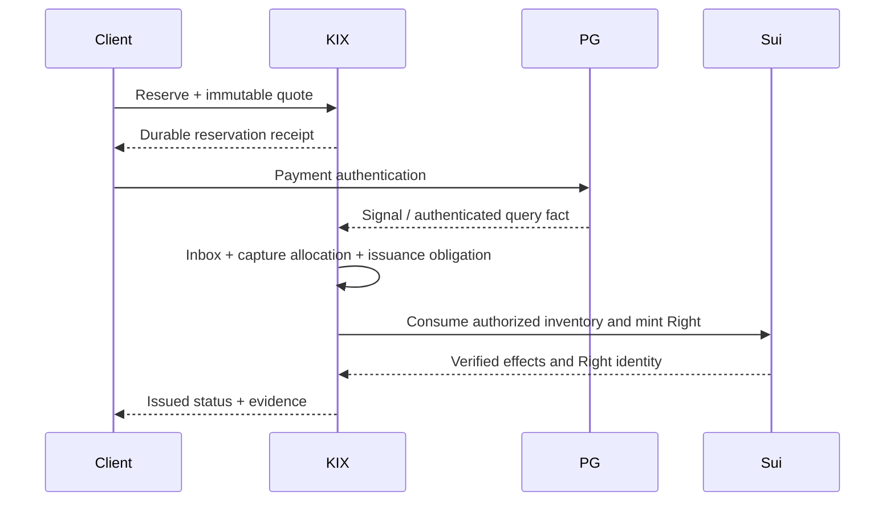

# KIX 통합 시스템 설계

상태: 설계 제안. 도입 결정·구현·운영 증명과 구분한다. 기준과 우선순위는 [README](README.md)를 따른다.

## 1. 제품 경계와 수익 구조

KIX는 관람권과 그 거래에서 발생하는 정산·신용 관계를 여러 채널이 공유하는 프로토콜이다. 운영 플랫폼은 이 프로토콜을 사용하는 첫 제품군이다. 자체 프론트엔드를 거치지 않는 파트너 API/SDK에도 같은 정책·수수료·멱등성·권한 규칙을 적용한다.

| 제품 영역 | 사용자가 하는 일 | 프로토콜이 보장해야 할 일 |
|---|---|---|
| 예매 | 행사 탐색, 좌석/연석/GA 선택, 결제, 티켓 보관 | 독점 예약 약정, 고정 견적, 자금 사실, 실제 발권 상태 |
| 공식 리셀 | 정책 내 매물 등록, 구매, 취소, 판매대금 조회 | 기존 Right 처분 제한, 한 번의 이전, buyer refund / seller payout 분리 |
| 마케팅 | 팬 자격, 선예매, 할인, 쿠폰, 리워드, 동의한 캠페인 | 혜택 자격·한도·할인 부담·예산 소진을 거래와 결합 |
| 주최자/공연장 | 행사·정책 등록, 분배, 선지급 신청, 실적 확인 | 수익 귀속·정산채권·채무·환불 위험의 정확한 구분 |
| 자본 공급 | facility 제안, 심사, 자금 집행, 회수·위험 확인 | eligible collateral·한도·담보·차입·지급 지시의 일관성 |
| 운영/심사 | 예외 대사, 승인, 동결, 복구, 민원 | 최소 권한, 이중 승인, 원문 증거, 재현 가능한 결정 |

채널 이용료·거래 수수료·정산/servicing 수수료·금융 파트너와의 계약상 보수는 별도 FeeSchedule로 등록한다. 수수료 부과 권한/귀속/환불 가능 여부를 고정 견적에 넣는다. 법적으로 허용되지 않은 금융 중개 수수료를 기술적으로 먼저 수취하지 않는다.

## 2. 한 개의 ‘정본’으로 모든 사실을 합치지 않는다

| 사실 | 원권위 | KIX의 기록/검증 | 다른 계층이 해서는 안 되는 것 |
|---|---|---|---|
| 재고와 Right 소유·이전·소비 | Sui/Move | network/package/object/version/effects와 원 operation 결합 | DB row만으로 체인 권리를 새로 만들기 |
| 배타 위임 범위 | 검증된 chain grant + 승인 계약 | grant 범위·세대·현재성·cut·미발행 약정 보존 | grant 만료를 기존 약정 소멸로 읽기 |
| 예약/견적/멱등 최초 결과 | 승인 범위의 Rust 업무 전이, 선택 backend | 같은 commit의 명령·결과·자원·의도 | UI cache를 예약 성공 근거로 사용 |
| 외부 결제/송금 | 해당 PG/은행의 인증된 사실 | 원문 inbox·검증·정규화·원장 적용 | webhook 한 건 또는 chain event로 원화 입금 확정 |
| 정산 귀속/반환 의무 | 계약·정책과 검증된 사실에 따른 업무 전이 | 분개·allocation·obligation·원문 출처 | 주최자 매출과 자유 현금을 동일시 |
| 채권·담보의 법적 효력 | 계약·당사자·법정 요건·실제 권한 | 문서 commitment·검증자·발효/철회 증거 | NFT 소유만으로 채권양도/대항요건 완료 선언 |
| credit 한도/대출 승인 | 권한 있는 자본 공급자/심사 정책 | 한도 snapshot, 승인 사건, 예약된 집행과 잔액 | 분석 모델의 점수를 자동 대출 권한으로 승격 |
| 분석/CRM/추천 | 원자료의 비권위 projection | source cut·schema·권한·정합성 | DuckDB/Polars/GPU 결과로 직접 원장 수정 |

‘토큰화’에는 실제 Move의 생성·권한·상태 전이 집행이 포함된다. chain anchor만 적재하고 상품을 토큰화했다고 부르지 않는다. 동시에 토큰이 표현하는 외부 사실에는 그 사실의 별도 신뢰 경계를 유지한다.

## 3. 실행 배치와 모듈 계약

초기에는 **Rust 모듈형 서버 + 별도 외부 실행 worker + read model/API + 권한 분리된 signer**를 권고한다. 모듈마다 마이크로서비스를 먼저 만드는 것은 필수가 아니다. 실제 backend는 비교 후 채택한다.

| 논리 모듈(제안명) | 소유할 상태/역할 | 출력 |
|---|---|---|
| Identity & Policy | 조직/사용자/지갑 결합, capability, 정책/자산 snapshot | VerifiedCommandContext, PolicySnapshot |
| Commerce & Reservation | OrderLine, QuoteSnapshot, Holds, 명령 이력 | 불변 원결과와 예약 약정 |
| Payment & Evidence | 외부 intent, inbox, event/operation 식별, 인증 조회 | VerifiedPaymentFact, SuspenseCase |
| Ledger & Settlement | 법인·통화별 journal, 분배, 환불/지급 의무 | BalanceView, SettlementBatch |
| Credit & Collateral | facility, eligible claims, valuation, draw lock, covenants | 승인된 DrawIntent, 회수/해제 지시 |
| Chain Gateway | grant/Right/Claim 상태, signed intent, effects, checkpoints | 검증된 체인 사실과 후속 의무 |
| Treasury Workers | PG/은행 요청, 원키 재사용, UNKNOWN 대사 | 출처 검증된 송금/환불 사실 |
| Case & Operations | 상충·종결·권한승계·break-glass 이력 | 지정 역할의 내구 결정 |
| Export & Analytics | 일관된 cut, 정수/null 의미론, SQL 감사, ML features | 추적 가능한 비권위 통계 |

이 이름은 이미 존재하는 crate 목록이 아니다. 경계를 먼저 정의하고 구현 Task가 실제 crate/service 배치를 정한다. 거래/수신과 분석의 CPU·메모리·queue·connection budget을 분리한다. 금융 심사와 마케팅 배치가 티켓 오픈의 예약/관측 예산을 소진하면 안 된다.

## 4. 공통 명령과 commit 계약

업무 identity는 `tenant + stable principal + business scope + client_command_id`다. 원래 payload의 fingerprint에 서버 routing/leader generation/서버가 새로 붙인 현재시각을 넣어 재시도를 다른 명령으로 만들지 않는다. 업무상 지정한 유효기간·대상·금액·정책 버전은 payload 일부다. 현재 실행 fence/업무 취소 fence는 별도다.

1. 인증·권한·입력 한도·schema 검증.
2. known command의 계약상 조회 우선순위를 적용. 같은 identity+다른 의미는 충돌.
3. 같은 권위 안의 재고/정산가능액/한도/외부 작업 슬롯을 원자적으로 예약한다. 체인 자원은 별도 확정 단계로 연결하며 체인·은행·로컬 저장소를 하나의 transaction으로 간주하지 않는다.
4. command·first result·state effect·order/obligation·외부 intent를 같은 commit 경계에 보존.
5. 선언된 내구 조건을 충족한 뒤 그 범위의 ACK. 외부 성공으로 승격하지 않음.
6. worker가 transaction 밖에서 실행. 원 operation과 idempotency key/원 signed bytes를 보존.
7. 늦은 사실은 원 intent와 결합하여 현재 상태에 적용. 취소된 주문을 자동 부활시키지 않음.

반환값과 상태 효과는 다른 차원이다. 현재 v4의 conflict `Err(Capacity)`는 격리/시간 변경을 포함할 수 있다. driver는 `응답 / 상태 효과 / 내구 적용 필요 / 재전송 가능성` 표를 계약으로 검사한다. reserve replay의 읽기 전용 보장과 혼동하지 않는다.

외부 작업은 PG·은행·체인 사이의 분산 원자 transaction으로 가장하지 않는다. **의도 → 실행 → 관측 → 후속 의무**의 단계별 확정성을 사용하고, 보상도 별도의 실패 가능한 외부 작업이다.

## 5. 거래 workflow

### 5.1 유상 최초 발행

지급 성공·발권 실패이면 발권 의무/보류 또는 계약상 환불 의무를 남긴다. 발권을 재시도할 때 새 거래가 기존 발권과 이중 실행되지 않게 원 reservation/operation을 chain에서 한 번만 소비한다. 검증되지 않은 PG signal은 mint authorization을 만들 수 없다.

### 5.2 공식 리셀

판매자 Right를 정책 집행 escrow/locked listing에 결합 → 구매자 견적·대금 fact → 같은 Move 경계에서 listing의 한 번만 종결과 Right 이전 → 확인된 이전 이후 판매자 지급 의무. chain 이전과 원화 지급은 별도 상태다. 이전 전 취소는 buyer refund, 이전 후 지급 실패는 seller payable/UNKNOWN이다. 이미 사용·취소·타 매물에 잠긴 Right는 매물로 만들 수 없다.

### 5.3 공연 취소와 환불

EventControl 취소 세대와 관련 권위 범위를 고정 → 신규 판매/사용 차단 → 미확정 PG/체인 사실 대사 → 원 OrderLine/권리/수취인에 따른 환불 의무 확정 → 환불 한도를 원자 예약 → 외부 반환 및 대사. 전체 공연 취소에 모든 Right를 한 transaction에서 순회하지 않는다. 현재 EventControl 검증으로 즉시 효력을 적용하고 개별 종결을 진행한다.

실제 자금 반환 확인 전 ‘환불 완료’를 표시하지 않는다. 주최자 신용 악화나 담보 집행 때문에 정상 구매자의 관람권을 임의 취소하지 않는다. 공연 취소와 금융 default의 원인이 다르면 상태도 다르다.

### 5.4 선지급·회수

정산채권 출처 검증 → 적격성/한도 snapshot → 권한 있는 심사·법률요건 → 담보/중복처분 제한 → draw exposure 예약 → lender 송금 → 인증된 송금 사실에 따른 대출 잔액 → 수금·준비금·계약상 waterfall → 대출 회수와 잔여 주최자 지급 → 적법한 담보 해제. 상세 수식과 부도 경로는 [CREDIT_FACILITY](CREDIT_FACILITY.md).

예상 매출만 있고 아직 생기지 않은 정산채권은 별도 project-finance 평가 대상이다. 사전 예측을 적격 확정채권으로 발행하거나 담보풀에 넣지 않는다. 외부 은행 사실이 체인보다 먼저/나중에 도착해도 UNKNOWN/suspense에 보존하고 사실을 버리지 않는다.

## 6. 업무 불변식

| ID | 반드시 유지할 보장 |
|---|---|
| INV-01 | 같은 원재고 단위는 동시에 둘에게 유효하게 배정/발행되지 않는다. 연석은 전체 성공 또는 실패. |
| INV-02 | 같은 업무 명령은 첫 결과가 불변이며 routing/owner 교체가 새 명령을 만들지 않는다. |
| INV-03 | event 중복과 economic operation 중복을 구분하고 상충 증거·격리를 보존한다. |
| INV-04 | UNKNOWN을 시간이나 조회 1회의 부재로 실패 처리하지 않는다. |
| INV-05 | 돈은 asset·registry·legal entity·book과 결합한 정수로 기록한다. 통화 간 잔액을 합치지 않는다. |
| INV-06 | 실제 돈/Right 확정과 실행 의도·내부 ACK·분석 결과를 혼동하지 않는다. |
| INV-07 | source receivable의 같은 금액 부분을 여러 시설/토큰/잔여 지급에 중복 사용하지 않는다. |
| INV-08 | funded outstanding + pending/unknown 및 계약상 counted exposure는 여신 한도를 점유한다. 출금이 반영되지 않은 지급 의도는 별도로 현금을 예약한다. funded와 live에 중복 계상하지 않으며 각 권위 내부에서 원자적으로 처리하고 체인·은행 간 진행은 대사한다. |
| INV-09 | 환불·차지백·분쟁 보호액 및 다른 수익자 귀속액을 주최자의 자유 자금으로 대출/지급하지 않는다. |
| INV-10 | organizer debt default가 고객의 유효한 관람권 소멸 권한을 만들지 않는다. |
| INV-11 | token transfer/해제는 계약·권한·현재성 검증을 우회하지 못한다. |
| INV-12 | 승인·attestation·oracle은 버전·범위·기한·nonce·증거에 결합한다. 폐기된 attestor로 새 실행을 허가하지 않는다. |
| INV-13 | 복원/과거 replay는 새로운 외부 송신 권한이 아니다. 구 signer와 미확정 작업을 함께 대사한다. |
| INV-14 | reserve/관측/환불/credit에 동시 한도 초과가 없고 과부하를 빠른 거절 TPS로 숨기지 않는다. |
| INV-15 | 실행 계층의 제한은 정확한 범위에 걸며, 금융 심사·마케팅·분석 실패가 전체 예매를 불필요하게 중단시키지 않는다. |

## 7. 계약과 버전

최소 연결키: tenant/event/order/line/right/grant/payment operation/claim lot/facility/draw/payout/refund/journal batch/case. 외부 operation identity에는 provider + merchant/account + environment + operation kind를 결합한다. transmission/event 항목을 operation identity로 오용하지 않는다. 배치 webhook은 batch identity + item identity로 정규화한다.

BCS schema, 업무 의미론, 정책/자산 snapshot, Move package, API, attestation, state migration 버전은 각각 기록한다. Rust/TS/Move의 고정 vector와 범위 테스트를 만들되 원래 CE1은 역사 namespace로 유지한다. 금융 토큰/원장을 새로 추가하려고 기존 R1 wire identity를 재해석하지 않는다.

서명 payload에는 network·package family/version·action·target IDs·asset+amount·policy commitment·source position·validity·nonce가 들어간다. PII/계좌 원문/신용자료는 공개 chain에 올리지 않는다. 낮은 엔트로피 PII의 단순 hash도 공개 식별자가 될 수 있으므로 domain separation·salt/opaque ID·접근통제된 원본 위치를 설계한다.

## 8. 성능과 운영

제품 SLO 수치·RPO/RTO·비용은 미정이다. 부하 계약을 정한 뒤 거래 성공 goodput, 신규/재시도 p99, capture 적용지연, chain 확정지연, credit draw 처리, 복원시간을 각각 측정한다. 예약의 DB/체인 쓰기와 조회/대기열 RPS를 분리한다.

seat/row-local 작업, GA shard, tenant/event별 admission과 예산, 제한된 workerpool을 설계한다. 전역 일괄 mutable 객체·전역 원장 lock·한 gas coin 병렬 소비는 피할 후보지만 실제 correctness/성능은 검증 대상이다. 금액은 u128 정본이며 SQL signed 타입/반올림/범위 축소를 피한다.

인증 export → Polars CPU → DuckDB SQL 대사는 거래 경로 외부다. native libcudf는 실제 workload·장비·정확성·전송 비용과 zero-fallback 비교로 선택한다. 신용 점수/추천모델은 설명 가능한 보조 판단이며 금융 승인 capability가 아니다.

## 9. 공개 사실과 계정별 미정

토스 공식 문서는 `payout.changed`/`seller.changed`의 서명 헤더를 별도로 설명한다. 이를 일반 카드 결제 signal의 동일 인증 보장으로 확대하지 않는다. 적용 이벤트·API·MID 계약별 인증 방법과 조회 대사를 어댑터에 고정한다. 지급대행 API의 존재는 KIX의 리셀/금융 자금 처리에 대한 가맹 승인과 다르다. [웹훅 공식 문서](https://docs.tosspayments.com/reference/using-api/webhook-events), [지급대행 공식 문서](https://docs.tosspayments.com/guides/v2/payouts)

Sui/Move의 구체 구현·금융 규제·운영 화면·builder 절차는 각각 동봉 문서를 따른다. 이 청사진은 거래/금융 실행을 포함하는 목표 구조이며 현재 배포된 시스템 설명이 아니다.
