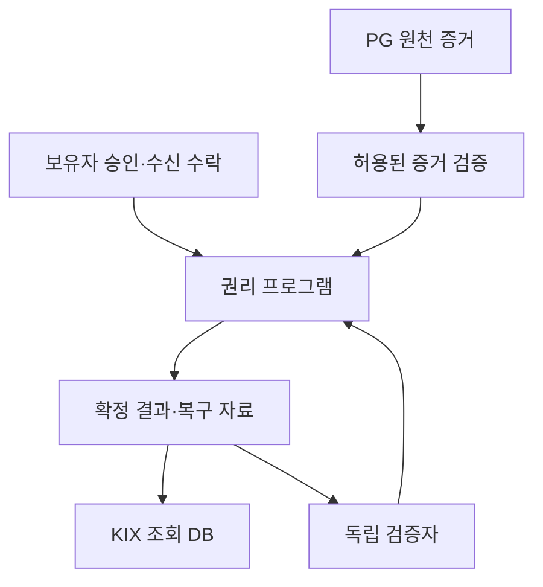

# KIX Sui·독립 검증·ZK 후속 구현 계약 v0.2

2026-09-11 · 설계 계약 · **아래 체인 프로그램·증명기는 아직 구현되지 않음**

목표는 운영자가 달라져도 이미 발행된 권리를 복구·검증할 수 있게 하고, 거래와 입장에 필요한 사실을 불필요한 이력 공개 없이 증명하는 것이다. 이번 Python v0.2는 전이 의미와 실패 처리를 비교할 기준 모형이다. 로컬 재구축 검사는 아래 목표의 완료 증거가 아니다.

## 1. 정본과 모듈 경계

| 영역 | 목표 정본/권한 | KIX 조정 서버의 역할 |
|---|---|---|
| 재고·발행·현재 권리·사용·취소 종료 | 하나의 권리 프로그램과 체인 확정 상태 | 요청 조정, 조회 인덱스, 복구 자료 전달 |
| 결제 승인·원결제 취소 | 허용된 PG 원천과 그 검증 계약 | 수집·정규화·귀속·상충 보존 |
| 실제 입출금·정산 공제 | 은행/PG 정산 원천 | 대사와 원장 반영 |
| 배분 의무 | 고정된 정책 버전과 확정 거래·취소 근거 | 계산과 검증 가능한 조회 |
| 광고 동의·연락처 | 별도 접근 통제 저장소 | 동의 갱신, 발송 직전 권한 확인 |

Sui 권리 프로그램과 로컬 DB가 각각 독자적으로 유효한 티켓을 발행하는 이중 정본을 만들지 않는다. 체인 전이를 시작한 권리에 대해서는 DB에서 권리를 먼저 확정해 사용시키는 경로를 금지한다. 조회 DB는 확정 결과의 투영이다.

마지막 연결은 현재 상태 확인과 소비 전이를 뜻한다. 오래된 영수증만 오프라인으로 읽고 전역 중복 사용까지 막았다고 해석하지 않는다.

## 2. 권한·객체 계약

다음 명칭은 설계상 인터페이스 이름이며 배포된 Move 타입이 아니다.

| 객체/권한 | 필수 범위·입력 | 강제할 제약 |
|---|---|---|
| IssuerAuthority | 발행자, 행사/회차, 물량, 정책, 키 버전 | 승인된 범위·한도 안에서만 발행. 초대권 한도 별도 |
| EventPolicy | 회차, 판매·입장·완료·취소 상태, 배분/환불/양도 정책 버전 | 과거 계약을 새 정책으로 몰래 재해석하지 않음 |
| InventoryUnit | 회차·좌석 또는 자유석 단위, 발행 세대, 현재 권리 | 재고별 유효한 발행 하나. 폐기된 ID 재사용 금지 |
| AdmissionRight | 권리 식별/commitment, 보유 제어, 정책, 버전, 소비 상태 | 모듈 밖의 임의 전송으로 양도·리셀 검사를 우회하지 못함 |
| TradeReservation | 입력 권리/버전, 약정 hash, 상대 승인, 만료, 종료 표식 | 옛 예약·중단된 거래의 늦은 확정 금지 |
| PaymentAttestor | PG/가맹점/환경/증거 유형, 공개키·키 버전·유효 범위 | 임의 운영자의 결제 사실 생성 금지. 같은 결제 증거의 재사용 금지 |
| AdmissionAuthority | 행사/회차, 검표자/장치, epoch, 위임 범위 | 다른 행사 사용 승인 및 위임 범위 밖 소비 금지 |
| RecoveryPolicy | 변경권자, 복구 승인 요건, 키 교체 버전, 이력 | 운영자 변경을 이용한 임의 보유권 이전·중복 복원 금지 |
| FinalizedReceipt | 거래 digest, 실행 결과, 입력/출력 참조, 정책, sequence/checkpoint 근거 | 확정 실패를 성공 권리로 반영하지 않음 |

발행·검표·결제 증거 권한의 생성/회수와 프로그램 업그레이드 권한을 분리한다. 기존 권리 보유자의 승인 없이 무엇을 바꿀 수 있는지, 주최자의 공연 취소 권한은 어디까지인지, 관리 키를 잃었을 때 누구의 어떤 증거로 복구하는지 정책에 명시한다. “서버가 없어도 권리가 유지된다”는 표현이 “정당한 공연 취소도 불가능하다”는 뜻이 되지 않도록 한다.

직접 지갑 전송 우회 차단은 문서의 API 제한만으로 끝내지 않는다. 실제 Move 타입의 ability·소유 방식·전송 진입점과 외부 모듈 공격 입력을 컴파일·실행해 확인해야 한다. 모듈 밖의 경로로 전이가 가능하면 실패다.

## 3. 체인 전이 API의 의미

각 변경 입력에는 프로토콜/네트워크 도메인, 프로그램 버전, 권한 키 버전, operationId, 입력 권리·재고 버전, 정책 commitment, 만료/epoch를 결합한다. 체인 직렬화의 바이트 규격과 Python 모형의 `canonical()` JSON은 아직 동일하지 않다. 교차 언어 테스트 벡터로 필드 순서·숫자·문자열·도메인 해시를 고정해야 한다.

| 전이 | 확인할 조건 | 성공 산출물 |
|---|---|---|
| 유상 최초 발행 | 발행 권한, 재고 버전, 결제 증거, 구매 조건·수락 | 새 발행 세대와 보유권, 결제 증거 소비 |
| 공식 리셀 | 현재 보유 제어, 미사용, 잠금·만료·정책, 결제·양측 조건 | 옛 제시 무효화, 새 보유 제어, 배분 근거 |
| 무상 양도 | 보유자 승인, 수신 수락, 현재 권리·정책·만료 | 금전 결제 없이 권리 전이 |
| 초대권 발행 | 행사별 발행 권한, 초대 물량, 재고 | 금전 결제 없는 새 권리 |
| 사용 | 행사/회차 검표 권한, 최신 유효 상태, 제시 challenge | 한 번의 사용 영수증 |
| 환불/폐기 | 선택한 환불 사유와 보유자/주최자 권한, 위임 종료 조건 | 권리 종료와 환불 사건 참조 |
| 재고 해제/재발행 | 구권리 영구 종료, 현장 사용 확정, 늦은 전이 차단 | 새 재고 버전과 별도 새 권리 ID |
| 위임 종료 | 해당 controller/session/epoch, 최종 사용 로그 | 사용/미사용 확정 또는 계속 불명확 |

PG 승인과 체인 전이는 하나의 트랜잭션이 아니다. 발행/이전이 실패했다고 판단할 수 있는 확정 근거가 생길 때까지, 환불과 늦은 권리 전이가 동시에 성공할 수 있는 경로를 열지 않는다. 체인 결과가 미확정이면 사용자 상태도 ‘발권/이전 확인 중’으로 남긴다.

## 4. 체인 요청·확정 어댑터

Sui 문서는 서명된 거래의 보관, digest를 이용한 조회, 조회 누락의 불확실성, 확정됐지만 실행은 실패한 거래를 구분한다. 다음 상태 계약은 이를 바탕으로 한 KIX의 구현 요구다. [Sui 거래 생애주기](https://docs.sui.io/develop/transactions/transaction-lifecycle)

| 어댑터 상태 | 허용되는 처리 | 금지되는 해석 |
|---|---|---|
| PREPARED_NOT_SUBMITTED | 서명 거래 바이트·digest·조건 보존, 최신 종료 상태 확인 | 저장 전 송신하고 기억에 의존 |
| SUBMITTED_OUTCOME_UNKNOWN | 같은 거래 digest 조회·정해진 재제출 정책 | 조회가 비었다는 이유로 실패 확정 |
| FINALIZED_SUCCESS | 인증된 effects와 필요한 확정 근거 확인, 조회 DB에 멱등 반영 | HTTP 응답 자체를 권리 성공으로 처리 |
| FINALIZED_FAILURE | 확정 실패 기록, 입력 권리 상태 대조, 보상 절차 | 실패 기록 삭제 후 옛 의도 재사용 |
| SOURCE_CONFLICT | 원자료·참조 보존, 승인된 대사 | 원하는 결과를 골라 확정 |

Sui의 같은 서명 거래 재제출과 은행/PG의 새 실행은 같은 멱등성 계약이 아니다. Python v0.2의 `QUERY_ONLY`를 모든 체인 거래에 그대로 복사하지 않는다. 체인 어댑터는 서명된 동일 거래 재제출과 새 거래 생성의 조건을 구분한다.

조회 DB가 반영에 실패해도 `FinalizedReceipt`의 입력·출력·정책·실행 성공 여부로 같은 결과를 재구축해야 한다. 복구된 DB에 새 권리 발행 권한이 생기는 것으로 처리하지 않는다.

## 5. 운영자 독립 시험

첫 시험의 범위는 **이미 체인에서 정상 확정된 관람권**이다. 다음 자료와 의존성을 명시한다.

| 필요한 것 | 시험 조건 |
|---|---|
| 보유 제어 키 또는 승인된 복구 수단 | 사용자의 복구 권한이 KIX 서버 로그인 성공 하나에만 의존하지 않음 |
| 공개 검증 근거 | 체인 상태/확정 근거를 다른 노드 또는 독립 경로로 취득 |
| 비공개 권리의 복구 자료 | 필요한 암호문·메타데이터가 KIX 단일 저장소 외부에서도 가용 |
| 검표자의 행사 권한 | 다른 운영자라도 해당 행사 검표 권한을 검증 가능 |
| 최신 소비 상태 | 현재 체인 상태 또는 명시적으로 위임된 검표 범위를 확인 |

실행 절차:

1. 최초 발행·공식 리셀·무상 양도의 샘플 권리를 실제 권리 프로그램에서 확정한다.
2. KIX 조정 서버와 조회 DB를 중지한다. 같은 코어 클래스를 다시 호출하는 것으로 대체하지 않는다.
3. 독립 클라이언트가 다른 자료 경로로 권리를 복구하고 행사·정책·현재 보유 제어를 확인한다.
4. 다른 운영자가 최신 사용 가능 상태를 검증해 정해진 사용 경로로 소비한다.
5. 옛 구매자, 이미 사용/환불된 권리, 취소된 행사, 변조된 복구 암호문은 거절한다.
6. KIX 조회 DB를 확정 영수증에서 재구축해 동일한 소유/소비 결과를 얻는다.

온라인 검증에서는 체인과 자료 공급 경로가 동작한다는 가정이 있다. 오프라인 검표라면 하나의 권리가 두 controller에서 동시에 유효해지지 않는 위임 분할·epoch·최종 로그 규칙을 별도로 검증한다. 통신 단절이 끝났다는 이유만으로 미사용을 추정하지 않는다.

## 6. 공개 프로필과 비공개 프로필

공개 객체 프로필은 상태 전이와 운영자 교체 효과를 먼저 검증하는 경로다. 보유 주소와 이전 관계가 공개되면 그 범위를 정확히 표시한다. 공개 객체에 신원·연결 가능한 결제 참조를 올린 뒤 ZK만 추가해 거래 비공개를 달성했다고 주장하지 않는다.

`zkLogin`은 로그인 관련 특정 정보를 보호하는 기능이다. 그것만으로 티켓 이전 관계·금액·전체 지갑 이력이 숨겨지지 않는다. KIX의 거래 비공개는 별도 입력·회로·노출 정책이 필요하다. [Sui zkLogin 공개/비공개 정보 설명](https://docs.sui.io/sui-stack/zklogin-integration/zklogin)

| 검증자·명제 | 공개 입력의 후보 | 비공개 입력의 후보 | 추가로 필요한 최신 조건 |
|---|---|---|---|
| 리셀 구매자: 정당한 권리를 수락한 조건대로 받음 | 프로그램/행사/정책 버전, 입출력 commitment, 조건 commitment, 소비 표식 | 입력 노트, 제어 비밀, 지급 증거·금액·관련 서명, 출력 노트 | 현재 미소비·미취소, 예약 종료 상태 |
| 검표자: 해당 회차의 미사용 권리를 제어함 | 회차, 허용 root, challenge, 소비 표식, 검표 권한 epoch | 권리 노트, 보유 제어 비밀, 포함 경로 | 현재 소비 집합, 행사 상태, 위임 범위 |
| 배분 검증자: 약정 산식과 금액 보존 | 정책/산식 버전, 금액 commitment, 범위·단위 | 금액, 원가/차익 기준, 배분액, 원천 서명 | 동일 약정과 결제에 대한 증거의 단일 사용 |
| 금융기관: 지정 범위 집계의 일관성 | 행사/기간, 기준 시점, 원천 집합 commitment, 공개 집계, 누락/상충 표시 | 개별 거래·환불·입출금·비공개 신원 | 해당 모집단의 범위와 원천 집합 완전성 근거 |

위 표는 회로 설계를 위한 후보 입력이다. 최종 공개 필드나 사용할 곡선·증명계를 확정한 것으로 해석하지 않는다. 공개 입력의 결합 자체로 개인을 연결할 수 있는지도 별도 평가해야 한다.

### 공통 소비 표식과 현재성

입력 노트 하나의 양도·입장·환불에는 **같은 소비 표식**을 사용한다. 설계 예시는 `N = PRF(noteSpendSecret, domain || noteSerial)`이며 동작 종류를 표식 분리에 이용하지 않는다. 실제 회로에서는 노트 commitment와 표식 생성 비밀의 일치를 검증해야 한다. 출력 노트는 새 비밀·새 식별자를 가진다.

노트가 과거 root에 포함됐다는 것만으로 사용을 승인하지 않는다. 허용 root, 현재 소비 집합, 현재 행사 취소 상태, 재고 발행 세대, 거래 종료·위임 epoch를 결합한다. 이벤트 전체 취소 뒤 옛 membership proof로 입장하는 입력은 실패해야 한다.

지급 증거가 참이라는 주장은 신뢰할 원천 서명과 권한 범위에 의존한다. ZK는 PG가 제공하지 않은 사실을 만들어 증명하지 못한다. 금융 집계의 산술 일관성과 모집단에 누락이 없다는 주장을 분리한다. 지정 기간의 원천 커서·누락 표시·정산 자료 범위를 공개 입력이나 검증 근거에 결합해야 한다.

### 암호화된 복구 자료

수신자는 수락한 조건 commitment, 출력 권리 commitment, 복구 암호문의 digest와 도메인을 결합해 확인한다. 암호문이 올바른 수신자와 출력 권리를 담는다는 관계를 검증한다. 수신자의 확인 서명만으로 장기 저장이나 자료 가용성이 증명됐다고 설명하지 않는다.

복구 키 분실, 운영자 키 교체, 저장소 중단, 암호문 변조, 옛 노트 재제시를 시험한다. 키 복구 권한이 보유권을 몰래 복제하거나 제3자에게 이전하는 우회 경로가 되지 않아야 한다.

## 7. 상품 확장용 후속 계약

| 모듈 | 다음 데이터 계약 | 완료 조건 |
|---|---|---|
| 여러 티켓 주문 | Order, OrderLine, Payment, PaymentAllocation, 라인별 RefundCase | 결제 배분 합계 보존, 일부 발권 실패와 부분 취소, 동일 결제의 중복 취소 차단 |
| 여러 회차 | Event/Session, 각 재고, 변경 사유·대체 권리·취소 정책 | 일부 회차 변경이 다른 회차 사용·정산을 임의 취소하지 않음 |
| 배분 정책 | 수취인 역할, 총액/차익 기준, 원금 기준, 절사·잔여 귀속, 지급 시점 | 수취인별 보존식, 손실 리셀, 취소·차지백 부담과 조기 지급 재원 |
| 실상품 환불 | 사유별 수익자·부담자·금액·권리 종료/반환·원결제 경로 | 보유자 환불과 리셀 계약 취소를 같은 과거 거래 환원으로 처리하지 않음 |
| 금융 자료 | 계약 ID, 담보/채권 범위, 원천 cursor, 시점·누락·상충, 집계 증거 | 자료 검증과 실제 자금 공급/지급 권한 분리 |
| 실제 마케팅 | 동의 버전, 발송 의도, 전달 결과, 철회와 작업 순서 | 과거 명단·영수증이 새 발송 권한이 되지 않음 |

주최자·공연자·기획사·공연장에 돌아갈 몫은 계약상 수취인 정책으로 정의한다. 과거 구매자라는 이유로 후속 리셀 이익을 계속 받는 구조는 추가하지 않는다.

## 8. 다음 구현의 완료 증거

| 단계 | 받아야 할 증거 |
|---|---|
| 권리 프로그램 | 실제 소스·컴파일 결과·정상/거절 전이, 권한 우회·중복 소비·재고 중복 검사 |
| 체인 조정 | 서명 요청 저장·응답 유실·확정 실패·취소 경합, 영수증 기반 조회 재구축 |
| 독립 검증 | KIX 중지 로그, 독립 클라이언트 실행, 복구 경로와 필요 의존성, 구권리 거절 |
| ZK | 명시한 공개 입력·회로·검증기, 위조 witness/옛 root/중복 소비 실패, 실제 노출 검사 |
| 성능 | 증명 생성·검증, 권리 확정·입장 지연을 각각 측정한 환경과 분포 |

이 문서나 Python 검사 통과를 실제 분산 검증·탈중앙성·개인정보 비공개·특허 진보성의 완료 증거로 사용하지 않는다. 다음 구현은 이 표의 증거를 실제로 생산하는 작업이다.
